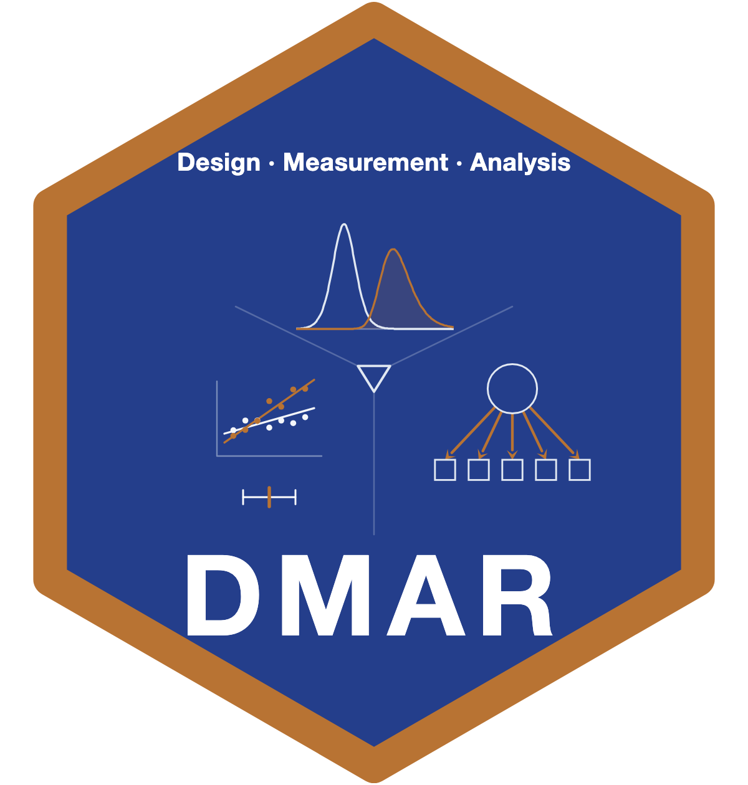

<!-- README.md is generated from README.Rmd. Please edit README.Rmd and re-knit. -->

```{r, include = FALSE}
knitr::opts_chunk$set(
  collapse = TRUE,
  comment = "#>",
  message = FALSE,
  warning = FALSE,
  fig.path = "man/figures/README-"
)
```

# DMAR 

<!-- badges: start -->
[](https://github.com/yelleKneK/DMAR/actions/workflows/R-CMD-check.yaml)
[](https://CRAN.R-project.org/package=DMAR)
[](https://lifecycle.r-lib.org/articles/stages.html#stable)
<!-- badges: end -->

**DMAR** (Design, Measurement, and Analysis in R, pronounced "Dee-Mar") is a
package for human-centered research: effect sizes, confidence intervals for
effect sizes, sample size planning, reliability and agreement, mediation
analysis (from the simple mediation model to likelihood ratio tests of
arbitrary indirect effects, with moderated mediation probing), equivalence
testing, meta-analysis, experimental and quasi-experimental designs, repeated
measures, and model comparison-based inference. It draws on the psychometric and statistical traditions and reflects
the methodological and applied research program of its author, Ken Kelley
(University of Notre Dame). It aims to be methodologically sound and useful
across psychology, sociology, education, management, marketing, and information
systems, especially where the independent or dependent variables involve the
person.

## Installation

```r
# Once on CRAN:
install.packages("DMAR")

# Development version from GitHub:
# install.packages("remotes")
remotes::install_github("yelleKneK/DMAR")
```

R >= 4.0.0 is required. Most estimation, inference, and planning functions
return a tidy `data.frame(term, value)` that composes naturally with `dplyr` /
`ggplot2` pipelines and with `broom::tidy()` / `broom::glance()`. Heavier
dependencies (e.g., `lavaan`, `lme4`, `OpenMx`) are in `Suggests` and gated by
`requireNamespace()`; install them only when you need the functions that use
them.

## Function families

DMAR is organized into a small number of stable function families:

- **Effect size estimates.** `smd()`, `cles()`,
  `proportion_of_superiority()` (sometimes called Cohen's U3),
  `cliff_delta()`, `vargha_delaney_A()`, `cohen_f()`, `eta_squared()`,
  `omega_squared()`, `nnt_from_smd()`.
- **Confidence intervals for effect sizes.** `ci_smd()`, `ci_R2()`,
  `ci_eta_squared()`, `ci_omega_squared()`, `ci_rmsea()`, `ci_cv()`,
  `ci_c()`, `ci_sc()`, `ci_c_ancova()`, `ci_sc_ancova()`,
  `ci_reg_coef()`, `ci_eigenvalue()`, `ci_mahalanobis()`.
- **Sample size planning under AIPE** (accuracy in parameter
  estimation). The `ss_aipe_*()` family covers SMD, R², ω², CV,
  partial / semipartial r, regression coefficients (standardized and
  unstandardized), ANCOVA contrasts, RMSEA, SEM paths, polynomial
  change, mixed-effects fixed effects, ICC, reliability, and Cliff's
  delta. Every planner has a Monte Carlo `*_sensitivity()` sibling
  that quantifies the impact of misspecified planning values.
- **Sample size planning under power.** `ss_power_R2()`,
  `ss_power_smd()`, `ss_power_r()`, `ss_power_one_way_anova()`,
  `ss_power_factorial_anova()`, `ss_power_rm_anova()`,
  `ss_power_split_plot_anova()`, `ss_power_mixed_effects()`,
  `ss_power_pcm()`, `ss_power_sem()`, `ss_power_contrast()`,
  `power_fisher_exact()`.
- **Minimum risk / sequential estimation.** `mr_smd()`, `mr_cv()`.
- **Equivalence testing.** `equivalence_smd()`, `equivalence_r()`,
  `ss_aipe_equivalence_smd()`.
- **Reliability.** `reliability_alpha()`, `reliability_omega()`,
  `reliability_omega_categorical()`, `reliability_omega_h()`,
  `reliability_H()`, `reliability_kr20()`, `var_alpha()`, the
  umbrella `reliability()`, and `ss_aipe_reliability()`.
- **ANOVA / ANCOVA / contrasts.** `welch_t()`, `contrast_test()`,
  `summary_t_test()`, `ancova()`, `mixed_anova()`, `manova_split_plot()`,
  `anova_within()`, `anova_within_two_way()`, `pairwise_within()`,
  `simple_effects_AB()`, `obrien_test()`, `mauchly_test()`,
  `epsilon_corrections()`, `contrast_adjusted()`.
- **Multiple-comparison procedures.** `ci_dunnett()`,
  `ci_tukey_kramer()`, `ci_scheffe()`, and their critical-value
  helpers `cv_dunnett()`, `cv_smm()`, `cv_scheffe()`, `cv_tukey_hsd()`,
  `cv_t()`, `cv_z()`.
- **Agreement and reliability of raters.** `icc()`, `icc_lmer()`,
  `cohen_kappa()`, `fleiss_kappa()`, `gwet_ac()`,
  `krippendorff_alpha()`, `lin_ccc()`, `limits_of_agreement()`.
- **Multilevel and multivariate / latent variable methods.** `cfa_1()`,
  `mlmr()`, `mlmr_mv()`, `R2_mixed_effects()`, `R2_mixed_effects_decomposition()`,
  `compare_cov_structures()`, `covmat_from_cfa()`, `cov_sem()`,
  `procrustes_phi()`.
- **Longitudinal designs.** `ss_aipe_pcm()`, `ss_power_pcm()`,
  `plot_trajectories()`, `plot_trajectories_fitted()`,
  `variance_components_mls()`.
- **Design utilities.** `design_effect()` (Kish's design effect and DEFT),
  `effects_coding()`, `helmert_coding()`, `is_orthogonal_set()`,
  `simulate_anova_data()`, `simulate_ancova_data()`,
  `simulate_regression_data()`.
- **Parameterization conversions** (`convert_*`). Invertible maps
  between equivalent metrics (`convert_r_Z` /  `convert_Z_r`,
  `convert_R2_f` / `convert_f_R2`, `convert_lambda_R2` /
  `convert_R2_lambda`, `convert_delta_lambda` /
  `convert_lambda_delta`, `convert_cor_cov`, `convert_t_smd`).
- **Plots.** `plot_smd()`, `plot_ci()`, `plot_R2()`,
  `plot_trajectories()`, `plot_trajectories_fitted()`. All default to
  showing the CI and the sample size.
- **Variance utilities.** `var_smd()`, `var_R2()`, `var_r()`,
  `var_partial_r()`, `var_semipartial_r()`, `var_cv()`,
  `var_omega_squared()`, `var_alpha()`, `var_icc()`,
  `var_indirect_effect()`.

## Canonical examples

### 1. Standardized mean difference with a noncentral-*t* confidence interval

```{r ex-smd}
library(DMAR)

# From summary statistics:
smd(mean_1 = 60, mean_2 = 55, s_1 = 10, s_2 = 10, n_1 = 30, n_2 = 30)

# CI on the standardized mean difference (Cohen's d) via the noncentral t:
ci_smd(smd = 0.5, n_1 = 30, n_2 = 30, conf_level = 0.95)
```

### 2. R² with a noncentral-*F* confidence interval and AIPE sample size

```{r ex-r2}
ci_R2(R2 = 0.30, N = 100, p = 4, conf_level = 0.95)

# What N is needed so the 95% CI on R^2 has full width <= 0.20?
ss_aipe_R2(population_R2 = 0.30, width = 0.20, p = 4)
```

### 3. AIPE planning with a sensitivity check

```{r ex-aipe}
# Plan N for a half-width of .10 on the SMD at delta = 0.40.
ss_aipe_smd(delta = 0.40, width = 0.20)

# How does that plan hold up if the truth is actually delta = 0.25?
set.seed(113)
ss_aipe_smd_sensitivity(
  true_delta      = 0.25,
  estimated_delta = 0.40,
  desired_width   = 0.20,
  G               = 200,
  print_iter      = FALSE
)
```

### 4. Welch's *t* test with a tidy return

```{r ex-welch}
set.seed(113)
x <- rnorm(20, mean = 100, sd = 15)
y <- rnorm(20, mean = 110, sd = 25)
welch_t(x, y, conf_level = 0.95)
```

### 5. Reliability with a confidence interval

```{r ex-reliability}
# Cronbach's alpha plus the Bonett (2002) CI from a covariance matrix.
S <- matrix(
  c(1.0, 0.6, 0.5, 0.5,
    0.6, 1.0, 0.6, 0.5,
    0.5, 0.6, 1.0, 0.6,
    0.5, 0.5, 0.6, 1.0),
  nrow = 4)
reliability_alpha(S = S, N = 250, ci_method = "bonett")
```

### 6. Kish's design effect in a clustered sample

```{r ex-design-effect}
# 25 schools with attendance ranging from 0 (closed) to 30 (full class),
# ICC = .10. How much clustering information do we actually have?
sizes <- c(0, 0, 1, 1, 1, 2, 3, 5, 8, 10, 12, 15, 18, 20, 22,
           22, 25, 26, 28, 28, 30, 30, 30, 30, 30)
design_effect(cluster_sizes = sizes, icc = 0.10)
```

## Numerical validation

DMAR ships a dedicated numerical-correctness test suite
(`tests/testthat/test-numerical-correctness.R` and companion files) that pins
its output against authoritative reference implementations and published
values, so results are reproducible and checkable:

| Quantity | Reference | Agreement |
|---|---|---|
| Confidence intervals for R², SMD; noncentral *t* / *F* limits; AIPE sample sizes | `MBESS` | 1e-5 to 1e-6 (integer *N*) |
| Within-subjects sphericity epsilons; factorial ANOVA / ANCOVA | `car` | machine precision |
| CFA, coefficient omega, RMSEA | `lavaan`, `semTools` | machine precision |
| `krippendorff_alpha()`, `gwet_ac()` | `irr`, `irrCAC` | machine precision (validated designs) |
| `R2_mixed_effects()` (Nakagawa & Schielzeth), `R2_mixed_effects_decomposition()` (Rights & Sterba) | `r2mlm` | machine precision (validated model classes) |
| Multiple-comparison critical values and CIs | `multcomp`, published tables | published values |

The machine-precision rows hold for the model and design classes the test
suite pins, including the boundary cases the current tests add. The
mixed-effects R-squared functions match `r2mlm` and the direct Johnson
quadratic form across random-intercept, correlated random-slope, split (`||`)
random-slope, multi-slope, and nested two-level models; on split random-slope
models `performance`/`insight` omits the random-slope variance, so DMAR agrees
with `r2mlm` and the Johnson form there and not with `performance`. The
agreement procedures match `irr` and `irrCAC` on the ordinary rating designs
and on the boundary cases the tests now cover: the zero-distance case of
ratio-metric Krippendorff's alpha, all-missing units in `gwet_ac()`, and
incomplete category sets in `cohen_kappa()`.

## Learn more

- **Package website:** <https://yelleknek.github.io/DMAR>
- **Start here:** `vignette("DMAR")` (overview), `vignette("dmar_output")`
  (the tidy `dmar_tbl` output and `tidy()`/`glance()`/`as_kable()` methods),
  `vignette("mbess_to_dmar")` (MBESS → DMAR migration).
- **Full function reference** and topical articles are on the website under
  *Reference* and *Articles*.

## Relation to MBESS

DMAR is the modern, more general reimplementation and expansion of the
**MBESS** package (Kelley, 2007a, *Journal of Statistical Software*,
20(8), 1–24; 2007b, *Behavior Research Methods*, 39(4), 979–984), which
has been on CRAN for about two decades.
MBESS was originally framed for the behavioral, educational, and
social sciences; its use has grown well beyond that scope, and DMAR
reflects how the methods are now applied across disciplines. The
notational and programming changes (uniform `snake_case`, tidy
`data.frame(term, value)` returns, native `ggplot2` plotting, broader
coverage of within-subjects, multivariate, mixed-effects, and
sequential-estimation methods) were too extensive to ship under the
MBESS name without breaking compatibility, so the work ships under a
new name. MBESS itself remains stable on CRAN; DMAR is the
recommended path forward for new users. See `NEWS.md` for the
MBESS → DMAR migration mapping.

## Relation to Maxwell, Delaney, and Kelley (MDK, 4th ed.)

Many of the methods in DMAR are discussed in Maxwell, Delaney, and
Kelley (2027), *Designing Experiments and Analyzing Data: A Model
Comparison Perspective* (4th ed., Routledge). Functions cite the
specific MDK chapter in their `@references` block where the
underlying method is discussed in detail. DMAR is broader than MDK:
it covers methods (e.g., minimum-risk sequential estimation,
equivalence testing, mediation effect size CIs, design effects for
cluster sampling) that are outside the scope of an experimental-
design textbook. Conversely, MDK covers conceptual material that
falls outside the scope of an R package. The two are complementary.

## Related packages

`BUCSS` (Bias-Corrected Uncertainty Adjusted Sample Size; Anderson,
Kelley, and others) provides bias and uncertainty corrected sample
size methods for several common designs, with overlap with DMAR's
AIPE family. Ken Kelley is a co-author of `BUCSS`; the two packages
take complementary approaches to the small-sample sample size
planning problem and reading them side by side is a good way to see
where the AIPE and BUCSS traditions agree, where they diverge, and
when each is most informative for a given planning question.

## Citation

If you use DMAR in published work, please cite

> Kelley, K. (2026). *DMAR: Design, Measurement, and Analysis in R*.
> R package version 1.0.0.

and, where appropriate, the original MBESS references for the
methodological lineage:

> Kelley, K. (2007). Confidence Intervals for Standardized Effect
> Sizes: Theory, Application, and Implementation. *Journal of
> Statistical Software*, 20(8), 1–24. <doi:10.18637/jss.v020.i08>

> Kelley, K. (2007). Methods for the Behavioral, Educational, and
> Social Sciences: An R package. *Behavior Research Methods*, 39(4),
> 979–984. <doi:10.3758/BF03192993>

`citation("DMAR")` reproduces the canonical BibTeX entry from R.

## Feedback

Bug reports, feature requests, and suggestions for new methods are
welcomed by email to Ken Kelley <kkelley@nd.edu> (please put "DMAR"
in the subject line). See <https://kenkelley.org> and
<https://kenkelley.org/publications/> for related publications.
