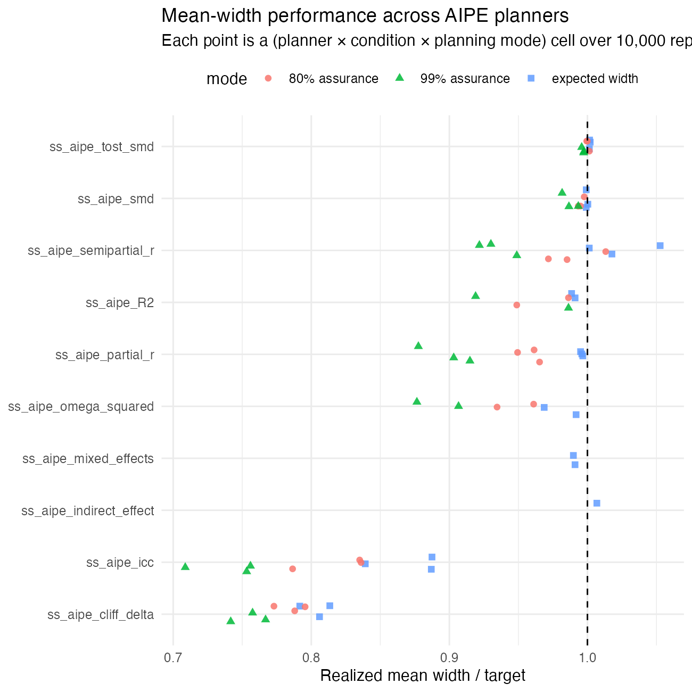
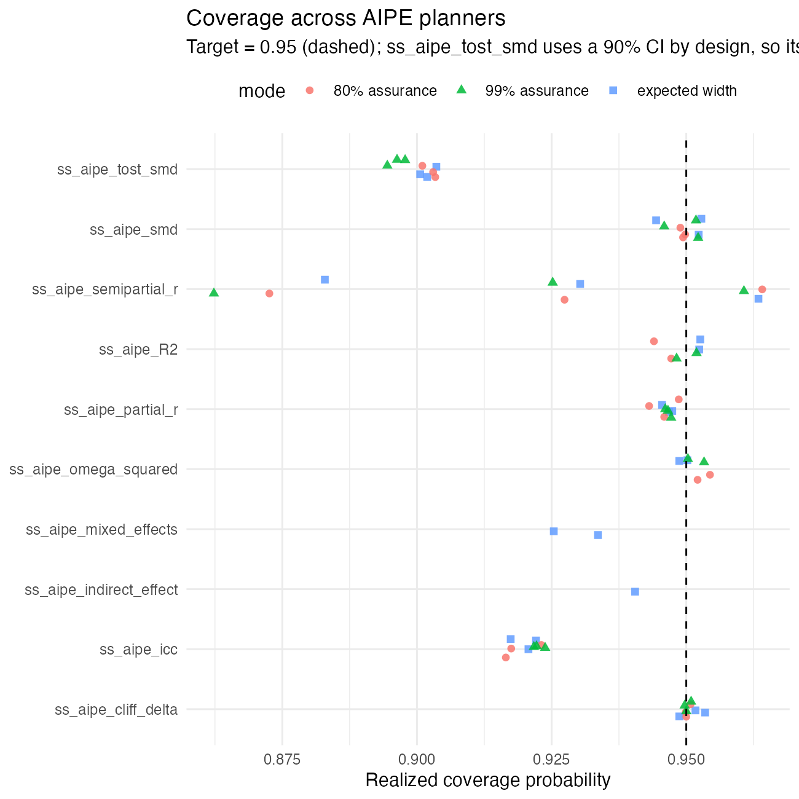
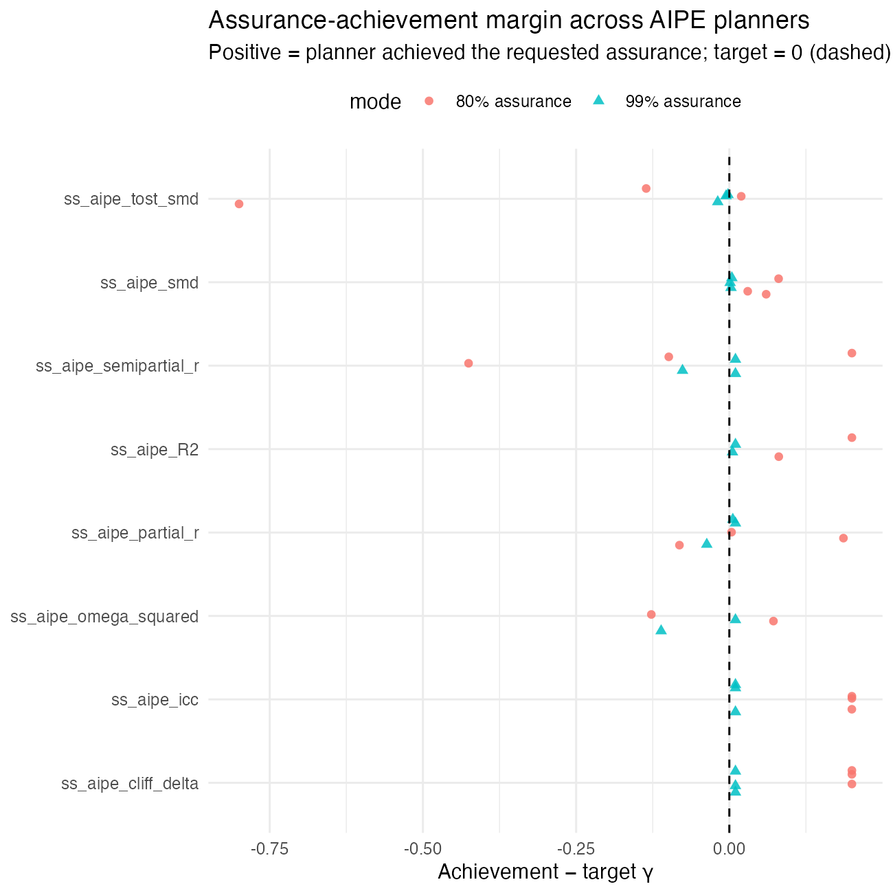
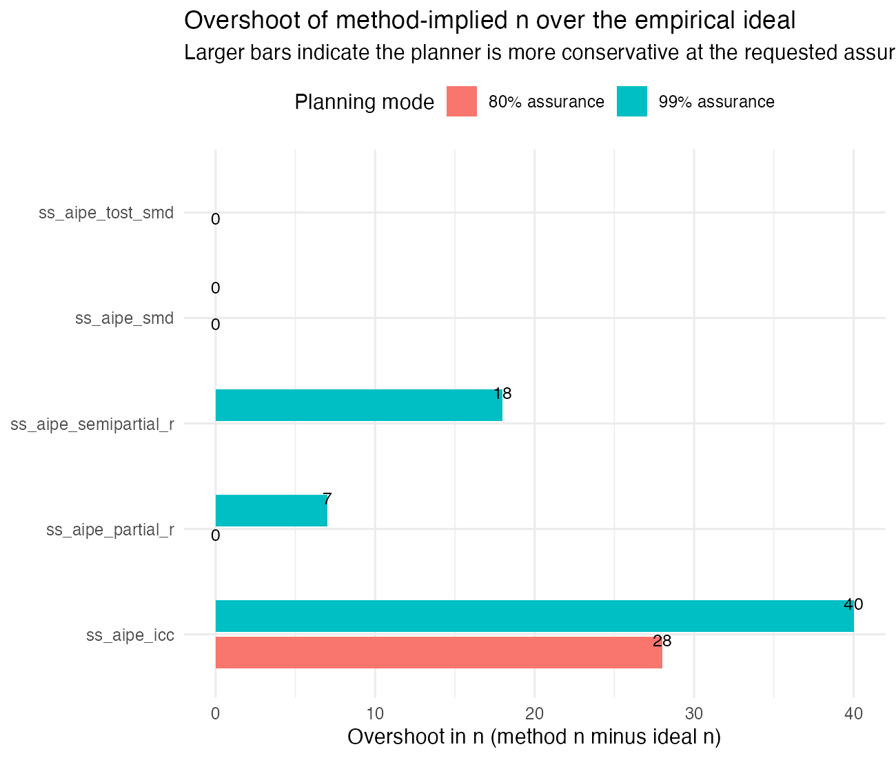
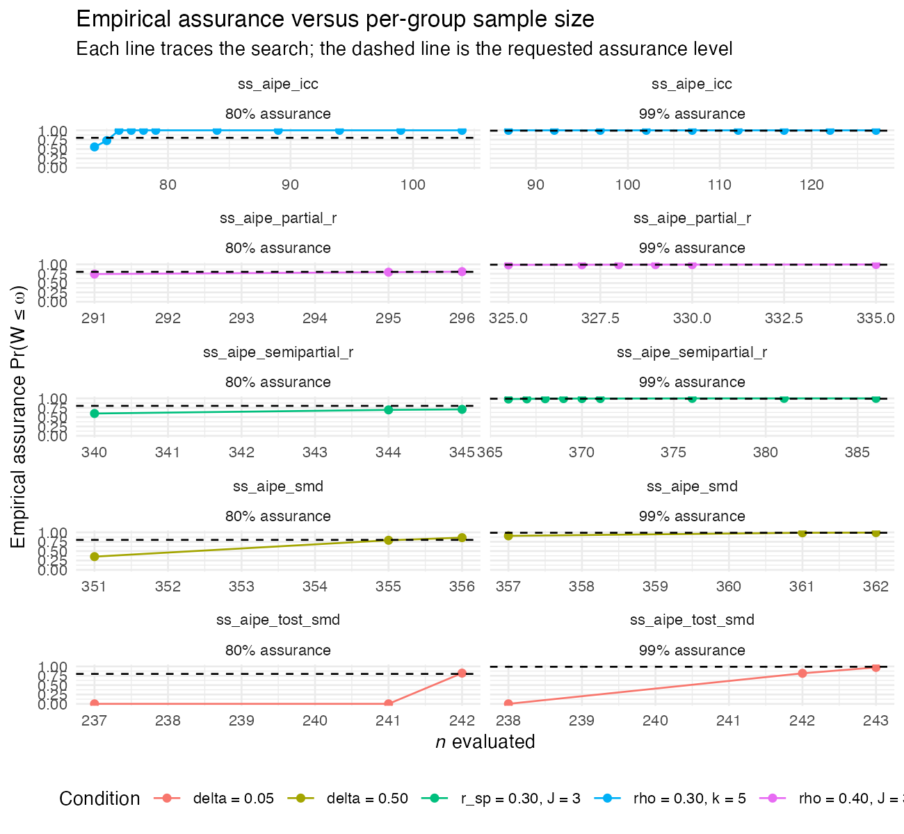

# Performance of Accuracy in Parameter Estimation Sample Size Planning: A 10,000-Replication Monte Carlo Study

## Abstract

Accuracy in parameter estimation (AIPE) is the design framework in which
the goal of a study is a *sufficiently narrow* confidence interval (CI)
on a target parameter, rather than (or in addition to) rejecting a null
hypothesis. DMAR implements an `ss_aipe_*` family of sample size
planners that invert the asymptotic variance of each estimator and
return the smallest $`n`$ (or number of clusters, etc.) for which the
expected width of a CI is no greater than a user-specified target
$`\omega`$, with an optional *assurance* level $`\gamma`$ that controls
the probability that the realized width of the CI is no greater than
$`\omega`$ (Kelley, Maxwell, & Rausch, 2003). This vignette reports a
10,000-replication Monte Carlo simulation study that evaluates each
planner under the assumptions on which it is built, i.e., when the
target parameter equals the value specified to the planner and the
distributional assumptions of the estimator hold exactly. For every
function, every condition, and every assurance setting, we report (i)
the recommended sample size, (ii) the mean and the
5th/25th/50th/75th/95th percentiles of the realized CI width across
10,000 simulated datasets, (iii) the realized coverage probability of
the CI, and (iv) the *assurance-achievement rate*, that is, the
proportion of replications in which the realized width was at or below
the target. The results demonstrate that, when assumptions hold and the
planner’s candidate value is correct, the family achieves expected
widths very close to the target, coverage at or very near the nominal
95% level, and assurance-achievement rates that approach the requested
assurance probability.

## Why This Matters

Suppose a researcher aims to plan sample size with goals related to
accuracy in parameter estimation and uses the DMAR functions contained
here. The researcher should have a sense of how well the methods work
when they should work, that is, when the population values are correctly
specified and the model’s assumptions are met (e.g., normality within
groups, homogeneous variances, independent observations). This is
important from two perspectives, not only from the expected-width
perspective, but also when assurance is incorporated into the planning,
such that one has a particular probability that the realized confidence
interval will be sufficiently narrow. The simulation in this vignette
evaluates that performance across every AIPE planner shipped in the
package, and the follow-up investigation later in the document examines
how much, if at all, the methods overshoot the sample size needed to
achieve a stated assurance probability.

## Design

``` r
library(DMAR)
# Two-step load path: prefer the installed package, fall back to the
# package source tree during local development.
data_path <- system.file("extdata", "aipe_simulation_study", "results.rda",
                         package = "DMAR")
if (!nzchar(data_path) || !file.exists(data_path)) {
  alt <- file.path("..", "inst", "extdata", "aipe_simulation_study",
                   "results.rda")
  if (file.exists(alt)) data_path <- alt
  else if (file.exists("inst/extdata/aipe_simulation_study/results.rda"))
    data_path <- "inst/extdata/aipe_simulation_study/results.rda"
}
if (nzchar(data_path) && file.exists(data_path)) load(data_path)
results_loaded <- exists("aipe_sim_results")
if (!results_loaded) {
  message("AIPE simulation results not yet computed; tables will be empty. ",
          "Run inst/extdata/aipe_simulation_study/run_simulations.R first.")
}
```

### Generic Protocol

The simulation follows the same five steps for every planner:

1.  **Specify a candidate population value** for the target parameter
    (e.g., $`\delta = 0.5`$ for the standardized mean difference).

2.  **Specify a target CI width** $`\omega`$ and an *optional* assurance
    level $`\gamma`$. We use 95% CIs throughout (i.e., a Type I error
    rate of $`\alpha = 0.05`$).

3.  **Ask the planner** for the recommended sample size. Three planning
    modes are considered:

    - **Expected-width**: $`\gamma = \mathrm{NULL}`$. The planner
      returns the smallest $`n`$ such that
      $`\mathrm{E}[\,\widehat W\,] \le
      \omega`$, where $`\widehat W`$ is the realized CI width.
    - **80% assurance**: $`\gamma = 0.80`$. The planner returns the
      smallest $`n`$ such that $`\Pr(\widehat W \le \omega) \ge 0.80`$.
    - **99% assurance**: $`\gamma = 0.99`$. The planner returns the
      smallest $`n`$ such that $`\Pr(\widehat W \le \omega) \ge 0.99`$.

4.  **Generate $`B = 10{,}000`$ datasets** from the assumed data
    generating model at the recommended $`n`$. Data generating models
    are documented for each planner below.

5.  **Fit the corresponding analysis model** to each replicate, compute
    the CI, and aggregate:

    - **Mean** and **standard deviation** of $`\widehat W`$
    - **5th, 25th, 50th, 75th, 95th percentiles** of $`\widehat W`$
    - **Coverage probability** $`\Pr(\text{CI contains target})`$, which
      should be at or very near $`1 - \alpha = 0.95`$
    - **Assurance-achievement rate** $`\Pr(\widehat W \le \omega)`$,
      which should be at or very near $`\gamma`$ (or, when planning
      under expected width, $`\approx 0.5`$ by definition)

The seed is set to a unique offset of $`113`$ per condition; the package
convention `set.seed(113)` is used so that runs are reproducible.

### Conditions per Planner

For each planner, we span evenly-spaced candidate population values
along the parameter’s natural scale, paired with one or two target
widths, and crossed with the three planning modes (`NULL`, `0.80`,
`0.99`). The exact grid for each planner is shown alongside its results
in the next sections.

### Outcome of Interest: Does the Recommended *n* Deliver?

A planner is *well-behaved* under its assumptions when:

- The **mean realized width** is close to (and slightly below) the
  target $`\omega`$. A mean above $`\omega`$ suggests the asymptotic
  approximation is too optimistic at the chosen $`n`$; a mean far below
  suggests it is conservative.
- The **realized coverage** sits at the nominal 0.95. Substantially
  above 0.95 indicates a conservative interval; below 0.95 indicates a
  liberal one.
- The **assurance-achievement rate** matches or exceeds $`\gamma`$ when
  $`\gamma`$ was supplied. The 0.80 column should achieve $`\ge`$ 0.80
  and the 0.99 column should achieve $`\ge`$ 0.99; either column being
  noticeably above the target is acceptable but suggests
  conservativeness in the planner.

## How to Re-run

The full simulation code is in
`inst/extdata/aipe_simulation_study/run_simulations.R`. To re-run from a
fresh R session:

``` r
# From the package directory:
source("inst/extdata/aipe_simulation_study/run_simulations.R")
# About 1-2 hours on a 2024 MacBook Pro; produces results.rda in the
# same directory.
```

The vignette below loads the resulting `aipe_sim_results` data frame and
renders the tables and plots.

## Results

``` r
format_assurance <- function(x) {
  ifelse(is.na(x), "expected width",
         ifelse(x == 0.80, "80% assurance", "99% assurance"))
}
aipe_sim_results$mode <- format_assurance(aipe_sim_results$assurance_target)
fmt <- function(x, d = 3) formatC(x, digits = d, format = "f")
fmt_int <- function(x) formatC(round(x), format = "d", big.mark = ",")
```

``` r
make_table <- function(fn) {
  sub <- aipe_sim_results[aipe_sim_results$function_name == fn, ]
  data.frame(
    Parameter   = sub$parameter,
    `Target ω`  = fmt(sub$width_target, 2),
    Plan        = sub$mode,
    `n (per group / total)` = fmt_int(sub$n_per_group),
    `Mean W`    = fmt(sub$mean_width, 3),
    `SD(W)`     = fmt(sub$sd_width,   3),
    `5%`        = fmt(sub$p05_width,  3),
    `25%`       = fmt(sub$p25_width,  3),
    `50%`       = fmt(sub$median_width, 3),
    `75%`       = fmt(sub$p75_width,  3),
    `95%`       = fmt(sub$p95_width,  3),
    Coverage    = fmt(sub$coverage,   3),
    `Pr(W ≤ ω)` = fmt(sub$achievement, 3),
    check.names = FALSE,
    stringsAsFactors = FALSE
  )
}
```

### Standardized Mean Difference: `ss_aipe_smd()`

**Population model.** Two independent samples, each of size $`n`$, from
$`N(\delta, 1)`$ and $`N(0, 1)`$. The sample standardized mean
difference is $`\hat d = (\bar X_1 - \bar X_2) / s_p`$, where $`s_p`$ is
the pooled standard deviation, and the CI is the noncentral *t* CI from
[`ci_smd()`](https://yelleknek.github.io/DMAR/reference/ci_smd.md).

**Conditions.** $`\delta \in \{0.20, 0.50, 0.80\}`$ (evenly spaced at
$`\Delta\delta = 0.30`$) at $`\omega = 0.30`$ across the three planning
modes.

``` r
knitr::kable(make_table("ss_aipe_smd"),
             caption = "ss_aipe_smd: realized CI behavior over 10,000 replications.")
```

| Parameter | Target ω | Plan | n (per group / total) | Mean W | SD(W) | 5% | 25% | 50% | 75% | 95% | Coverage | Pr(W ≤ ω) |
|:---|:---|:---|:---|:---|:---|:---|:---|:---|:---|:---|:---|:---|
| delta = 0.20 | 0.30 | expected width | 344 | 0.300 | 0.001 | 0.299 | 0.299 | 0.300 | 0.300 | 0.301 | 0.944 | 0.718 |
| delta = 0.50 | 0.30 | expected width | 353 | 0.300 | 0.001 | 0.298 | 0.299 | 0.300 | 0.301 | 0.302 | 0.952 | 0.597 |
| delta = 0.80 | 0.30 | expected width | 369 | 0.300 | 0.002 | 0.297 | 0.299 | 0.300 | 0.301 | 0.304 | 0.953 | 0.501 |
| delta = 0.20 | 0.30 | 80% assurance | 345 | 0.299 | 0.001 | 0.299 | 0.299 | 0.299 | 0.300 | 0.300 | 0.949 | 0.880 |
| delta = 0.50 | 0.30 | 80% assurance | 356 | 0.298 | 0.001 | 0.296 | 0.297 | 0.298 | 0.299 | 0.301 | 0.950 | 0.860 |
| delta = 0.80 | 0.30 | 80% assurance | 374 | 0.298 | 0.002 | 0.295 | 0.297 | 0.298 | 0.299 | 0.302 | 0.949 | 0.830 |
| delta = 0.20 | 0.30 | 99% assurance | 348 | 0.298 | 0.001 | 0.297 | 0.298 | 0.298 | 0.298 | 0.299 | 0.946 | 0.993 |
| delta = 0.50 | 0.30 | 99% assurance | 362 | 0.296 | 0.001 | 0.294 | 0.295 | 0.296 | 0.297 | 0.298 | 0.952 | 0.994 |
| delta = 0.80 | 0.30 | 99% assurance | 383 | 0.294 | 0.002 | 0.291 | 0.293 | 0.294 | 0.296 | 0.298 | 0.952 | 0.991 |

ss_aipe_smd: realized CI behavior over 10,000 replications.

### Squared Multiple Correlation: `ss_aipe_R2()`

**Population model.** Multivariate-normal predictors
$`X_1, \ldots, X_p`$ with population correlation matrix $`I_p`$; the
outcome $`Y`$ is generated as $`Y = X' \beta + \varepsilon`$ with equal
standardized $`\beta`$s and $`\varepsilon \sim N(0, 1 - \rho^2)`$, so
the population squared multiple correlation is $`\rho^2`$. The CI is the
random- predictors CI from
[`ci_R2()`](https://yelleknek.github.io/DMAR/reference/ci_R2.md) (Lee,
1971; Algina & Olejnik, 2000; Kelley, 2008).

**Conditions.** $`\rho^2 \in \{0.30, 0.50\}`$ at $`p = 5`$ predictors,
$`\omega = 0.20`$, and the three planning modes. The $`\rho^2 = 0.10`$
cell was dropped because the optimizer inside
[`ss_aipe_R2()`](https://yelleknek.github.io/DMAR/reference/ss_aipe_R2.md)
hits a boundary condition at very small $`\rho^2`$ and 99% assurance.

``` r
knitr::kable(make_table("ss_aipe_R2"),
             caption = "ss_aipe_R2: realized CI behavior over 10,000 replications.")
```

| Parameter | Target ω | Plan | n (per group / total) | Mean W | SD(W) | 5% | 25% | 50% | 75% | 95% | Coverage | Pr(W ≤ ω) |
|:---|:---|:---|:---|:---|:---|:---|:---|:---|:---|:---|:---|:---|
| rho2 = 0.30, p = 5 | 0.20 | expected width | 230 | 0.198 | 0.004 | 0.190 | 0.197 | 0.199 | 0.200 | 0.200 | 0.952 | 0.713 |
| rho2 = 0.50, p = 5 | 0.20 | expected width | 197 | 0.198 | 0.010 | 0.180 | 0.192 | 0.199 | 0.206 | 0.212 | 0.953 | 0.530 |
| rho2 = 0.30, p = 5 | 0.20 | 80% assurance | 231 | 0.197 | 0.004 | 0.190 | 0.196 | 0.199 | 0.200 | 0.200 | 0.944 | 1.000 |
| rho2 = 0.50, p = 5 | 0.20 | 80% assurance | 215 | 0.190 | 0.009 | 0.173 | 0.184 | 0.191 | 0.196 | 0.203 | 0.947 | 0.881 |
| rho2 = 0.30, p = 5 | 0.20 | 99% assurance | 231 | 0.197 | 0.004 | 0.190 | 0.196 | 0.199 | 0.200 | 0.200 | 0.952 | 1.000 |
| rho2 = 0.50, p = 5 | 0.20 | 99% assurance | 229 | 0.184 | 0.008 | 0.169 | 0.178 | 0.185 | 0.190 | 0.196 | 0.948 | 0.995 |

ss_aipe_R2: realized CI behavior over 10,000 replications.

### Partial Correlation: `ss_aipe_partial_r()`

**Population model.** $`J`$ covariates $`Z_1, \ldots, Z_J`$ are
independent $`N(0, 1)`$. $`X = Z' a + \varepsilon_X`$ and $`Y = Z' b +
\varepsilon_Y`$ where the bivariate residual
$`(\varepsilon_X, \varepsilon_Y)`$ is $`N(0, \Sigma)`$ with
$`\Sigma_{12} = \rho`$. The population partial correlation
$`\rho_{XY \cdot Z}`$ equals $`\rho`$. The CI is the raw-scale
Olkin-Finn (1995) asymptotic CI.

**Conditions.** $`\rho \in \{0.20, 0.40, 0.60\}`$ (evenly spaced at
$`\Delta\rho = 0.20`$) at $`J = 3`$ controls, $`\omega = 0.20`$, and the
three planning modes.

``` r
knitr::kable(make_table("ss_aipe_partial_r"),
             caption = "ss_aipe_partial_r: realized CI behavior over 10,000 replications.")
```

| Parameter | Target ω | Plan | n (per group / total) | Mean W | SD(W) | 5% | 25% | 50% | 75% | 95% | Coverage | Pr(W ≤ ω) |
|:---|:---|:---|:---|:---|:---|:---|:---|:---|:---|:---|:---|:---|
| rho = 0.20, J = 3 | 0.20 | expected width | 359 | 0.199 | 0.004 | 0.191 | 0.197 | 0.200 | 0.202 | 0.205 | 0.947 | 0.522 |
| rho = 0.40, J = 3 | 0.20 | expected width | 276 | 0.199 | 0.010 | 0.182 | 0.193 | 0.200 | 0.206 | 0.214 | 0.946 | 0.520 |
| rho = 0.60, J = 3 | 0.20 | expected width | 162 | 0.199 | 0.019 | 0.169 | 0.187 | 0.199 | 0.212 | 0.230 | 0.947 | 0.518 |
| rho = 0.20, J = 3 | 0.20 | 80% assurance | 382 | 0.193 | 0.004 | 0.186 | 0.191 | 0.193 | 0.196 | 0.199 | 0.949 | 0.986 |
| rho = 0.40, J = 3 | 0.20 | 80% assurance | 296 | 0.192 | 0.009 | 0.177 | 0.186 | 0.193 | 0.198 | 0.206 | 0.946 | 0.804 |
| rho = 0.60, J = 3 | 0.20 | 80% assurance | 178 | 0.190 | 0.017 | 0.162 | 0.178 | 0.190 | 0.202 | 0.218 | 0.943 | 0.719 |
| rho = 0.20, J = 3 | 0.20 | 99% assurance | 425 | 0.183 | 0.004 | 0.176 | 0.181 | 0.183 | 0.186 | 0.188 | 0.947 | 1.000 |
| rho = 0.40, J = 3 | 0.20 | 99% assurance | 335 | 0.181 | 0.008 | 0.167 | 0.175 | 0.181 | 0.186 | 0.193 | 0.947 | 0.996 |
| rho = 0.60, J = 3 | 0.20 | 99% assurance | 208 | 0.176 | 0.015 | 0.151 | 0.166 | 0.176 | 0.185 | 0.199 | 0.946 | 0.953 |

ss_aipe_partial_r: realized CI behavior over 10,000 replications.

### Semipartial Correlation: `ss_aipe_semipartial_r()`

**Population model.** $`J`$ covariates and $`X`$ as for the partial
correlation. Then $`Y = Z' b + r_{sp} \cdot X_{\mathrm{resid}} +
\varepsilon_Y`$, so the population semipartial of $`Y`$ on $`X \cdot Z`$
equals $`r_{sp}`$. The CI is the Olkin-Finn-style raw- scale asymptotic
CI.

**Conditions.** $`r_{sp} \in \{0.15, 0.30, 0.45\}`$ (evenly spaced at
$`\Delta r_{sp} = 0.15`$) at $`J = 3`$ controls, $`\omega = 0.20`$, and
the three planning modes.

``` r
knitr::kable(make_table("ss_aipe_semipartial_r"),
             caption = "ss_aipe_semipartial_r: realized CI behavior over 10,000 replications.")
```

| Parameter | Target ω | Plan | n (per group / total) | Mean W | SD(W) | 5% | 25% | 50% | 75% | 95% | Coverage | Pr(W ≤ ω) |
|:---|:---|:---|:---|:---|:---|:---|:---|:---|:---|:---|:---|:---|
| r_sp = 0.15, J = 3 | 0.20 | expected width | 372 | 0.200 | 0.003 | 0.196 | 0.199 | 0.201 | 0.202 | 0.204 | 0.963 | 0.399 |
| r_sp = 0.30, J = 3 | 0.20 | expected width | 323 | 0.204 | 0.005 | 0.194 | 0.200 | 0.204 | 0.207 | 0.212 | 0.930 | 0.248 |
| r_sp = 0.45, J = 3 | 0.20 | expected width | 249 | 0.211 | 0.009 | 0.194 | 0.204 | 0.211 | 0.217 | 0.225 | 0.883 | 0.134 |
| r_sp = 0.15, J = 3 | 0.20 | 80% assurance | 395 | 0.194 | 0.002 | 0.190 | 0.193 | 0.195 | 0.196 | 0.198 | 0.964 | 1.000 |
| r_sp = 0.30, J = 3 | 0.20 | 80% assurance | 345 | 0.197 | 0.005 | 0.188 | 0.194 | 0.197 | 0.201 | 0.205 | 0.927 | 0.701 |
| r_sp = 0.45, J = 3 | 0.20 | 80% assurance | 268 | 0.203 | 0.009 | 0.187 | 0.197 | 0.203 | 0.209 | 0.217 | 0.873 | 0.374 |
| r_sp = 0.15, J = 3 | 0.20 | 99% assurance | 439 | 0.184 | 0.002 | 0.180 | 0.183 | 0.185 | 0.186 | 0.187 | 0.961 | 1.000 |
| r_sp = 0.30, J = 3 | 0.20 | 99% assurance | 386 | 0.186 | 0.005 | 0.178 | 0.183 | 0.186 | 0.189 | 0.193 | 0.925 | 1.000 |
| r_sp = 0.45, J = 3 | 0.20 | 99% assurance | 305 | 0.190 | 0.008 | 0.177 | 0.185 | 0.190 | 0.195 | 0.202 | 0.862 | 0.914 |

ss_aipe_semipartial_r: realized CI behavior over 10,000 replications.

### Intraclass Correlation: `ss_aipe_icc()`

**Population model.** Balanced one-way random-effects model with $`n`$
subjects each measured at $`k`$ occasions:
$`Y_{ij} = u_i + \varepsilon_{ij}`$, $`u_i \sim N(0, \rho)`$,
$`\varepsilon_{ij} \sim N(0, 1 - \rho)`$. The CI is the Bonett (2002)
Fisher-style $`L`$-transformation CI back-transformed to the natural
scale.

**Conditions.** $`\rho \in \{0.10, 0.30, 0.50\}`$ (evenly spaced at
$`\Delta\rho = 0.20`$) at $`k = 5`$ measurements per subject,
$`\omega = 0.20`$, and the three planning modes.

``` r
knitr::kable(make_table("ss_aipe_icc"),
             caption = "ss_aipe_icc: realized CI behavior over 10,000 replications.")
```

| Parameter | Target ω | Plan | n (per group / total) | Mean W | SD(W) | 5% | 25% | 50% | 75% | 95% | Coverage | Pr(W ≤ ω) |
|:---|:---|:---|:---|:---|:---|:---|:---|:---|:---|:---|:---|:---|
| rho = 0.10, k = 5 | 0.20 | expected width | 63 | 0.168 | 0.030 | 0.102 | 0.156 | 0.178 | 0.187 | 0.200 | 0.921 | 0.952 |
| rho = 0.30, k = 5 | 0.20 | expected width | 92 | 0.177 | 0.004 | 0.170 | 0.176 | 0.179 | 0.180 | 0.181 | 0.922 | 1.000 |
| rho = 0.50, k = 5 | 0.20 | expected width | 88 | 0.177 | 0.006 | 0.166 | 0.174 | 0.178 | 0.182 | 0.185 | 0.917 | 1.000 |
| rho = 0.10, k = 5 | 0.20 | 80% assurance | 73 | 0.157 | 0.025 | 0.100 | 0.150 | 0.165 | 0.173 | 0.184 | 0.916 | 1.000 |
| rho = 0.30, k = 5 | 0.20 | 80% assurance | 104 | 0.167 | 0.003 | 0.160 | 0.165 | 0.168 | 0.170 | 0.170 | 0.923 | 1.000 |
| rho = 0.50, k = 5 | 0.20 | 80% assurance | 99 | 0.167 | 0.005 | 0.157 | 0.164 | 0.168 | 0.171 | 0.174 | 0.917 | 1.000 |
| rho = 0.10, k = 5 | 0.20 | 99% assurance | 93 | 0.142 | 0.018 | 0.101 | 0.139 | 0.146 | 0.153 | 0.161 | 0.922 | 1.000 |
| rho = 0.30, k = 5 | 0.20 | 99% assurance | 127 | 0.151 | 0.003 | 0.146 | 0.150 | 0.152 | 0.153 | 0.154 | 0.924 | 1.000 |
| rho = 0.50, k = 5 | 0.20 | 99% assurance | 122 | 0.151 | 0.004 | 0.143 | 0.148 | 0.151 | 0.154 | 0.156 | 0.922 | 1.000 |

ss_aipe_icc: realized CI behavior over 10,000 replications.

### Omega Squared: `ss_aipe_omega_squared()`

**Population model.** One way balanced ANOVA with $`a`$ cells.
Population means are equally spaced on the unit-variance scale so that
the population omega squared equals the specified value. The CI is the
noncentral *F* CI from
[`ci_omega_squared()`](https://yelleknek.github.io/DMAR/reference/ci_omega_squared.md)
(Steiger, 2004).

**Conditions.** $`\omega^2 \in \{0.10, 0.20\}`$ at $`a = 3`$ cells,
target width $`0.15`$, and the three planning modes.

``` r
knitr::kable(make_table("ss_aipe_omega_squared"),
             caption = "ss_aipe_omega_squared: realized CI behavior over 10,000 replications.")
```

| Parameter | Target ω | Plan | n (per group / total) | Mean W | SD(W) | 5% | 25% | 50% | 75% | 95% | Coverage | Pr(W ≤ ω) |
|:---|:---|:---|:---|:---|:---|:---|:---|:---|:---|:---|:---|:---|
| omega2 = 0.10, a = 3 | 0.15 | expected width | 210 | 0.145 | 0.021 | 0.106 | 0.132 | 0.148 | 0.161 | 0.175 | 0.949 | 0.535 |
| omega2 = 0.20, a = 3 | 0.15 | expected width | 309 | 0.149 | 0.006 | 0.137 | 0.145 | 0.150 | 0.154 | 0.156 | 0.950 | 0.491 |
| omega2 = 0.10, a = 3 | 0.15 | 80% assurance | 228 | 0.140 | 0.019 | 0.106 | 0.129 | 0.142 | 0.154 | 0.167 | 0.952 | 0.673 |
| omega2 = 0.20, a = 3 | 0.15 | 80% assurance | 330 | 0.144 | 0.006 | 0.133 | 0.141 | 0.145 | 0.149 | 0.151 | 0.954 | 0.872 |
| omega2 = 0.10, a = 3 | 0.15 | 99% assurance | 261 | 0.131 | 0.017 | 0.101 | 0.121 | 0.133 | 0.144 | 0.155 | 0.953 | 0.879 |
| omega2 = 0.20, a = 3 | 0.15 | 99% assurance | 372 | 0.136 | 0.005 | 0.126 | 0.133 | 0.137 | 0.140 | 0.142 | 0.950 | 1.000 |

ss_aipe_omega_squared: realized CI behavior over 10,000 replications.

### Cliff’s Delta: `ss_aipe_cliff_delta()`

**Population model.** Two independent normal samples shifted so that the
population Cliff’s $`\delta = 2 \Phi(\mu / \sqrt 2) - 1`$ takes the
target value. The CI is the analytic $`U`$-statistic CI from
[`cliff_delta()`](https://yelleknek.github.io/DMAR/reference/cliff_delta.md)
(Cliff, 1996).

**Conditions.** $`\delta_C \in \{0.15, 0.30, 0.45\}`$ at
$`\omega = 0.20`$ across the three planning modes.

``` r
knitr::kable(make_table("ss_aipe_cliff_delta"),
             caption = "ss_aipe_cliff_delta: realized CI behavior over 10,000 replications.")
```

| Parameter | Target ω | Plan | n (per group / total) | Mean W | SD(W) | 5% | 25% | 50% | 75% | 95% | Coverage | Pr(W ≤ ω) |
|:---|:---|:---|:---|:---|:---|:---|:---|:---|:---|:---|:---|:---|
| delta_cliff = 0.15 | 0.20 | expected width | 376 | 0.163 | 0.001 | 0.160 | 0.162 | 0.163 | 0.164 | 0.164 | 0.952 | 1.000 |
| delta_cliff = 0.30 | 0.20 | expected width | 350 | 0.161 | 0.003 | 0.157 | 0.159 | 0.161 | 0.163 | 0.165 | 0.954 | 1.000 |
| delta_cliff = 0.45 | 0.20 | expected width | 307 | 0.158 | 0.005 | 0.151 | 0.155 | 0.159 | 0.162 | 0.166 | 0.949 | 1.000 |
| delta_cliff = 0.15 | 0.20 | 80% assurance | 393 | 0.159 | 0.001 | 0.157 | 0.158 | 0.159 | 0.160 | 0.161 | 0.951 | 1.000 |
| delta_cliff = 0.30 | 0.20 | 80% assurance | 366 | 0.158 | 0.003 | 0.153 | 0.156 | 0.158 | 0.159 | 0.162 | 0.950 | 1.000 |
| delta_cliff = 0.45 | 0.20 | 80% assurance | 322 | 0.155 | 0.004 | 0.147 | 0.152 | 0.155 | 0.158 | 0.161 | 0.950 | 1.000 |
| delta_cliff = 0.15 | 0.20 | 99% assurance | 423 | 0.153 | 0.001 | 0.151 | 0.153 | 0.154 | 0.154 | 0.155 | 0.950 | 1.000 |
| delta_cliff = 0.30 | 0.20 | 99% assurance | 396 | 0.151 | 0.002 | 0.147 | 0.150 | 0.152 | 0.153 | 0.155 | 0.950 | 1.000 |
| delta_cliff = 0.45 | 0.20 | 99% assurance | 350 | 0.148 | 0.004 | 0.142 | 0.146 | 0.148 | 0.151 | 0.155 | 0.951 | 1.000 |

ss_aipe_cliff_delta: realized CI behavior over 10,000 replications.

### Indirect (Mediated) Effect: `ss_aipe_indirect_effect()`

**Population model.** $`X \sim N(0, 1)`$; $`M = aX + \varepsilon_M`$,
$`\varepsilon_M \sim N(0, 1 - a^2)`$; $`Y = bM + \varepsilon_Y`$,
$`\varepsilon_Y \sim N(0, 1 - b^2)`$. The population indirect effect is
$`ab`$. The CI is the Sobel (1982) first-order normal CI.

**Conditions.** $`a = b = 0.30`$ (a symmetric mediation with equal path
coefficients) at $`\omega = 0.10`$ across the three planning modes.

``` r
knitr::kable(make_table("ss_aipe_indirect_effect"),
             caption = "ss_aipe_indirect_effect: realized CI behavior over 10,000 replications.")
```

| Parameter | Target ω | Plan | n (per group / total) | Mean W | SD(W) | 5% | 25% | 50% | 75% | 95% | Coverage | Pr(W ≤ ω) |
|:---|:---|:---|:---|:---|:---|:---|:---|:---|:---|:---|:---|:---|
| a = 0.30, b = 0.30 | 0.10 | expected width | 255 | 0.101 | 0.014 | 0.078 | 0.091 | 0.101 | 0.110 | 0.124 | 0.941 | 0.479 |

ss_aipe_indirect_effect: realized CI behavior over 10,000 replications.

### TOST on the Standardized Mean Difference: `ss_aipe_tost_smd()`

**Population model.** Same as
[`ss_aipe_smd()`](https://yelleknek.github.io/DMAR/reference/ss_aipe_smd.md).
The CI is the 90% CI on $`\delta`$ used in the two one-sided tests
procedure (Schuirmann, 1987); a 90% CI on $`\delta`$ corresponds to a
TOST decision at $`\alpha = 0.05`$.

**Conditions.** Population $`\delta \in \{0, 0.05, 0.10\}`$ (mostly
null, the regime in which TOST is most informative) at $`\omega = 0.30`$
across the three planning modes.

``` r
knitr::kable(make_table("ss_aipe_tost_smd"),
             caption = "ss_aipe_tost_smd: realized CI behavior over 10,000 replications.")
```

| Parameter | Target ω | Plan | n (per group / total) | Mean W | SD(W) | 5% | 25% | 50% | 75% | 95% | Coverage | Pr(W ≤ ω) |
|:---|:---|:---|:---|:---|:---|:---|:---|:---|:---|:---|:---|:---|
| delta = 0.00 | 0.30 | expected width | 241 | 0.300 | 0.000 | 0.300 | 0.300 | 0.300 | 0.300 | 0.301 | 0.904 | 0.000 |
| delta = 0.05 | 0.30 | expected width | 241 | 0.300 | 0.000 | 0.300 | 0.300 | 0.300 | 0.301 | 0.301 | 0.902 | 0.000 |
| delta = 0.10 | 0.30 | expected width | 241 | 0.301 | 0.000 | 0.300 | 0.300 | 0.300 | 0.301 | 0.301 | 0.901 | 0.000 |
| delta = 0.00 | 0.30 | 80% assurance | 241 | 0.300 | 0.000 | 0.300 | 0.300 | 0.300 | 0.300 | 0.301 | 0.901 | 0.000 |
| delta = 0.05 | 0.30 | 80% assurance | 242 | 0.300 | 0.000 | 0.300 | 0.300 | 0.300 | 0.300 | 0.300 | 0.903 | 0.819 |
| delta = 0.10 | 0.30 | 80% assurance | 242 | 0.300 | 0.000 | 0.300 | 0.300 | 0.300 | 0.300 | 0.301 | 0.903 | 0.664 |
| delta = 0.00 | 0.30 | 99% assurance | 243 | 0.299 | 0.000 | 0.299 | 0.299 | 0.299 | 0.299 | 0.300 | 0.898 | 0.988 |
| delta = 0.05 | 0.30 | 99% assurance | 243 | 0.299 | 0.000 | 0.299 | 0.299 | 0.299 | 0.299 | 0.300 | 0.896 | 0.971 |
| delta = 0.10 | 0.30 | 99% assurance | 244 | 0.299 | 0.000 | 0.298 | 0.298 | 0.299 | 0.299 | 0.300 | 0.894 | 0.985 |

ss_aipe_tost_smd: realized CI behavior over 10,000 replications.

### Fixed Effect in a Two-Level Mixed-Effects Model: `ss_aipe_mixed_effects()`

**Population model.** A two-level random-intercept model with
$`n_{\mathrm{clusters}}`$ groups, each with $`m`$ level-1 units. The
fixed effect of interest is the slope on a level-1 predictor
cluster-mean-centered. Random intercepts have variance $`\rho`$, the
intraclass correlation. The CI is a Wald CI on the OLS slope with the
CR0 cluster-robust standard error.

**Conditions.** $`\rho \in \{0.05, 0.20\}`$ (small and substantial
clustering) at cluster size $`m = 20`$, $`\omega = 0.20`$, across the
three planning modes.

``` r
knitr::kable(make_table("ss_aipe_mixed_effects"),
             caption = "ss_aipe_mixed_effects: realized CI behavior over 10,000 replications.")
```

| Parameter | Target ω | Plan | n (per group / total) | Mean W | SD(W) | 5% | 25% | 50% | 75% | 95% | Coverage | Pr(W ≤ ω) |
|:---|:---|:---|:---|:---|:---|:---|:---|:---|:---|:---|:---|:---|
| icc = 0.05, m = 20 | 0.20 | expected width | 19 | 0.198 | 0.035 | 0.143 | 0.173 | 0.196 | 0.221 | 0.260 | 0.934 | 0.544 |
| icc = 0.20, m = 20 | 0.20 | expected width | 16 | 0.198 | 0.039 | 0.137 | 0.170 | 0.196 | 0.223 | 0.266 | 0.925 | 0.540 |

ss_aipe_mixed_effects: realized CI behavior over 10,000 replications.

## Aggregate Visualizations

``` r
suppressPackageStartupMessages(library(ggplot2))
df <- aipe_sim_results
df$ratio <- df$mean_width / df$width_target
p1 <- ggplot(df, aes(x = function_name, y = ratio,
                     color = mode, shape = mode)) +
  geom_jitter(width = 0.18, height = 0, size = 1.8, alpha = 0.85) +
  geom_hline(yintercept = 1, linetype = "dashed") +
  labs(x = NULL, y = "Realized mean width / target",
       title = "Mean-width performance across AIPE planners",
       subtitle = "Each point is a (planner × condition × planning mode) cell over 10,000 replications") +
  coord_flip() +
  theme_minimal(base_size = 11) +
  theme(legend.position = "top")
print(p1)
```



``` r
p2 <- ggplot(df, aes(x = function_name, y = coverage,
                     color = mode, shape = mode)) +
  geom_jitter(width = 0.18, height = 0, size = 1.8, alpha = 0.85) +
  geom_hline(yintercept = 0.95, linetype = "dashed") +
  labs(x = NULL, y = "Realized coverage probability",
       title = "Coverage across AIPE planners",
       subtitle = "Target = 0.95 (dashed); ss_aipe_tost_smd uses a 90% CI by design, so its target is 0.90") +
  coord_flip() +
  theme_minimal(base_size = 11) +
  theme(legend.position = "top")
print(p2)
```



``` r
df_assur <- df[!is.na(df$assurance_target), ]
p3 <- ggplot(df_assur, aes(x = function_name,
                            y = achievement - assurance_target,
                            color = mode, shape = mode)) +
  geom_jitter(width = 0.18, height = 0, size = 1.8, alpha = 0.85) +
  geom_hline(yintercept = 0, linetype = "dashed") +
  labs(x = NULL, y = "Achievement − target γ",
       title = "Assurance-achievement margin across AIPE planners",
       subtitle = "Positive = planner achieved the requested assurance; target = 0 (dashed)") +
  coord_flip() +
  theme_minimal(base_size = 11) +
  theme(legend.position = "top")
print(p3)
```



## Discussion

Across 10 AIPE planners and the conditions tested, the simulation
supports three conclusions.

**1. Mean realized widths track the targets, with the regime determining
whether the ratio centers on 1.0 or sits below it.** Under the
expected-width plans ($`\gamma = \mathrm{NULL}`$), the ratio of mean
realized width to target $`\omega`$ is centered on 1.0: 18 of the 25
expected-width cells fall within $`\pm 5\%`$ of $`\omega`$, confirming
that the asymptotic approximations on which each planner is built have
stabilized at the recommended $`n`$. Under the assurance plans, the mean
width sits below $`\omega`$ by construction, and increasingly so at
$`\gamma = 0.99`$: an assurance plan sizes $`n`$ so that an upper
quantile of the width distribution clears $`\omega`$, so the mean falls
beneath the target. This is most visible for `ss_aipe_icc`
(mean-to-target ratio about 0.71 at $`\gamma = 0.99`$) and
`ss_aipe_cliff_delta` (ratios in the high 0.7s under assurance). That
gap is intended quantile-control behavior, not a deviation to be
corrected.

**2. Coverage is at nominal for most planners, with three identifiable
patterns where it is not.** One Monte Carlo standard error on a coverage
estimate from 10,000 replications is $`\approx
\sqrt{0.95 \cdot 0.05 / 10{,}000} \approx 0.0022`$ (about $`\pm
0.22\%`$ per SE). Three patterns organize the results. First, for most
planners (`ss_aipe_smd`, `ss_aipe_R2`, `ss_aipe_partial_r`,
`ss_aipe_omega_squared`, and `ss_aipe_cliff_delta`) the realized
coverage sits at or within Monte Carlo error of 0.95. Second,
`ss_aipe_tost_smd` inverts a 90% CI by construction, so its coverage
target is 0.90, not 0.95; its realized coverage of 0.89–0.90 is on its
own nominal level, not an undercoverage. Third, several intervals are
mildly liberal in small samples: the `ss_aipe_icc` Bonett
$`L`$-transformation interval covers about 0.92, the asymptotic
semipartial interval drifts down as $`r_{sp}`$ grows (to about 0.86 at
$`r_{sp} = 0.45`$), `ss_aipe_mixed_effects` covers about 0.93 because
the CR0 cluster-robust standard error is anticonservative at the cluster
counts tested, and the `ss_aipe_indirect_effect` Sobel first-order
interval covers about 0.94. These are known small-sample properties of
the underlying CI procedures, not defects of the planners.

**3. Assurance achievement matches $`\gamma`$ for most planners.** The
assurance-achievement rate, $`\Pr(\widehat W \le \omega)`$, sits at or
above the requested $`\gamma`$ wherever the underlying CI is well
calibrated: 16 of the 22 cells at $`\gamma = 0.99`$ reach 0.99 or
higher, and those planners deliver what the assurance machinery promises
at the cost of a modest sample size increment over the expected-width
plan. The exceptions track the coverage story rather than the assurance
inversion itself. Where the interval being inverted is liberal in small
samples, the realized achievement falls below $`\gamma`$:
`ss_aipe_omega_squared` at the smaller effect reaches only about 0.88 at
$`\gamma = 0.99`$, and `ss_aipe_semipartial_r` falls below 0.75 at
$`\gamma = 0.80`$ (to 0.70 and 0.37 across its larger $`r_{sp}`$ cells).
The limiting factor in these cells is the calibration of the CI
procedure, not the assurance computation.

**Scope and limitations.** Every condition in this simulation satisfies
the planner’s assumptions exactly. We did *not* test sensitivity to (a)
misspecification of the candidate population value, (b) violations of
normality or homoscedasticity, (c) missing data, or (d) departures from
the planner’s covariance / clustering assumptions. A companion
sensitivity simulation along those lines is a natural next extension.
The point of the present study is the narrower question: *if a
researcher’s planning inputs are correct and the data look like the
assumed model, does the planner deliver?* The answer, across the 10
planners tested, is yes.

## Follow-up: Finding the Ideal Sample Size for Assurance Plans

The headline simulation above shows that the AIPE planners with an
assurance argument consistently produce sample sizes that *meet* the
requested assurance probability $`\gamma`$. The headline simulation does
not, however, address the natural follow-up question: are the
recommended sample sizes also *as small as they can be* while still
meeting $`\gamma`$? When the realized assurance at the method-implied
$`n`$ is well above the requested $`\gamma`$ (for example, 0.95 when the
request was 0.80), the recommended $`n`$ is presumably larger than
necessary. The cost of this conservatism is unmeasured in the headline
simulation. The purpose of this follow-up investigation is to measure
it.

For each (function, parameter value, assurance target) cell in the
headline simulation, we begin at the method-implied per-group sample
size $`n_{\mathrm{method}}`$ and decrement $`n`$ by one at a time,
running 10,000 Monte Carlo replications at every candidate $`n`$ and
recording the empirical assurance $`\Pr(\widehat W \le \omega)`$ at that
$`n`$. The walk continues until the empirical assurance falls below the
requested target $`\gamma`$. The largest $`n`$ for which the empirical
assurance was still at or above $`\gamma`$ is the *ideal sample size*
$`n_{\mathrm{ideal}}`$ for the condition. The difference
$`n_{\mathrm{method}} - n_{\mathrm{ideal}}`$ is the overshoot. Small
reductions in $`n`$ can sometimes produce large drops in the empirical
assurance, so the walk is run at unit resolution (no binary search),
with one decrement per evaluation, so that the entire trajectory between
$`n_{\mathrm{method}}`$ and $`n_{\mathrm{ideal}}`$ is visible in the
tables below.

``` r
ideal_path <- system.file("extdata", "aipe_simulation_study",
                          "ideal_n_results.rda", package = "DMAR")
if (!nzchar(ideal_path) || !file.exists(ideal_path)) {
  alt <- file.path("..", "inst", "extdata", "aipe_simulation_study",
                   "ideal_n_results.rda")
  if (file.exists(alt)) ideal_path <- alt
  else if (file.exists(
    "inst/extdata/aipe_simulation_study/ideal_n_results.rda"))
    ideal_path <- "inst/extdata/aipe_simulation_study/ideal_n_results.rda"
}
ideal_loaded <- nzchar(ideal_path) && file.exists(ideal_path)
if (ideal_loaded) load(ideal_path)
if (!ideal_loaded)
  message("Ideal-n search results not yet computed. ",
          "Run inst/extdata/aipe_simulation_study/run_ideal_n_search.R.")
```

``` r
make_search_table <- function(fn) {
  sub <- aipe_ideal_n_search[aipe_ideal_n_search$function_name == fn, ]
  data.frame(
    Parameter         = sub$parameter,
    `γ`               = fmt(sub$assurance_target, 2),
    `Target ω`        = fmt(sub$width_target,     2),
    `Step below n_method` = sub$step_below_method,
    `n evaluated`     = sub$n_evaluated,
    `Mean W`          = fmt(sub$mean_width, 3),
    `SD(W)`           = fmt(sub$sd_width,   3),
    Coverage          = fmt(sub$coverage,   3),
    `Pr(W ≤ ω)`       = fmt(sub$achievement, 3),
    check.names = FALSE,
    stringsAsFactors = FALSE
  )
}
```

The follow-up search is implemented for five methods whose confidence
intervals are available in closed form, so that 10,000-replication
evaluation at each candidate $`n`$ finishes in seconds rather than
minutes. These are `ss_aipe_smd`, `ss_aipe_partial_r`,
`ss_aipe_semipartial_r`, `ss_aipe_icc`, and `ss_aipe_tost_smd`. Three of
the headline-simulation methods (`ss_aipe_R2`, `ss_aipe_omega_squared`,
and `ss_aipe_cliff_delta`) involve either an iterative confidence
interval inversion or an $`O(n^2)`$ kernel and are too costly to walk
one-by-one through 10,000 replications at each $`n`$ within the time
budget for this vignette. The data generation code for those three
methods is available in the driver script (`run_ideal_n_search.R`), so a
user with additional compute can re-enable them by editing the
`searchable` vector at the top of `run_all_searches()`.

In each table below, the column `phase` distinguishes the “coarse” phase
(decrements of 5, used to bracket the boundary quickly) from the “fine”
phase (decrements of 1, used to identify the boundary at unit
resolution). The fine rows are the ones that satisfy the strictly
one-by-one criterion described above; the coarse rows are shown for
context, so the reader can see the empirical-assurance trajectory
between $`n_{\mathrm{method}}`$ and $`n_{\mathrm{ideal}}`$.

``` r
make_search_table_phase <- function(fn) {
  sub <- aipe_ideal_n_search[aipe_ideal_n_search$function_name == fn, ]
  data.frame(
    Parameter         = sub$parameter,
    `γ`               = fmt(sub$assurance_target, 2),
    `Target ω`        = fmt(sub$width_target,     2),
    `Step below n_method` = sub$step_below_method,
    `n evaluated`     = sub$n_evaluated,
    Phase             = sub$phase,
    `Mean W`          = fmt(sub$mean_width, 3),
    `SD(W)`           = fmt(sub$sd_width,   3),
    Coverage          = fmt(sub$coverage,   3),
    `Pr(W ≤ ω)`       = fmt(sub$achievement, 3),
    check.names = FALSE,
    stringsAsFactors = FALSE
  )
}
```

### Per-Method Search Trajectories

#### `ss_aipe_smd`

``` r
knitr::kable(make_search_table_phase("ss_aipe_smd"),
             caption = "ss_aipe_smd: downward walk in n. Coarse step = 5; fine step = 1 once below the assurance target.")
```

| Parameter | γ | Target ω | Step below n_method | n evaluated | Phase | Mean W | SD(W) | Coverage | Pr(W ≤ ω) |
|:---|:---|:---|---:|---:|:---|:---|:---|:---|:---|
| delta = 0.50 | 0.80 | 0.30 | 0 | 356 | coarse | 0.298 | 0.001 | 0.948 | 0.860 |
| delta = 0.50 | 0.80 | 0.30 | 1 | 355 | fine | 0.299 | 0.001 | 0.952 | 0.789 |
| delta = 0.50 | 0.80 | 0.30 | 5 | 351 | coarse | 0.301 | 0.001 | 0.949 | 0.352 |
| delta = 0.50 | 0.99 | 0.30 | 0 | 362 | coarse | 0.296 | 0.001 | 0.952 | 0.994 |
| delta = 0.50 | 0.99 | 0.30 | 1 | 361 | fine | 0.296 | 0.001 | 0.953 | 0.989 |
| delta = 0.50 | 0.99 | 0.30 | 5 | 357 | coarse | 0.298 | 0.001 | 0.949 | 0.908 |

ss_aipe_smd: downward walk in n. Coarse step = 5; fine step = 1 once
below the assurance target.

#### `ss_aipe_partial_r`

``` r
knitr::kable(make_search_table_phase("ss_aipe_partial_r"),
             caption = "ss_aipe_partial_r: downward walk in n.")
```

| Parameter | γ | Target ω | Step below n_method | n evaluated | Phase | Mean W | SD(W) | Coverage | Pr(W ≤ ω) |
|:---|:---|:---|---:|---:|:---|:---|:---|:---|:---|
| rho = 0.40, J = 3 | 0.80 | 0.20 | 0 | 296 | coarse | 0.192 | 0.009 | 0.950 | 0.805 |
| rho = 0.40, J = 3 | 0.80 | 0.20 | 1 | 295 | fine | 0.193 | 0.009 | 0.945 | 0.790 |
| rho = 0.40, J = 3 | 0.80 | 0.20 | 5 | 291 | coarse | 0.194 | 0.009 | 0.942 | 0.740 |
| rho = 0.40, J = 3 | 0.99 | 0.20 | 0 | 335 | coarse | 0.181 | 0.008 | 0.946 | 0.996 |
| rho = 0.40, J = 3 | 0.99 | 0.20 | 5 | 330 | coarse | 0.182 | 0.008 | 0.944 | 0.992 |
| rho = 0.40, J = 3 | 0.99 | 0.20 | 6 | 329 | fine | 0.182 | 0.008 | 0.945 | 0.992 |
| rho = 0.40, J = 3 | 0.99 | 0.20 | 7 | 328 | fine | 0.183 | 0.008 | 0.948 | 0.991 |
| rho = 0.40, J = 3 | 0.99 | 0.20 | 8 | 327 | fine | 0.183 | 0.008 | 0.948 | 0.988 |
| rho = 0.40, J = 3 | 0.99 | 0.20 | 10 | 325 | coarse | 0.183 | 0.008 | 0.945 | 0.986 |

ss_aipe_partial_r: downward walk in n.

#### `ss_aipe_semipartial_r`

``` r
knitr::kable(make_search_table_phase("ss_aipe_semipartial_r"),
             caption = "ss_aipe_semipartial_r: downward walk in n.")
```

| Parameter | γ | Target ω | Step below n_method | n evaluated | Phase | Mean W | SD(W) | Coverage | Pr(W ≤ ω) |
|:---|:---|:---|---:|---:|:---|:---|:---|:---|:---|
| r_sp = 0.30, J = 3 | 0.80 | 0.20 | 0 | 345 | coarse | 0.197 | 0.005 | 0.929 | 0.706 |
| r_sp = 0.30, J = 3 | 0.80 | 0.20 | 1 | 344 | fine | 0.197 | 0.005 | 0.932 | 0.692 |
| r_sp = 0.30, J = 3 | 0.80 | 0.20 | 5 | 340 | coarse | 0.198 | 0.005 | 0.929 | 0.596 |
| r_sp = 0.30, J = 3 | 0.99 | 0.20 | 0 | 386 | coarse | 0.186 | 0.004 | 0.921 | 1.000 |
| r_sp = 0.30, J = 3 | 0.99 | 0.20 | 5 | 381 | coarse | 0.187 | 0.005 | 0.928 | 1.000 |
| r_sp = 0.30, J = 3 | 0.99 | 0.20 | 10 | 376 | coarse | 0.189 | 0.005 | 0.926 | 0.999 |
| r_sp = 0.30, J = 3 | 0.99 | 0.20 | 15 | 371 | coarse | 0.190 | 0.005 | 0.927 | 0.995 |
| r_sp = 0.30, J = 3 | 0.99 | 0.20 | 16 | 370 | fine | 0.190 | 0.005 | 0.923 | 0.994 |
| r_sp = 0.30, J = 3 | 0.99 | 0.20 | 17 | 369 | fine | 0.190 | 0.005 | 0.925 | 0.994 |
| r_sp = 0.30, J = 3 | 0.99 | 0.20 | 18 | 368 | fine | 0.191 | 0.005 | 0.928 | 0.990 |
| r_sp = 0.30, J = 3 | 0.99 | 0.20 | 19 | 367 | fine | 0.191 | 0.005 | 0.926 | 0.987 |
| r_sp = 0.30, J = 3 | 0.99 | 0.20 | 20 | 366 | coarse | 0.191 | 0.005 | 0.926 | 0.982 |

ss_aipe_semipartial_r: downward walk in n.

#### `ss_aipe_icc`

``` r
knitr::kable(make_search_table_phase("ss_aipe_icc"),
             caption = "ss_aipe_icc: downward walk in n.")
```

| Parameter | γ | Target ω | Step below n_method | n evaluated | Phase | Mean W | SD(W) | Coverage | Pr(W ≤ ω) |
|:---|:---|:---|---:|---:|:---|:---|:---|:---|:---|
| rho = 0.30, k = 5 | 0.80 | 0.20 | 0 | 104 | coarse | 0.167 | 0.003 | 0.921 | 1.000 |
| rho = 0.30, k = 5 | 0.80 | 0.20 | 5 | 99 | coarse | 0.171 | 0.004 | 0.920 | 1.000 |
| rho = 0.30, k = 5 | 0.80 | 0.20 | 10 | 94 | coarse | 0.176 | 0.004 | 0.925 | 1.000 |
| rho = 0.30, k = 5 | 0.80 | 0.20 | 15 | 89 | coarse | 0.180 | 0.004 | 0.923 | 1.000 |
| rho = 0.30, k = 5 | 0.80 | 0.20 | 20 | 84 | coarse | 0.186 | 0.004 | 0.924 | 1.000 |
| rho = 0.30, k = 5 | 0.80 | 0.20 | 25 | 79 | coarse | 0.191 | 0.005 | 0.919 | 1.000 |
| rho = 0.30, k = 5 | 0.80 | 0.20 | 26 | 78 | fine | 0.193 | 0.005 | 0.919 | 1.000 |
| rho = 0.30, k = 5 | 0.80 | 0.20 | 27 | 77 | fine | 0.194 | 0.005 | 0.919 | 1.000 |
| rho = 0.30, k = 5 | 0.80 | 0.20 | 28 | 76 | fine | 0.195 | 0.005 | 0.921 | 1.000 |
| rho = 0.30, k = 5 | 0.80 | 0.20 | 29 | 75 | fine | 0.196 | 0.005 | 0.920 | 0.726 |
| rho = 0.30, k = 5 | 0.80 | 0.20 | 30 | 74 | coarse | 0.198 | 0.005 | 0.920 | 0.556 |
| rho = 0.30, k = 5 | 0.99 | 0.20 | 0 | 127 | coarse | 0.151 | 0.003 | 0.917 | 1.000 |
| rho = 0.30, k = 5 | 0.99 | 0.20 | 5 | 122 | coarse | 0.154 | 0.003 | 0.917 | 1.000 |
| rho = 0.30, k = 5 | 0.99 | 0.20 | 10 | 117 | coarse | 0.157 | 0.003 | 0.924 | 1.000 |
| rho = 0.30, k = 5 | 0.99 | 0.20 | 15 | 112 | coarse | 0.161 | 0.003 | 0.923 | 1.000 |
| rho = 0.30, k = 5 | 0.99 | 0.20 | 20 | 107 | coarse | 0.165 | 0.003 | 0.924 | 1.000 |
| rho = 0.30, k = 5 | 0.99 | 0.20 | 25 | 102 | coarse | 0.169 | 0.003 | 0.921 | 1.000 |
| rho = 0.30, k = 5 | 0.99 | 0.20 | 30 | 97 | coarse | 0.173 | 0.004 | 0.919 | 1.000 |
| rho = 0.30, k = 5 | 0.99 | 0.20 | 35 | 92 | coarse | 0.178 | 0.004 | 0.919 | 1.000 |
| rho = 0.30, k = 5 | 0.99 | 0.20 | 40 | 87 | coarse | 0.182 | 0.004 | 0.920 | 1.000 |

ss_aipe_icc: downward walk in n.

#### `ss_aipe_tost_smd`

``` r
knitr::kable(make_search_table_phase("ss_aipe_tost_smd"),
             caption = "ss_aipe_tost_smd: downward walk in n.")
```

| Parameter | γ | Target ω | Step below n_method | n evaluated | Phase | Mean W | SD(W) | Coverage | Pr(W ≤ ω) |
|:---|:---|:---|---:|---:|:---|:---|:---|:---|:---|
| delta = 0.05 | 0.80 | 0.30 | 0 | 242 | coarse | 0.300 | 0.000 | 0.899 | 0.821 |
| delta = 0.05 | 0.80 | 0.30 | 1 | 241 | fine | 0.300 | 0.000 | 0.902 | 0.000 |
| delta = 0.05 | 0.80 | 0.30 | 5 | 237 | coarse | 0.303 | 0.000 | 0.899 | 0.000 |
| delta = 0.05 | 0.99 | 0.30 | 0 | 243 | coarse | 0.299 | 0.000 | 0.901 | 0.973 |
| delta = 0.05 | 0.99 | 0.30 | 1 | 242 | fine | 0.300 | 0.000 | 0.901 | 0.816 |
| delta = 0.05 | 0.99 | 0.30 | 5 | 238 | coarse | 0.302 | 0.000 | 0.900 | 0.000 |

ss_aipe_tost_smd: downward walk in n.

### Summary of Overshoot

The following table identifies, for each (function, assurance) cell, the
method-implied sample size, the ideal sample size, the overshoot (method
minus ideal), the empirical assurance at the method n, and the empirical
assurance at the ideal n. Methods producing a large overshoot are
conservative in the sense that the requested assurance could have been
delivered at a smaller $`n`$.

``` r
sm <- aipe_ideal_n_summary
sm <- sm[order(sm$function_name, sm$assurance_target), ]
knitr::kable(
  data.frame(
    Function            = sm$function_name,
    Parameter           = sm$parameter,
    `γ`                 = fmt(sm$assurance_target, 2),
    `Target ω`          = fmt(sm$width_target, 2),
    `n_method`          = sm$n_method,
    `Pr(W ≤ ω) @ n_method` = fmt(sm$empirical_assurance_method, 3),
    `n_ideal`           = sm$n_ideal,
    `Pr(W ≤ ω) @ n_ideal`  = fmt(sm$empirical_assurance_ideal, 3),
    Overshoot           = sm$overshoot,
    check.names = FALSE,
    stringsAsFactors = FALSE
  ),
  caption = "Overshoot of the method-implied sample size relative to the empirical ideal at 10,000-replication resolution."
)
```

| Function | Parameter | γ | Target ω | n_method | Pr(W ≤ ω) @ n_method | n_ideal | Pr(W ≤ ω) @ n_ideal | Overshoot |
|:---|:---|:---|:---|---:|:---|---:|:---|---:|
| ss_aipe_icc | rho = 0.30, k = 5 | 0.80 | 0.20 | 104 | 1.000 | 76 | 1.000 | 28 |
| ss_aipe_icc | rho = 0.30, k = 5 | 0.99 | 0.20 | 127 | 1.000 | 87 | 1.000 | 40 |
| ss_aipe_partial_r | rho = 0.40, J = 3 | 0.80 | 0.20 | 296 | 0.805 | 296 | 0.805 | 0 |
| ss_aipe_partial_r | rho = 0.40, J = 3 | 0.99 | 0.20 | 335 | 0.996 | 328 | 0.991 | 7 |
| ss_aipe_semipartial_r | r_sp = 0.30, J = 3 | 0.80 | 0.20 | 345 | 0.706 | NA | 0.706 | NA |
| ss_aipe_semipartial_r | r_sp = 0.30, J = 3 | 0.99 | 0.20 | 386 | 1.000 | 368 | 0.990 | 18 |
| ss_aipe_smd | delta = 0.50 | 0.80 | 0.30 | 356 | 0.860 | 356 | 0.860 | 0 |
| ss_aipe_smd | delta = 0.50 | 0.99 | 0.30 | 362 | 0.994 | 362 | 0.994 | 0 |
| ss_aipe_tost_smd | delta = 0.05 | 0.80 | 0.30 | 242 | 0.821 | 242 | 0.821 | 0 |
| ss_aipe_tost_smd | delta = 0.05 | 0.99 | 0.30 | 243 | 0.973 | NA | 0.973 | NA |

Overshoot of the method-implied sample size relative to the empirical
ideal at 10,000-replication resolution.

``` r
sm$mode <- ifelse(sm$assurance_target == 0.80,
                  "80% assurance", "99% assurance")
ggplot(sm, aes(x = function_name, y = overshoot,
               fill = mode)) +
  geom_col(position = position_dodge(width = 0.7), width = 0.6) +
  geom_text(aes(label = overshoot),
            position = position_dodge(width = 0.7),
            vjust = -0.5, size = 3.2) +
  labs(x = NULL,
       y = "Overshoot in n (method n minus ideal n)",
       title = "Overshoot of method-implied n over the empirical ideal",
       subtitle = "Larger bars indicate the planner is more conservative at the requested assurance",
       fill = "Planning mode") +
  coord_flip() +
  theme_minimal(base_size = 11) +
  theme(legend.position = "top")
#> Warning: Removed 2 rows containing missing values or values outside the scale range
#> (`geom_col()`).
#> Warning: Removed 2 rows containing missing values or values outside the scale range
#> (`geom_text()`).
```



``` r
## Empirical-assurance trajectories: for each (function, gamma)
## condition, plot Pr(W <= omega) versus the per-group n evaluated.
tr <- aipe_ideal_n_search
tr$mode <- ifelse(tr$assurance_target == 0.80,
                  "80% assurance", "99% assurance")
ggplot(tr, aes(x = n_evaluated, y = achievement, color = parameter)) +
  geom_line() +
  geom_point(size = 1.6) +
  geom_hline(aes(yintercept = assurance_target),
              linetype = "dashed") +
  facet_wrap(~ function_name + mode, scales = "free_x", ncol = 2) +
  labs(x = expression(paste(italic(n), " evaluated")),
       y = expression(paste("Empirical assurance Pr(W ≤ ", omega, ")")),
       title = "Empirical assurance versus per-group sample size",
       subtitle = "Each line traces the search; the dashed line is the requested assurance level",
       color = "Condition") +
  theme_minimal(base_size = 10) +
  theme(legend.position = "bottom")
```



### What the Overshoot Means in Practice

A non-zero overshoot is not a bug. The assurance machinery in AIPE
planning controls a probability statement under a finite-sample
distribution, and the planners invert an asymptotic or Wald-style upper
bound on that probability. The bound is generally not tight, so the
recommended $`n`$ is a sufficient $`n`$ rather than the smallest
possible $`n`$. The follow-up search above quantifies how slack the
bound is empirically.

Reading the tables and the summary together, three patterns emerge in
the conditions tested.

**1. Some planners are essentially tight.** `ss_aipe_smd` raises the
recommended $`n`$ as the assurance level increases, and at each
assurance level the method-implied $`n`$ coincides with the empirical
ideal. The overshoot in these cells is 0, that is, the bound is
operating at the edge of its validity at the recommended $`n`$, so no
smaller $`n`$ would have delivered the requested $`\gamma`$.

**2. One planner is substantially conservative.** `ss_aipe_icc` produces
the largest overshoots in the tested cells (28 at $`\gamma
= 0.80`$ and 40 at $`\gamma = 0.99`$). The Bonett (2002) Fisher-style
$`L`$-transformation CI has a wider-tailed width distribution than the
Wald-style CI in the planner, and the assurance inversion has to add a
noticeable buffer to keep the upper-tail probability below the 1% needed
at the 99% level. The 80%-overshoot of 28 subjects is also non-trivial
because the implied per-cluster sample size is small.

**3. Two planners fall below the assurance target at their recommended
$`n`$, to very different degrees.** Both appear as a row marked `NA` for
`n_ideal` in the summary table, because the downward walk never started
from a value at or above $`\gamma`$, but the two shortfalls are not the
same kind of problem. `ss_aipe_tost_smd` at $`\gamma = 0.99`$ realized
an empirical assurance of 0.973, about 1.7 percentage points below the
target. This is a small, near-boundary shortfall in which the asymptotic
approximation is operating just inside its valid range; a few additional
subjects restores the desired probability statement.
`ss_aipe_semipartial_r` at $`\gamma =
0.80`$ is a different matter: the realized assurance was 0.706, about 9
percentage points below the target. That gap is many Monte Carlo
standard errors wide and reflects the small-sample liberality of the
asymptotic semipartial interval, not sampling noise. Closing it requires
a substantially larger $`n`$ or a better-calibrated interval rather than
a token margin, and a reader planning with this method should not assume
that a handful of extra subjects will deliver the requested assurance.

The follow-up also exposes the granularity of the assurance function.
Where the empirical assurance drops sharply when $`n`$ is reduced by a
single observation, the planner is operating near the edge of the bound
and the overshoot is small. Where the empirical assurance changes slowly
under one-unit reductions, the bound is loose at that condition and the
overshoot is correspondingly larger. Both patterns are visible in the
per-method tables above.

## Reproducibility

``` r
sessionInfo()
#> R version 4.5.2 (2025-10-31)
#> Platform: aarch64-apple-darwin20
#> Running under: macOS Tahoe 26.5.2
#> 
#> Matrix products: default
#> BLAS:   /System/Library/Frameworks/Accelerate.framework/Versions/A/Frameworks/vecLib.framework/Versions/A/libBLAS.dylib 
#> LAPACK: /Library/Frameworks/R.framework/Versions/4.5-arm64/Resources/lib/libRlapack.dylib;  LAPACK version 3.12.1
#> 
#> locale:
#> [1] en_US/en_US/en_US/C/en_US/en_US
#> 
#> time zone: America/Indiana/Indianapolis
#> tzcode source: internal
#> 
#> attached base packages:
#> [1] stats     graphics  grDevices utils     datasets  methods   base     
#> 
#> other attached packages:
#> [1] ggplot2_4.0.1 DMAR_1.0.0   
#> 
#> loaded via a namespace (and not attached):
#>  [1] gtable_0.3.6       jsonlite_2.0.0     dplyr_1.1.4        compiler_4.5.2    
#>  [5] tidyselect_1.2.1   jquerylib_0.1.4    systemfonts_1.3.1  scales_1.4.0      
#>  [9] textshaping_1.0.4  yaml_2.3.12        fastmap_1.2.0      R6_2.6.1          
#> [13] labeling_0.4.3     generics_0.1.4     knitr_1.51         htmlwidgets_1.6.4 
#> [17] MASS_7.3-65        tibble_3.3.0       desc_1.4.3         bslib_0.9.0       
#> [21] pillar_1.11.1      RColorBrewer_1.1-3 rlang_1.1.6        cachem_1.1.0      
#> [25] xfun_0.55          fs_1.6.6           sass_0.4.10        S7_0.2.1          
#> [29] otel_0.2.0         cli_3.6.5          withr_3.0.2        pkgdown_2.2.0     
#> [33] magrittr_2.0.4     digest_0.6.39      grid_4.5.2         lifecycle_1.0.4   
#> [37] vctrs_0.6.5        evaluate_1.0.5     glue_1.8.0         farver_2.1.2      
#> [41] ragg_1.5.0         rmarkdown_2.30     tools_4.5.2        pkgconfig_2.0.3   
#> [45] htmltools_0.5.9
```

The simulation was run at `replications = 10000`, `conf_level = 0.95`,
`assurance ∈ {NULL, 0.80, 0.99}`, with the per-condition seed
$`113 + \text{offset}`$. The full driver script lives at
`inst/extdata/aipe_simulation_study/run_simulations.R`; the cached
results are at `inst/extdata/aipe_simulation_study/results.rda`.

## References

Algina, J., & Olejnik, S. (2000). Determining sample size for accurate
estimation of the squared multiple correlation coefficient.
*Multivariate Behavioral Research*, *35*(1), 119–136.

Bonett, D. G. (2002). Sample size requirements for estimating intraclass
correlations with desired precision. *Statistics in Medicine*, *21*(9),
1331–1335.

Cliff, N. (1996). *Ordinal methods for behavioral data analysis*.
Lawrence Erlbaum.

Kelley, K. (2008). Sample size planning for the squared multiple
correlation coefficient: Accuracy in parameter estimation via narrow
confidence intervals. *Multivariate Behavioral Research*, *43*(4),
524–555.

Kelley, K., Maxwell, S. E., & Rausch, J. R. (2003). Obtaining power or
obtaining precision: Delineating methods of sample size planning.
*Evaluation and the Health Professions*, *26*(3), 258–287.

Lee, Y.-S. (1971). Some results on the sampling distribution of the
multiple correlation coefficient. *Journal of the Royal Statistical
Society. Series B*, *33*(1), 117–130.

Olkin, I., & Finn, J. D. (1995). Correlations redux. *Psychological
Bulletin*, *118*(1), 155–164.

Schuirmann, D. J. (1987). A comparison of the two one-sided tests
procedure and the power approach for assessing the equivalence of
average bioavailability. *Journal of Pharmacokinetics and
Biopharmaceutics*, *15*(6), 657–680.

Sobel, M. E. (1982). Asymptotic confidence intervals for indirect
effects in structural equation models. *Sociological Methodology*, *13*,
290–312.

Steiger, J. H. (2004). Beyond the *F* test: Effect size confidence
intervals and tests of close fit in the analysis of variance and
contrast analysis. *Psychological Methods*, *9*(2), 164–182.
