# Composite Power for Factorial ANCOVA: Planning Simple Effects, an Interaction, and a Moderator

This vignette is a worked tutorial on planning statistical power for a
factorial design in which more than one effect matters. It is organized
around a single running example, a 2 × 2 experiment, and it does three
things that a single call to a power function does not:

- it displays the population at every stage, since a design can only be
  evaluated against an explicit statement of the world it is meant to
  detect;
- it shows the arithmetic, so that every value returned by a `DMAR`
  function can be reproduced by hand; and
- it distinguishes *analytic* (closed-form) power from *Monte Carlo*
  (simulation) power, and identifies where each is appropriate.

The same design is planned for the power of individual effects, for
**composite power** (all effects detected in a single study), for a
variance-absorbing covariate, and for a three-way interaction with a
continuous moderator. The framework is the model comparison perspective
of Maxwell, Delaney, and Kelley (2027).

## The Design and the Population

The study is a between-subjects experiment with two crossed two-level
factors:

- **Agent**: a task performed by a *Human* or by a *Machine*.
- **Condition**: the participant works under the *Control* protocol or
  under the *Treatment*, which imposes time pressure and degraded
  information.

The outcome is a task performance score, for which **higher values are
better** (for example, diagnostic accuracy). Our best prior estimates of
the four population cell means, together with the common within-cell
variance, are $`\sigma^{2} = 2`$ in every cell.

### The Cell Means in a Two-by-Two Layout

Displayed the way an analysis of variance text would display them, with
the marginal (main effect) means in the margins:

``` r
mu     <- c(6, 4, 3.1, 2.9)      # Agent varies fastest: HC, MC, HT, MT
sigma2 <- 2
sigma  <- sqrt(sigma2)

m <- matrix(mu, nrow = 2,
            dimnames = list(Agent = c("Human", "Machine"),
                            Condition = c("Control", "Treatment")))
layout_2x2 <- cbind(m, "Row mean" = rowMeans(m))
layout_2x2 <- rbind(layout_2x2,
                    "Column mean" = colMeans(layout_2x2))
knitr::kable(layout_2x2, digits = 2,
             caption = "Population cell means, with marginal means. Higher scores are better; the common within-cell variance is 2.")
```

|             | Control | Treatment | Row mean |
|:------------|--------:|----------:|---------:|
| Human       |       6 |       3.1 |     4.55 |
| Machine     |       4 |       2.9 |     3.45 |
| Column mean |       5 |       3.0 |     4.00 |

Population cell means, with marginal means. Higher scores are better;
the common within-cell variance is 2.

The same layout as a figure, with the four cells shaded and the margins
in gray:

``` r
base <- data.frame(
  Agent     = rep(c("Human", "Machine"), 2),
  Condition = rep(c("Control", "Treatment"), each = 2),
  mu = mu, stringsAsFactors = FALSE)
margins <- rbind(
  data.frame(Agent = c("Human", "Machine"), Condition = "Row mean",
             mu = c(mean(mu[c(1, 3)]), mean(mu[c(2, 4)])), stringsAsFactors = FALSE),
  data.frame(Agent = "Column mean", Condition = c("Control", "Treatment"),
             mu = c(mean(mu[1:2]), mean(mu[3:4])), stringsAsFactors = FALSE),
  data.frame(Agent = "Column mean", Condition = "Row mean",
             mu = mean(mu), stringsAsFactors = FALSE))
grid_all <- rbind(base, margins)
grid_all$type <- ifelse(grid_all$Agent == "Column mean" |
                        grid_all$Condition == "Row mean", "margin", "cell")
grid_all$Agent     <- factor(grid_all$Agent,
                             levels = rev(c("Human", "Machine", "Column mean")))
grid_all$Condition <- factor(grid_all$Condition,
                             levels = c("Control", "Treatment", "Row mean"))

ggplot(grid_all, aes(Condition, Agent, fill = type)) +
  geom_tile(color = "white", linewidth = 1.6) +
  geom_text(aes(label = sprintf("%.2f", mu)), size = 5,
            color = ifelse(grid_all$type == "cell", "white", "grey15")) +
  scale_fill_manual(values = c(cell = agent_cols[["Machine"]], margin = "grey85"),
                    guide = "none") +
  labs(title = "The 2 × 2 design with population cell means",
       subtitle = "Grey margins are the marginal (main-effect) means",
       x = "Condition", y = "Agent")
```

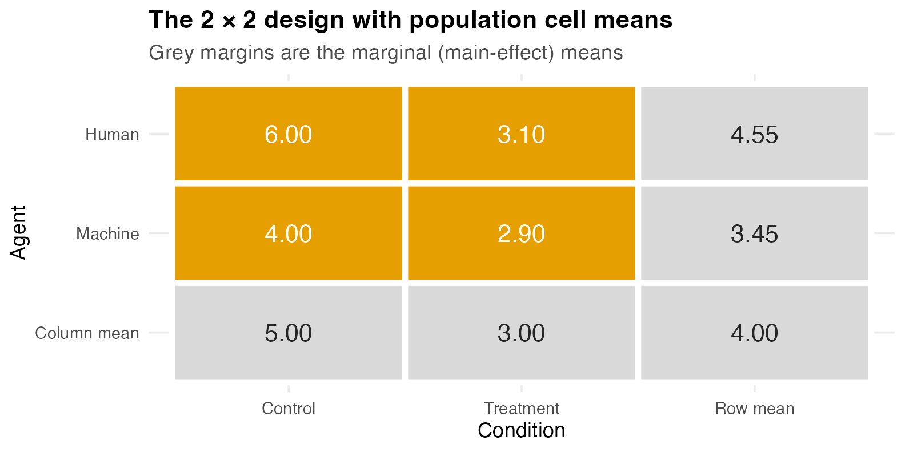

### Viewing the Population

The most informative figure in a power analysis is drawn before any
power is computed: the population being assumed. Two views of the same
four means make the structure clear. On the left is the interaction
plot, with error bars at $`\pm 1`$ within-cell standard deviation as a
reminder of the variability each effect must be detected against. On the
right are the marginal means that the two main effects compare.

``` r
pop <- expand.grid(Agent = c("Human", "Machine"),
                   Condition = c("Control", "Treatment"))
pop$mu <- mu
pop$sd <- sigma
pop$Condition <- factor(pop$Condition, levels = c("Control", "Treatment"))

p_interaction <- ggplot(pop, aes(Condition, mu, color = Agent, group = Agent)) +
  geom_errorbar(aes(ymin = mu - sd, ymax = mu + sd),
                width = 0.08, linewidth = 0.5, alpha = 0.8) +
  geom_line(linewidth = 1) +
  geom_point(size = 3) +
  geom_text(aes(label = mu), vjust = -0.9, size = 3.4, show.legend = FALSE) +
  scale_color_manual(values = agent_cols) +
  labs(title = "Population cell means",
       subtitle = "cell means with ±1 within-cell SD",
       y = "Performance score (higher is better)") +
  ylim(2, 7.5)

marg <- data.frame(
  label = factor(c("Control", "Treatment", "Human", "Machine"),
                 levels = c("Control", "Treatment", "Human", "Machine")),
  kind  = c("Condition", "Condition", "Agent", "Agent"),
  value = c(mean(mu[1:2]), mean(mu[3:4]), mean(mu[c(1,3)]), mean(mu[c(2,4)])))
p_marginals <- ggplot(marg, aes(label, value, fill = kind)) +
  geom_col(width = 0.65, alpha = 0.9) +
  geom_text(aes(label = round(value, 2)), vjust = -0.5, size = 3.4) +
  scale_fill_manual(values = c(Agent = agent_cols[["Human"]],
                               Condition = unname(grDevices::palette.colors(3))[3]), name = NULL) +
  labs(title = "Marginal means", subtitle = "what the two main effects compare",
       x = NULL, y = "Population marginal mean") +
  ylim(0, 6.5)

if (has_patchwork) p_interaction + p_marginals else p_interaction
```

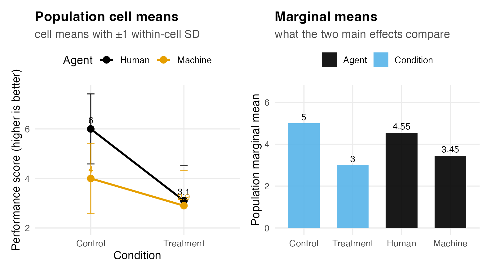

The substantive pattern is visible before any arithmetic. Under the
Control protocol, humans (6.0) outperform machines (4.0). The Treatment
lowers performance for both, but it lowers human performance
considerably more, and the two groups end up nearly equal (3.1 and 2.9).
The treatment therefore eliminates the human advantage. That
non-parallelism of the two lines is the interaction, and it is the
reason the design is of interest.

## The Effects Worth Planning

A 2 × 2 design contains a family of effects rather than a single effect.
A **simple effect** is the effect of one factor evaluated at a fixed
level of the other, and a 2 × 2 has four of them, two for each factor.
It is worth setting out all four alongside the interaction before
deciding which the design must be able to detect.

### Simple Effects of Both Factors

Slicing by Agent gives the performance cost imposed by the Treatment,
separately for each type of agent:

``` math

\begin{aligned}
\psi_{1} &= \mu_{\text{H,C}} - \mu_{\text{H,T}} = 6.0 - 3.1 = 2.9
   &&\text{(cost of the Treatment for Humans)}\\
\psi_{2} &= \mu_{\text{M,C}} - \mu_{\text{M,T}} = 4.0 - 2.9 = 1.1
   &&\text{(cost of the Treatment for Machines).}
\end{aligned}
```

Slicing by Condition gives the human advantage, separately within each
condition:

``` math

\begin{aligned}
\psi_{3} &= \mu_{\text{H,C}} - \mu_{\text{M,C}} = 6.0 - 4.0 = 2.0
   &&\text{(human advantage under Control)}\\
\psi_{4} &= \mu_{\text{H,T}} - \mu_{\text{M,T}} = 3.1 - 2.9 = 0.2
   &&\text{(human advantage under Treatment).}
\end{aligned}
```

The interaction can be written from either slicing, and it is the same
effect either way. Expressed as a contrast whose positive weights sum to
$`1`$, it is **half** the difference between the two simple effects of a
factor:

``` math

\psi_{AB} = \tfrac{1}{2}\big(\psi_{1} - \psi_{2}\big)
          = \tfrac{1}{2}\big(\psi_{3} - \psi_{4}\big)
          = \tfrac{1}{2}(2.9 - 1.1) = 0.9 .
```

The figure below annotates the two Treatment-cost simple effects
directly on the population means.

``` r
ggplot(pop, aes(Condition, mu, color = Agent, group = Agent)) +
  geom_line(linewidth = 1.1) +
  geom_point(size = 3) +
  annotate("segment", x = 2.06, xend = 2.06, y = mu[3], yend = mu[1],
           color = agent_cols[["Human"]], linewidth = 0.7,
           arrow = arrow(ends = "both", length = unit(0.10, "in"))) +
  annotate("segment", x = 2.14, xend = 2.14, y = mu[4], yend = mu[2],
           color = agent_cols[["Machine"]], linewidth = 0.7,
           arrow = arrow(ends = "both", length = unit(0.10, "in"))) +
  annotate("text", x = 2.06, y = mean(mu[c(1,3)]), hjust = -0.15, size = 3.3,
           color = agent_cols[["Human"]],  label = "psi[1]==2.9", parse = TRUE) +
  annotate("text", x = 2.16, y = mean(mu[c(2,4)]), hjust = -0.15, size = 3.3,
           color = agent_cols[["Machine"]], label = "psi[2]==1.1", parse = TRUE) +
  scale_color_manual(values = agent_cols) +
  labs(title = "The interaction as a difference between simple effects",
       subtitle = "psi_AB = (psi_1 - psi_2)/2 = (2.9 - 1.1)/2 = 0.9",
       y = "Performance score") +
  coord_cartesian(xlim = c(1, 2.5), ylim = c(2.5, 6.5))
```

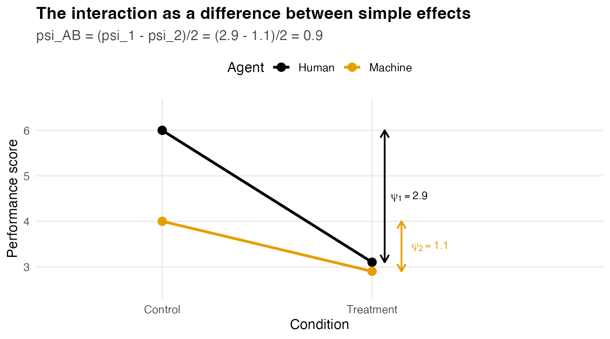

### Contrast Weights

Every effect above is a **contrast**, a set of weights on the cell
means. `DMAR` requires contrast weights in normalized form: the positive
weights sum to $`+1`$, the negative weights sum to $`-1`$, and therefore
all weights sum to $`0`$. Written this way, $`\psi = \sum_j c_j \mu_j`$
is directly interpretable as a difference between (possibly averaged)
means, and effects expressed on different slices remain comparable.

``` r
contrasts_list <- list(
  "Treatment cost | Human"   = c(  1,   0,  -1,   0),
  "Treatment cost | Machine" = c(  0,   1,   0,  -1),
  "Human adv. | Control"     = c(  1,  -1,   0,   0),
  "Human adv. | Treatment"   = c(  0,   0,   1,  -1),
  "Interaction"              = c( .5,  -.5, -.5,  .5))

wt <- as.data.frame(do.call(rbind, contrasts_list))
names(wt) <- c("H,C", "M,C", "H,T", "M,T")
wt$`sum +` <- sapply(contrasts_list, function(w) sum(w[w > 0]))
wt$`sum -` <- sapply(contrasts_list, function(w) sum(w[w < 0]))
wt$`psi`   <- sapply(contrasts_list, function(w) sum(w * mu))
knitr::kable(wt, digits = 2,
             caption = "Contrast weights in normalized form. Positive weights sum to 1, negative weights to -1.")
```

|                           | H,C |  M,C |  H,T |  M,T | sum + | sum - | psi |
|:--------------------------|----:|-----:|-----:|-----:|------:|------:|----:|
| Treatment cost \| Human   | 1.0 |  0.0 | -1.0 |  0.0 |     1 |    -1 | 2.9 |
| Treatment cost \| Machine | 0.0 |  1.0 |  0.0 | -1.0 |     1 |    -1 | 1.1 |
| Human adv. \| Control     | 1.0 | -1.0 |  0.0 |  0.0 |     1 |    -1 | 2.0 |
| Human adv. \| Treatment   | 0.0 |  0.0 |  1.0 | -1.0 |     1 |    -1 | 0.2 |
| Interaction               | 0.5 | -0.5 | -0.5 |  0.5 |     1 |    -1 | 0.9 |

Contrast weights in normalized form. Positive weights sum to 1, negative
weights to -1.

Note the interaction row: the weights are $`\pm\tfrac{1}{2}`$ rather
than $`\pm 1`$, which is what places the interaction on the same
per-comparison scale as the simple effects and yields
$`\psi_{AB} = 0.9`$.

## Analytic Power for a Single Contrast

### The Arithmetic

Under the fixed-effects model with common variance $`\sigma^{2}`$ and
$`n`$ per cell, the estimated contrast
$`\hat{\psi} = \sum_j c_j \bar{Y}_j`$ has standard error

``` math

\mathrm{SE}_{\hat{\psi}} = \sqrt{\dfrac{\sigma^{2} \sum_j c_j^{2}}{n}} .
```

The statistic $`t = \hat{\psi} / \mathrm{SE}_{\hat{\psi}}`$ follows a
central $`t`$ distribution with $`df = N - a`$ (here $`a = 4`$ cells)
when the null hypothesis is true, and a **noncentral** $`t`$
distribution with the same $`df`$ and noncentrality parameter

``` math

\lambda = \frac{\psi}{\mathrm{SE}_{\hat{\psi}}}
        = \frac{\psi}{\sqrt{\dfrac{\sigma^{2} \sum_j c_j^{2}}{n}}}
```

when it is false. Power is the probability that a noncentral $`t`$
variate falls beyond the ordinary two-sided critical value,

``` math

1 - \beta = \Pr\!\big(T_{df,\lambda} > t_{1-\alpha/2,\,df}\big)
          + \Pr\!\big(T_{df,\lambda} < -t_{1-\alpha/2,\,df}\big).
```

A useful benchmark is that two-sided power of $`.80`$ at
$`\alpha = .05`$ requires $`\lambda \approx 2.80`$, approximately
$`1.96 + 0.84`$. Setting $`\lambda = 2.80`$ and solving for $`n`$ gives
the approximation

``` math

n \approx \frac{\lambda^{2}\,\sigma^{2}\,\sum_j c_j^{2}}{\psi^{2}} .
```

Applying that approximation to all five contrasts, and comparing it with
the exact noncentral $`t`$ search performed by `ss_power_contrast`:

``` r
lambda_target <- 2.80

hand <- data.frame(
  effect = names(contrasts_list),
  psi    = sapply(contrasts_list, function(w) sum(w * mu)),
  sum_c2 = sapply(contrasts_list, function(w) sum(w^2)))
hand$n_approx <- ceiling(lambda_target^2 * sigma2 * hand$sum_c2 / hand$psi^2)

exact <- t(sapply(contrasts_list, function(w) {
  r <- ss_power_contrast(w, mu = mu, sigma_squared = sigma2, desired_power = .80)
  c(n_exact = r$value[1], total_N = r$value[2], f = r$value[5])
}))
hand <- cbind(hand, exact)
knitr::kable(hand, digits = 3, row.names = FALSE,
             caption = "Approximate n (from lambda = 2.80) and DMAR's exact search, for each contrast planned alone to power .80.")
```

| effect                    | psi | sum_c2 | n_approx | n_exact | total_N |     f |
|:--------------------------|----:|-------:|---------:|--------:|--------:|------:|
| Treatment cost \| Human   | 2.9 |      2 |        4 |       5 |      20 | 0.725 |
| Treatment cost \| Machine | 1.1 |      2 |       26 |      27 |     108 | 0.275 |
| Human adv. \| Control     | 2.0 |      2 |        8 |       9 |      36 | 0.500 |
| Human adv. \| Treatment   | 0.2 |      2 |      784 |     786 |    3144 | 0.050 |
| Interaction               | 0.9 |      1 |       20 |      20 |      80 | 0.318 |

Approximate n (from lambda = 2.80) and DMAR’s exact search, for each
contrast planned alone to power .80.

The approximation and the exact search agree closely; they differ
slightly because the exact critical value depends on $`df`$, which
itself depends on $`n`$.

The required sample sizes differ enormously across the five effects. The
human advantage under Treatment, $`\psi_4 = 0.2`$, would require **786
participants per cell** (a total of 3,144) to reach $`.80`$. That effect
is small precisely because the treatment nearly eliminates the human
advantage, which is the very thing the interaction expresses. It is
therefore not a sensible planning target, and the design instead targets
the three effects that can be detected at a common sample size: the two
Treatment costs and the interaction.

``` r
targets <- contrasts_list[c("Treatment cost | Human",
                            "Treatment cost | Machine", "Interaction")]
ss_power_contrast(targets[["Treatment cost | Machine"]],
                  mu = mu, sigma_squared = sigma2, desired_power = .80)
```

| term                  | value |
|:----------------------|:------|
| necessary_n_per_group | 27    |
| total_N               | 108   |
| actual_power          | 0.808 |
| noncentral_t_parm     | 2.86  |
| effect_size_f         | 0.275 |

Cohen’s $`f`$ for a one-degree-of-freedom effect is
$`\lambda / \sqrt{N}`$.

### A Picture of One Power Calculation

The following figure shows, for the Treatment cost among Machines at its
required sample size, the sampling distribution of $`t`$ under the null
hypothesis (centered at zero) and under the alternative (shifted to
$`\lambda`$). Power is the shaded area of the alternative distribution
beyond the critical value.

``` r
w_mach <- contrasts_list[["Treatment cost | Machine"]]
n_m  <- ss_power_contrast(w_mach, mu = mu, sigma_squared = sigma2,
                          desired_power = .80)$value[1]
N_m  <- 4 * n_m; df_m <- N_m - 4
SE_m <- sqrt(sigma2 * sum(w_mach^2) / n_m)
lam  <- sum(w_mach * mu) / SE_m
tcrit <- qt(.975, df_m)
power_m <- pt(tcrit, df_m, ncp = lam, lower.tail = FALSE) +
           pt(-tcrit, df_m, ncp = lam)

tg  <- seq(-4, 8, length.out = 700)
den <- data.frame(t = tg, Null = dt(tg, df_m), Alt = dt(tg, df_m, ncp = lam))

ggplot(den, aes(t)) +
  geom_area(data = subset(den, t > tcrit), aes(y = Alt), fill = accent, alpha = 0.35) +
  geom_line(aes(y = Null), color = "grey45", linewidth = 0.8) +
  geom_line(aes(y = Alt),  color = agent_cols[["Machine"]], linewidth = 1) +
  geom_vline(xintercept = tcrit, linetype = "dashed", color = "grey30") +
  annotate("text", x = 0,   y = 0.42, label = "Null distribution", size = 3.2, color = "grey35") +
  annotate("text", x = lam, y = 0.42, label = "Alternative\n(noncentral)",
           size = 3.2, color = agent_cols[["Machine"]]) +
  annotate("text", x = tcrit + 1.7, y = 0.11,
           label = sprintf("power = %.2f", power_m), size = 3.6, color = "grey15") +
  labs(title = "Power for a single contrast",
       subtitle = sprintf("Treatment cost among Machines: n = %d per cell, lambda = %.2f, critical t = %.2f",
                           n_m, lam, tcrit),
       x = "t statistic", y = "Density")
```


### The Shared Design

A design that must detect all three targeted effects has to satisfy the
most demanding of them, so the required per-cell sample size is the
largest:

``` r
per_cell <- sapply(targets, function(w)
  ss_power_contrast(w, mu = mu, sigma_squared = sigma2, desired_power = .80)$value[1])
n_design <- max(per_cell)
c(per_cell, chosen_n = n_design, total_N = 4 * n_design)
#>   Treatment cost | Human Treatment cost | Machine              Interaction 
#>                        5                       27                       20 
#>                 chosen_n                  total_N 
#>                       27                      108
```

At $`n =`$ 27 per cell, a total of $`N =`$ 108, each targeted effect
attains at least $`.80`$. This is its **marginal power**, meaning the
power of that effect considered on its own:

``` r
marg_pow <- sapply(targets, function(w)
  ss_power_contrast(w, mu = mu, sigma_squared = sigma2,
                    n_per_group = n_design)$value[3])
round(marg_pow, 3)
#>   Treatment cost | Human Treatment cost | Machine              Interaction 
#>                    1.000                    0.808                    0.906
```

Power curves display the same information across sample sizes. All five
contrasts are shown; the curve that reaches $`.80`$ farthest to the
right among the targeted effects determines the sample size, and the
human advantage under Treatment remains near the nominal $`\alpha`$
level throughout this range.

``` r
n_grid <- 3:45
curve_df <- do.call(rbind, Map(function(w, nm) {
  data.frame(effect = nm, n = n_grid,
             power = sapply(n_grid, function(nn)
               ss_power_contrast(w, mu = mu, sigma_squared = sigma2,
                                 n_per_group = nn)$value[3]))
}, contrasts_list, names(contrasts_list)))
curve_df$effect <- factor(curve_df$effect, levels = names(contrasts_list))

ggplot(curve_df, aes(n, power, color = effect)) +
  geom_hline(yintercept = 0.80, linetype = "dashed", color = "grey40") +
  geom_vline(xintercept = n_design, linetype = "dotted", color = "grey40") +
  geom_line(linewidth = 1) +
  scale_color_manual(values = unname(grDevices::palette.colors(8))[c(1, 2, 3, 4, 7)], name = NULL) +
  annotate("text", x = n_design + 0.7, y = 0.15, hjust = 0, size = 3.2,
           color = "grey30", label = sprintf("design: n = %d per cell", n_design)) +
  guides(color = guide_legend(nrow = 2)) +
  labs(title = "Power curves for all five contrasts",
       subtitle = "Among the targeted effects, the Treatment cost for Machines reaches .80 last",
       x = "n per cell", y = "Marginal power (analytic)") +
  ylim(0, 1)
```

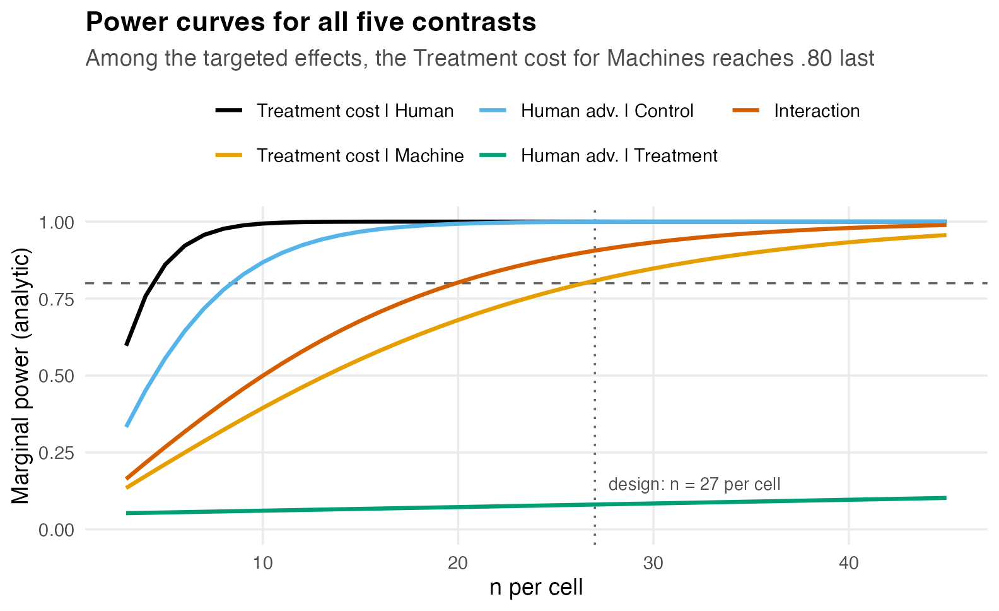

## Composite Power: Detecting Every Effect in One Study

The design just constructed gives each targeted effect a marginal power
of at least $`.80`$. It does not follow that the study has an $`80\%`$
chance of producing the full predicted pattern.

**Composite power** (also called compound, conjunctive, or all-or-none
power) is the probability that *every* pre-specified effect is
statistically significant in *the same* study. This is typically the
event on which a theoretical claim rests: not that the interaction was
significant, but that the interaction and both simple effects were
significant together. Two considerations place it below any individual
marginal power:

- It is a conjunction. Three tests must reject simultaneously, so
  composite power cannot exceed the smallest marginal power.
- The tests are not independent. All three are computed from the same
  four cell means and share a single pooled error term, so composite
  power is not the product of the marginal powers.

Because the joint distribution of several correlated noncentral $`t`$
statistics has no convenient closed form, composite power is estimated
by **Monte Carlo** simulation: generate many datasets from the assumed
population, apply all three tests to each, and record the proportion of
datasets in which all three reject.

``` r
composite_power <- function(n, mu, sigma2, reps = 4000, alpha = 0.05, seed = 113) {
  set.seed(seed)
  a <- length(mu); N <- a * n; df <- N - a
  tcrit <- qt(1 - alpha / 2, df)
  W   <- do.call(cbind, targets)          # the three targeted contrasts
  ssq <- colSums(W^2)
  cellmeans <- matrix(rep(mu, each = n), nrow = n)
  reject <- matrix(FALSE, reps, ncol(W))
  for (r in seq_len(reps)) {
    y    <- cellmeans + matrix(rnorm(N, 0, sqrt(sigma2)), nrow = n)
    ybar <- colMeans(y)
    mse  <- sum(sweep(y, 2, ybar)^2) / df          # pooled error variance
    psi  <- as.numeric(t(W) %*% ybar)              # contrast estimates
    reject[r, ] <- abs(psi / sqrt(mse * ssq / n)) > tcrit
  }
  list(marginal  = colMeans(reject),
       composite = mean(rowSums(reject) == ncol(W)),
       product   = prod(colMeans(reject)))
}

mc <- composite_power(n_design, mu, sigma2)
round(c(smallest_marginal = min(mc$marginal),
        product_if_independent = mc$product,
        composite = mc$composite), 3)
#>      smallest_marginal product_if_independent              composite 
#>                  0.801                  0.730                  0.712
```

At the sample size chosen for $`.80`$ marginal power, composite power is
approximately 0.71. The simulated marginal powers reproduce the analytic
values, which confirms the simulation is behaving correctly. The product
of the marginals, 0.73, is close to the composite but not equal to it,
since independence does not hold.

``` r
bar_df <- data.frame(
  quantity = factor(c("Treatment | Human", "Treatment | Machine", "Interaction",
                      "Product (independence)", "Composite (all three)"),
                    levels = c("Treatment | Human", "Treatment | Machine", "Interaction",
                               "Product (independence)", "Composite (all three)")),
  power = c(mc$marginal, mc$product, mc$composite),
  kind  = c("marginal", "marginal", "marginal", "reference", "composite"))

ggplot(bar_df, aes(quantity, power, fill = kind)) +
  geom_col(width = 0.68) +
  geom_hline(yintercept = 0.80, linetype = "dashed", color = "grey35") +
  geom_text(aes(label = sprintf("%.2f", power)), vjust = -0.4, size = 3.4) +
  scale_fill_manual(values = c(marginal = agent_cols[["Machine"]],
                               reference = "grey65", composite = accent),
                    guide = "none") +
  labs(title = "Each targeted effect reaches .80, but not all three jointly",
       subtitle = sprintf("At n = %d per cell (N = %d)", n_design, 4 * n_design),
       x = NULL, y = "Power") +
  ylim(0, 1.05) +
  theme(axis.text.x = element_text(size = 8.5))
```

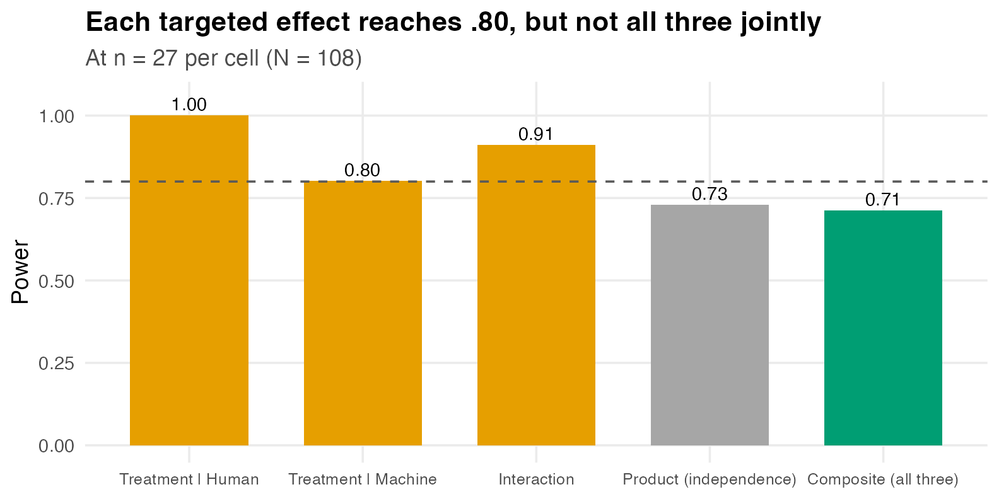

### Sizing the Study for Composite Power

To obtain composite power of $`.80`$, meaning an $`80\%`$ probability
that the entire predicted pattern is detected, the sample size must
increase until the simulation reaches that value.

``` r
n_seq    <- seq(20, 40, by = 2)
comp_seq <- sapply(n_seq, function(nn) composite_power(nn, mu, sigma2, reps = 3000)$composite)
weakest  <- sapply(n_seq, function(nn)
  ss_power_contrast(targets[["Treatment cost | Machine"]], mu = mu,
                    sigma_squared = sigma2, n_per_group = nn)$value[3])
n_comp80 <- n_seq[which(comp_seq >= 0.80)[1]]

comp_plot <- rbind(
  data.frame(n = n_seq, power = weakest,  curve = "Smallest marginal power"),
  data.frame(n = n_seq, power = comp_seq, curve = "Composite power (all three)"))

ggplot(comp_plot, aes(n, power, color = curve)) +
  geom_hline(yintercept = 0.80, linetype = "dashed", color = "grey40") +
  geom_line(linewidth = 1) + geom_point(size = 1.6) +
  geom_vline(xintercept = n_design, linetype = "dotted", color = "grey55") +
  geom_vline(xintercept = n_comp80, linetype = "dotted", color = accent) +
  scale_color_manual(values = c("Smallest marginal power" = agent_cols[["Machine"]],
                                "Composite power (all three)" = accent), name = NULL) +
  labs(title = "The additional cost of requiring all three effects jointly",
       subtitle = sprintf("Marginal design: n = %d per cell. Composite design: n = %d per cell.",
                          n_design, n_comp80),
       x = "n per cell", y = "Power") +
  ylim(0, 1)
```

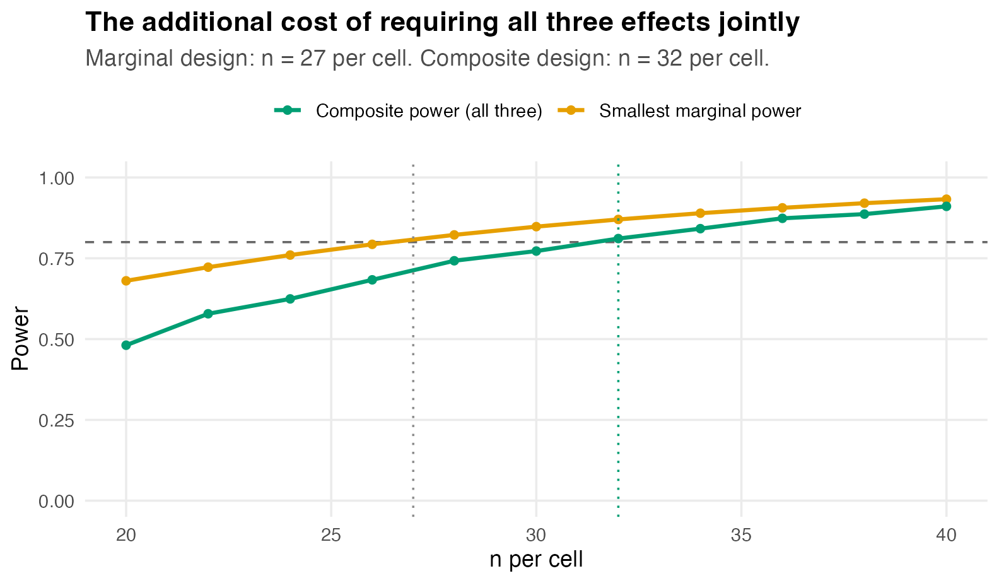

| n per cell | total N | composite power |
|-----------:|--------:|----------------:|
|         20 |      80 |           0.481 |
|         22 |      88 |           0.578 |
|         24 |      96 |           0.624 |
|         26 |     104 |           0.683 |
|         28 |     112 |           0.742 |
|         30 |     120 |           0.772 |
|         32 |     128 |           0.811 |
|         34 |     136 |           0.842 |
|         36 |     144 |           0.874 |
|         38 |     152 |           0.887 |
|         40 |     160 |           0.911 |

Monte Carlo composite power by sample size.

Composite power reaches $`.80`$ at approximately 32 per cell, a total of
$`N =`$ 128, compared with the 108 required for each effect
individually. Because these are simulation estimates, the exact crossing
point varies slightly between runs; increasing `reps` reduces that
variability. The distinction between powering each effect and powering
the complete pattern is central to planning multi-effect studies, and
the difference grows as the number of required effects increases.

## Analytic Versus Monte Carlo Power

**Analytic power** evaluates the exact noncentral $`t`$ or $`F`$
distribution for one effect at a time, treating the design as fixed. It
is immediate, free of simulation error, and is the method used
internally by `ss_power_contrast`, `ss_power_factorial_ancova`, and
`ss_power_reg_coef`. It applies to the power of a single contrast, main
effect, interaction, or regression coefficient in a balanced design with
homogeneous, normally distributed errors.

**Monte Carlo power** generates many datasets, analyzes each in the
manner intended for the real study, and records the rejection rate. It
is slower and carries sampling error, but it applies when a closed-form
result is unavailable:

- composite or joint power for several correlated effects;
- designs with random predictors, such as a continuous moderator and the
  product terms formed from it;
- unequal cell sizes, heterogeneous variances, non-normal outcomes, or
  analysis procedures more elaborate than the formula assumes.

In practice both are used together: marginal sample sizes are obtained
analytically, and the joint or non-standard components are verified by
simulation. Where the two disagree, the simulation reflects the analysis
actually planned and is the more appropriate basis for the decision.

## The Moderator as a Covariate

Suppose a continuous **moderator** $`M`$ can also be measured at
baseline, such as prior experience, correlating $`\rho = .2`$ with the
outcome. Such a variable can serve two distinct functions, and it is
useful to separate them.

The first function requires no interaction at all. Including $`M`$ as a
covariate makes the analysis an **analysis of covariance**, and the
covariate absorbs error variance. With squared multiple correlation
$`R^{2}`$ between the covariate and the outcome, the error variance is
reduced by the factor $`1 - R^{2}`$, so an effect of size $`f`$ on the
analysis of variance metric behaves as $`f / \sqrt{1 - R^{2}}`$ under
analysis of covariance, at a cost of one error degree of freedom per
covariate:

``` r
rho <- 0.2
R2  <- rho^2
f_int <- ss_power_contrast(contrasts_list[["Interaction"]], mu = mu,
                           sigma_squared = sigma2, desired_power = .80)$value[5]
c(R2 = R2, variance_retained = 1 - R2,
  f_unadjusted = f_int, f_adjusted = f_int / sqrt(1 - R2))
#>                R2 variance_retained      f_unadjusted        f_adjusted 
#>         0.0400000         0.9600000         0.3181981         0.3247595
```

With $`\rho = .2`$ the squared correlation is only $`R^{2} = .04`$, so
the error variance is reduced by four percent and the interaction’s
$`f`$ increases from $`0.318`$ to about $`0.325`$:

``` r
ss_power_factorial_ancova(factor_levels = c(2, 2), effect_indices = c(1, 2),
                          f = f_int, covariate_R2 = 0, n_covariates = 0,
                          desired_power = .80)
```

| term                 | value |
|:---------------------|:------|
| necessary_n_per_cell | 20    |
| total_N              | 80    |
| actual_power         | 0.802 |
| df_effect            | 1     |
| df_error             | 76    |
| f                    | 0.318 |
| f_adjusted           | 0.318 |
| covariate_R2         | 0     |
| n_covariates         | 0     |
| noncentrality        | 8.1   |
| alpha_level          | 0.05  |

``` r
ss_power_factorial_ancova(factor_levels = c(2, 2), effect_indices = c(1, 2),
                          f = f_int, covariate_R2 = R2, n_covariates = 1,
                          desired_power = .80)
```

| term                 | value |
|:---------------------|:------|
| necessary_n_per_cell | 20    |
| total_N              | 80    |
| actual_power         | 0.818 |
| df_effect            | 1     |
| df_error             | 75    |
| f                    | 0.318 |
| f_adjusted           | 0.325 |
| covariate_R2         | 0.04  |
| n_covariates         | 1     |
| noncentrality        | 8.44  |
| alpha_level          | 0.05  |

Power at $`n = 20`$ per cell increases from about $`.80`$ to about
$`.82`$. The gain is real but modest. The figure below shows why, by
varying the covariate’s correlation with the outcome and reading off the
interaction’s power at a fixed $`n = 20`$ per cell. Meaningful
reductions in required sample size occur only when the covariate
correlates substantially with the outcome; at $`\rho = .2`$ the
improvement is negligible relative to the degree of freedom expended.

``` r
rho_grid <- seq(0, 0.7, by = 0.025)
cov_pow  <- sapply(rho_grid, function(rr)
  ss_power_factorial_ancova(factor_levels = c(2, 2), effect_indices = c(1, 2),
                            f = f_int, covariate_R2 = rr^2, n_covariates = 1,
                            n_per_cell = 20)$value[2])
pow_at_02 <- cov_pow[which.min(abs(rho_grid - 0.2))]

ggplot(data.frame(rho = rho_grid, power = cov_pow), aes(rho, power)) +
  geom_line(linewidth = 1, color = agent_cols[["Machine"]]) +
  geom_vline(xintercept = 0.2, linetype = "dashed", color = "grey40") +
  annotate("point", x = 0.2, y = pow_at_02, size = 3, color = accent) +
  annotate("text", x = 0.22, y = pow_at_02, hjust = 0, vjust = 1.6, size = 3.2,
           color = "grey20",
           label = sprintf("rho = .2 gives power %.2f", pow_at_02)) +
  labs(title = "Power gain as a function of covariate strength",
       subtitle = "Interaction power at n = 20 per cell, with one covariate",
       x = "Covariate correlation with the outcome", y = "Interaction power")
```

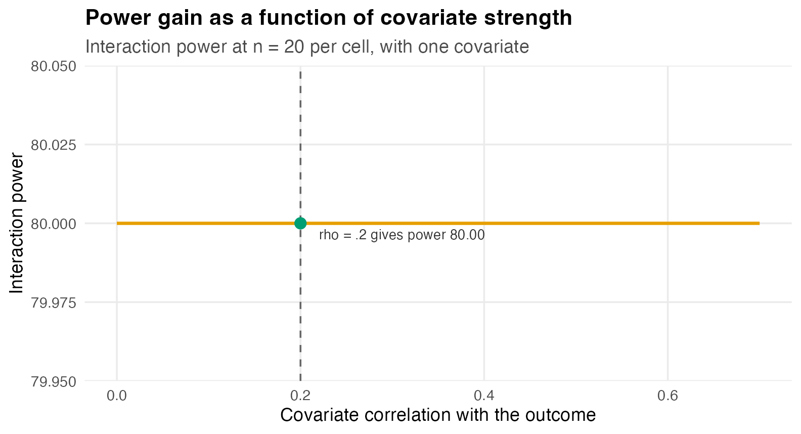

## The Moderator as a Three-Way Interaction

The second function of a moderator is substantive. The question is not
whether $`M`$ correlates with the outcome, but whether the Agent ×
Condition interaction itself depends on $`M`$: whether, for instance,
the treatment eliminates the human advantage only among less experienced
participants. That is a **three-way interaction**, Agent × Condition ×
Moderator.

Because $`M`$ is continuous, the model is expressed as a regression.
Effect-code the factors, $`A, B \in \{-\tfrac{1}{2}, +\tfrac{1}{2}\}`$,
standardize $`M`$, and write

``` math

Y = \beta_0 + \beta_A A + \beta_B B + \beta_{AB}(AB) + \beta_M M
      + \gamma\,(ABM) + \varepsilon .
```

The cell means determine the analysis of variance coefficients
($`\beta_0 = 4.0`$, $`\beta_A = 1.1`$, $`\beta_B = 2.0`$,
$`\beta_{AB} = 1.8`$), and the correlation $`\rho = .2`$ determines
$`\beta_M`$. The coefficient $`\gamma`$, which governs the size of the
three-way interaction, is a separate quantity that the cell means do not
determine. **The value $`\rho = .2`$ carries no information about the
magnitude of the three-way interaction.** Since the difference between
the two simple-effect differences equals $`1.8 + \gamma M`$ as $`M`$
varies, $`\gamma`$ is interpretable as the change in the interaction per
standard deviation of the moderator.

We set $`\gamma = 0.8`$, which as shown below corresponds to
$`f^{2} = .02`$ (Cohen, 1988).

### Visualizing the Three-Way Interaction

The clearest way to specify $`\gamma`$ is to display it. The top row
shows the population interaction plots at $`M = -1`$, $`0`$, and $`+1`$
standard deviation for the small three-way interaction used in the plan.
The bottom row shows a larger three-way interaction, included only to
calibrate the eye. The separation between the two lines at the Treatment
level increases with $`M`$, and it does so gradually when the three-way
interaction is small.

``` r
b0 <- 4; bA <- 1.1; bB <- 2.0; bAB <- 1.8; bM <- 0.38

cell_mean <- function(agent, cond, m, gamma) {
  A <- ifelse(agent == "Human", 0.5, -0.5)
  B <- ifelse(cond  == "Control", 0.5, -0.5)
  b0 + bA*A + bB*B + bAB*A*B + bM*m + gamma*A*B*m
}

grid3 <- expand.grid(Agent = c("Human", "Machine"),
                     Condition = c("Control", "Treatment"),
                     m = c(-1, 0, 1), gamma = c(0.8, 1.6))
grid3$mu <- mapply(cell_mean, grid3$Agent, grid3$Condition, grid3$m, grid3$gamma)
grid3$Condition <- factor(grid3$Condition, levels = c("Control", "Treatment"))
grid3$Mlab <- factor(grid3$m, levels = c(-1, 0, 1),
                     labels = c("M = -1 SD", "M = 0", "M = +1 SD"))
grid3$Glab <- factor(grid3$gamma, levels = c(0.8, 1.6),
                     labels = c("small (gamma = 0.8)", "larger (gamma = 1.6)"))

ggplot(grid3, aes(Condition, mu, color = Agent, group = Agent)) +
  geom_line(linewidth = 0.9) + geom_point(size = 2.3) +
  facet_grid(Glab ~ Mlab) +
  scale_color_manual(values = agent_cols) +
  labs(title = "The three-way interaction displayed",
       subtitle = "The Agent × Condition interaction changes across levels of the moderator",
       y = "Performance score") +
  theme(panel.spacing = unit(0.9, "lines"))
```

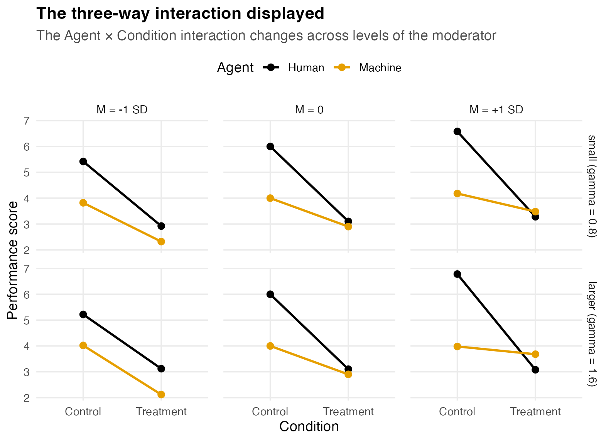

### Effect Sizes for the Moderated Model

With effect coding and mutually independent, mean-centered predictors,
the terms of the model are orthogonal, and Cohen’s $`f^{2}`$ for any
single term is its explained variance divided by the residual variance
$`\sigma^{2}_{\varepsilon} = 2`$. Because
$`A, B \in \{\pm\tfrac{1}{2}\}`$ gives $`\mathrm{Var}(AB) = 0.0625`$,
and $`M`$ is standardized so that $`\mathrm{Var}(ABM) = 0.0625`$ as
well,

``` math

f^{2}_{\text{2-way}}
  = \frac{\beta_{AB}^{2}\,\mathrm{Var}(AB)}{\sigma^{2}_{\varepsilon}}
  = \frac{1.8^{2} \times 0.0625}{2} = 0.10125,
\qquad
f^{2}_{\text{3-way}}
  = \frac{\gamma^{2}\,\mathrm{Var}(ABM)}{\sigma^{2}_{\varepsilon}}
  = 0.03125\,\gamma^{2}.
```

``` r
f2_2way <- bAB^2 * 0.0625 / sigma2
f2_3way <- function(gamma) 0.03125 * gamma^2
gamma_small <- 0.8
c(f2_2way = f2_2way, f2_3way_small = f2_3way(gamma_small))
#>       f2_2way f2_3way_small 
#>       0.10125       0.02000
```

Two features are worth noting. The expression for
$`f^{2}_{\text{3-way}}`$ involves $`\gamma`$ but not $`\beta_M`$, and
therefore not $`\rho`$, confirming that the detectability of the
three-way interaction is governed entirely by $`\gamma`$. And
$`\gamma = 0.8`$ yields $`f^{2} = .02`$ exactly, whereas the two-way
interaction’s $`f^{2} = .101`$ is roughly five times larger. Supplying
each $`f^{2}`$ to `ss_power_reg_coef`, with $`p = 7`$ predictors in the
full model ($`A`$, $`B`$, $`M`$, $`AB`$, $`AM`$, $`BM`$, $`ABM`$):

``` r
getN <- function(res) res$value[res$term == "necessary_N"]
N_2way <- getN(ss_power_reg_coef(cohen_f2 = f2_2way, p = 7, desired_power = .80))
N_3way <- getN(ss_power_reg_coef(cohen_f2 = f2_3way(gamma_small), p = 7,
                                 desired_power = .80))
c(two_way = N_2way, three_way_small = N_3way)
#>         two_way three_way_small 
#>              80             395
```

Required sample size is inversely proportional to $`f^{2}`$, so the
small three-way interaction requires roughly five times the total sample
size of the two-way interaction. The figure below traces that
relationship across values of $`\gamma`$ and marks the value adopted
here.

``` r
g_grid <- seq(0.5, 2.0, by = 0.05)
N_grid <- sapply(g_grid, function(g)
  getN(ss_power_reg_coef(cohen_f2 = f2_3way(g), p = 7, desired_power = .80)))

ggplot(data.frame(gamma = g_grid, N = N_grid), aes(gamma, N)) +
  geom_line(linewidth = 1, color = agent_cols[["Machine"]]) +
  geom_vline(xintercept = gamma_small, linetype = "dashed", color = "grey40") +
  annotate("point", x = gamma_small, y = N_3way, size = 3, color = accent) +
  annotate("text", x = gamma_small + 0.05, y = N_3way, hjust = 0, vjust = -0.6,
           size = 3.3, color = "grey20",
           label = sprintf("gamma = 0.8 (f2 = .02): N = %d", N_3way)) +
  labs(title = "Sample size required for the three-way interaction",
       subtitle = "Total N for power of .80, as a function of the three-way coefficient",
       x = "gamma (change in the interaction per SD of the moderator)",
       y = "Total N required")
```

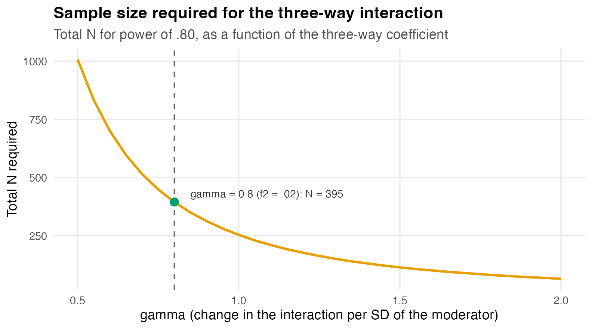

### Confirming the Plan by Simulation

The analytic sample size treats the predictors as fixed. A continuous
moderator is random, however, and so are the product terms constructed
from it, so the appropriate verification is to simulate the regression
that would actually be estimated. The population is constructed as
specified, with $`\beta_M`$ chosen so that $`\mathrm{cor}(M, Y) = .2`$,
and the model `lm(y ~ A*B*M)` is fitted to each generated sample:

``` r
simulate_threeway_power <- function(N, gamma, rho = .2, reps = 1500, seed = 113) {
  sigma_e <- sqrt(2)
  varY_less_M <- bA^2*.25 + bB^2*.25 + bAB^2*.0625 + gamma^2*.0625 + sigma_e^2
  betaM <- sqrt(rho^2 * varY_less_M / (1 - rho^2))
  set.seed(seed)
  hit3 <- hit2 <- logical(reps)
  for (r in seq_len(reps)) {
    A <- sample(c(-.5, .5), N, TRUE); B <- sample(c(-.5, .5), N, TRUE); M <- rnorm(N)
    y <- b0 + bA*A + bB*B + bAB*A*B + betaM*M + gamma*A*B*M + rnorm(N, 0, sigma_e)
    cf <- summary(lm(y ~ A * B * M))$coefficients
    hit3[r] <- cf["A:B:M", "Pr(>|t|)"] < .05
    hit2[r] <- cf["A:B",   "Pr(>|t|)"] < .05
  }
  c(three_way = mean(hit3), two_way = mean(hit2))
}

mc_small <- simulate_threeway_power(N_3way, gamma = gamma_small)
round(mc_small, 3)
#> three_way   two_way 
#>     0.794     1.000
```

At the analytic sample size the simulated power for the three-way
interaction is approximately 0.79, slightly below $`.80`$. This reflects
the difference between fixed and random predictors noted in the
`ss_power_reg_coef` documentation, under which random predictors require
a somewhat larger sample for the same power. Sweeping across sample
sizes locates the value that achieves $`.80`$ in the random-predictor
case:

``` r
N_try   <- c(N_3way, 420, 440, 460)
mc_by_N <- sapply(N_try, function(NN)
  simulate_threeway_power(NN, gamma = gamma_small)["three_way"])
N_mc80  <- N_try[which(mc_by_N >= 0.80)[1]]

ggplot(data.frame(N = N_try, power = mc_by_N), aes(N, power)) +
  geom_hline(yintercept = 0.80, linetype = "dashed", color = "grey40") +
  geom_vline(xintercept = N_3way, linetype = "dotted", color = "grey55") +
  geom_line(linewidth = 1, color = accent) +
  geom_point(size = 2.6, color = accent) +
  geom_text(aes(label = sprintf("%.2f", power)), vjust = -0.9, size = 3.3) +
  annotate("text", x = N_3way, y = 0.755, angle = 90, vjust = -0.4, size = 3,
           color = "grey40", label = sprintf("analytic N = %d", N_3way)) +
  labs(title = "Random predictors require a larger sample than the fixed-predictor formula",
       subtitle = "Monte Carlo power for the small three-way interaction (gamma = 0.8)",
       x = "Total N", y = "Three-way power (Monte Carlo)") +
  ylim(0.72, 0.90)
```

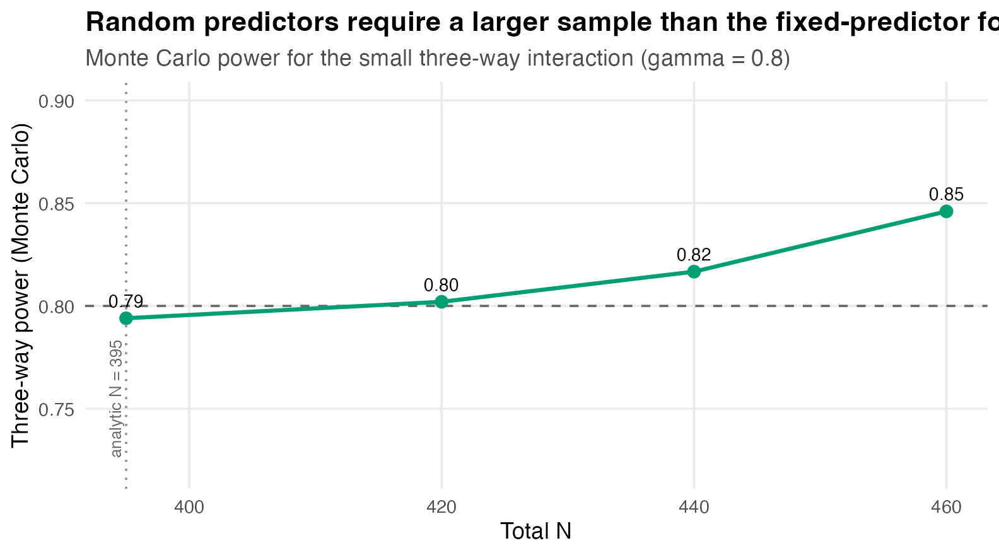

Power of $`.80`$ is reached near $`N =`$ 420, above the fixed-predictor
value of 395. A design required to detect both the two-way interaction
and this small three-way interaction is governed entirely by the latter,
so $`N \approx`$ 420 satisfies both; the two-way interaction, requiring
only 80, is then powered well beyond $`.80`$.

## Summary

``` r
ladder <- data.frame(
  plan = c("Each targeted effect alone (.80)",
           "Composite: all three jointly (.80)",
           "Two-way interaction in the moderated model",
           "Small three-way interaction (analytic)",
           "Small three-way interaction (Monte Carlo)"),
  N = c(4 * n_design, 4 * n_comp80, N_2way, N_3way, N_mc80))
ladder$plan <- factor(ladder$plan, levels = rev(ladder$plan))

ggplot(ladder, aes(N, plan, fill = N)) +
  geom_col(width = 0.62, show.legend = FALSE) +
  geom_text(aes(label = N), hjust = -0.2, size = 3.6) +
  scale_fill_gradient(low = unname(grDevices::palette.colors(3))[2], high = unname(grDevices::palette.colors(3))[1]) +
  labs(title = "Total sample size by planning objective",
       x = "Total N", y = NULL) +
  xlim(0, max(ladder$N) * 1.18)
```

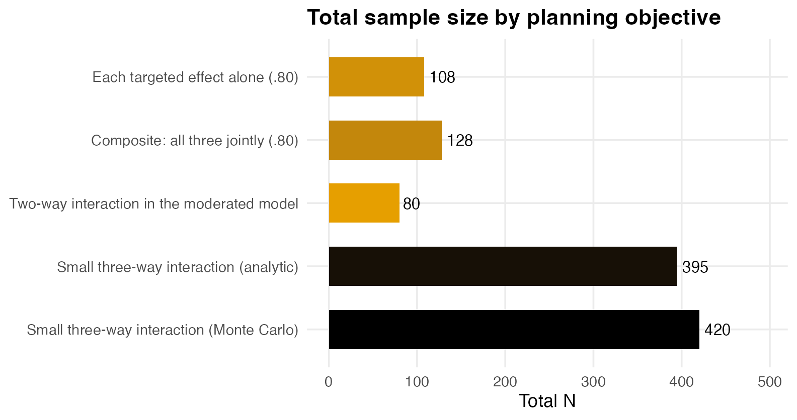

| Planning objective | Function | Method | Total $`N`$ |
|----|----|----|:--:|
| Each targeted effect alone at $`.80`$ | `ss_power_contrast` | analytic | 108 |
| Composite power of $`.80`$ for all three | simulation | Monte Carlo | 128 |
| Two-way interaction with $`\rho = .2`$ covariate | `ss_power_factorial_ancova` | analytic | 80 |
| Two-way interaction in the moderated model | `ss_power_reg_coef` | analytic | 80 |
| Small three-way interaction ($`\gamma = 0.8`$, $`f^{2} = .02`$) | `ss_power_reg_coef` and simulation | both | 395 and 420 |

Four conclusions follow from this analysis.

1.  A 2 × 2 design contains several effects with very different sample
    size requirements. Planning should target the effect that the study
    can least afford to miss, which is often a moderate simple effect or
    the interaction rather than the largest effect. In this design one
    simple effect, the human advantage under Treatment, is too small to
    be a feasible target at all.
2.  Composite power is smaller than any individual marginal power. When
    a conclusion requires several effects to be detected together, the
    study should be sized for the conjunction.
3.  A covariate correlated $`\rho = .2`$ with the outcome yields little
    gain in power, whereas allowing that same variable to moderate the
    interaction introduces a substantially more demanding sample size
    requirement.
4.  Closed-form results should be used where they are exact, and
    simulation where they are not. Marginal power for a single effect is
    analytic; joint power across effects, and any design with random
    predictors, calls for Monte Carlo.

## References

Cohen, J. (1988). *Statistical power analysis for the behavioral
sciences* (2nd ed.). Erlbaum.

Maxwell, S. E., Delaney, H. D., & Kelley, K. (2027). *Designing
experiments and analyzing data: A model comparison perspective* (4th
ed.). Routledge.
