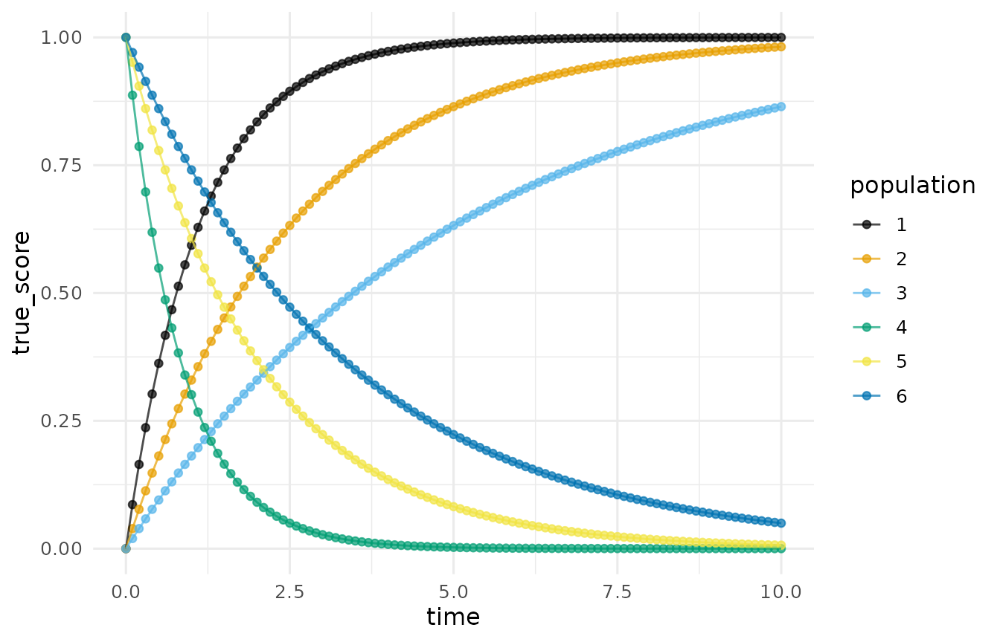
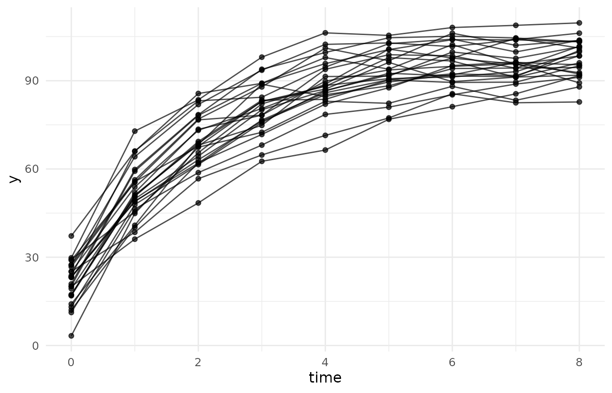
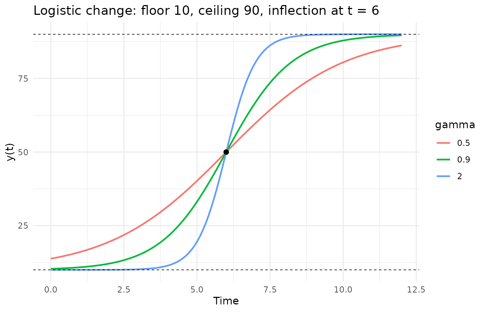
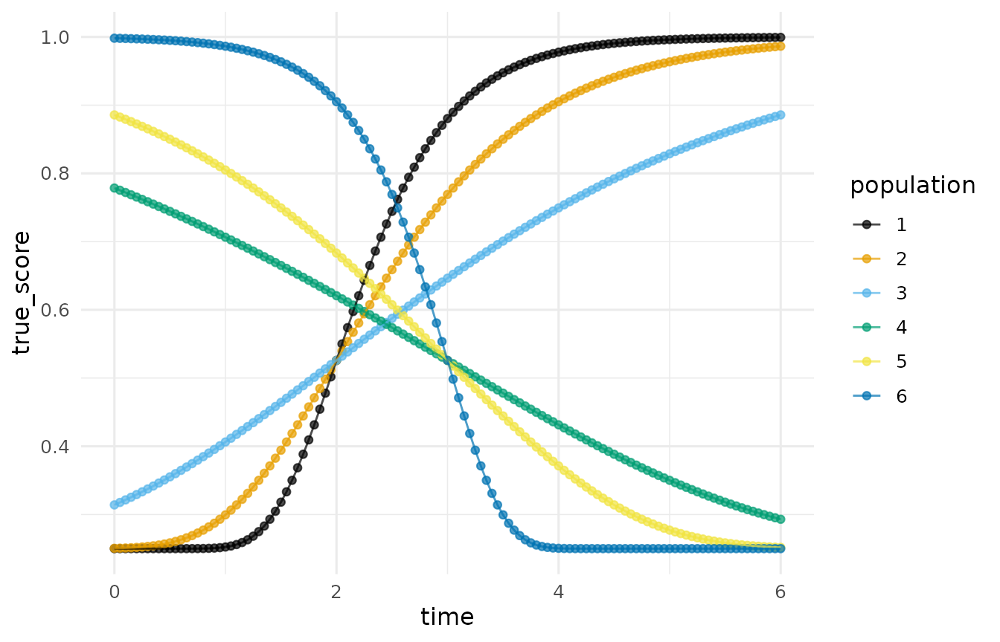
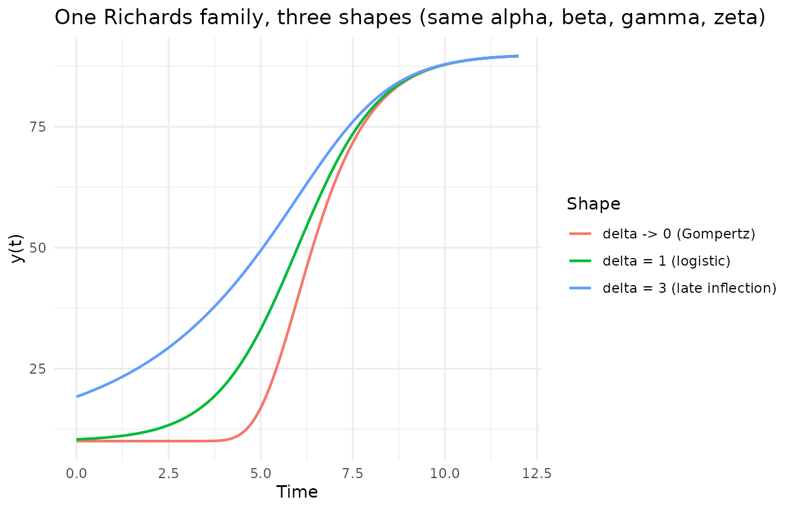
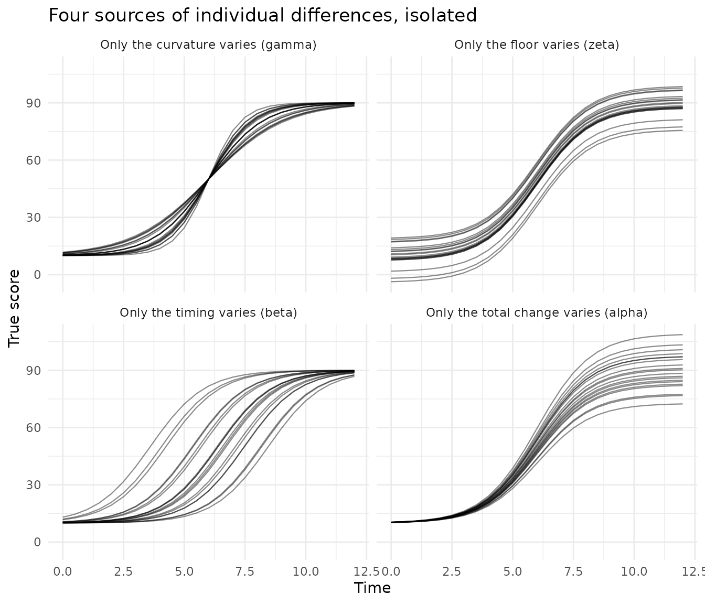
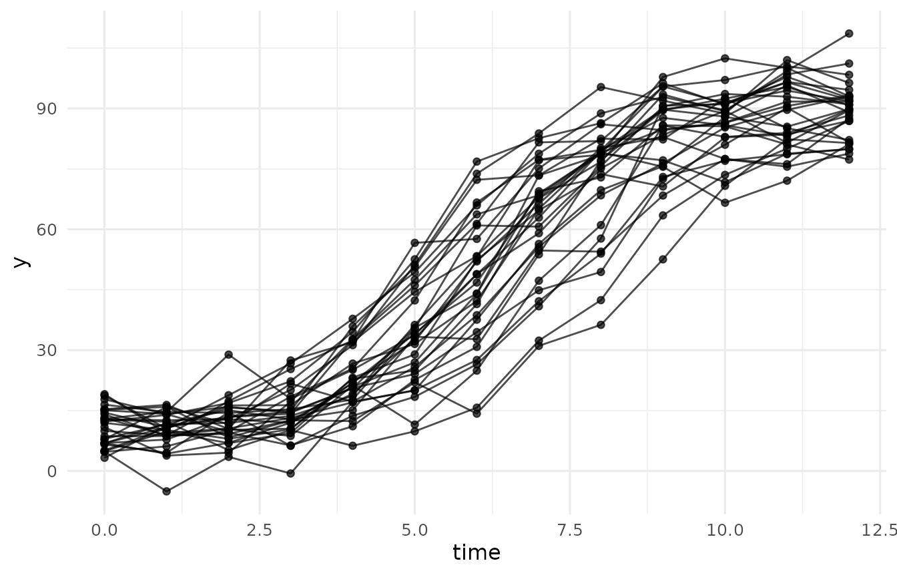
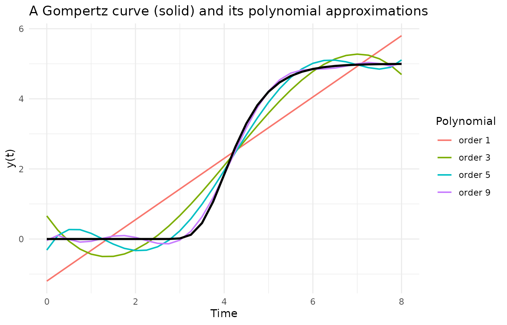
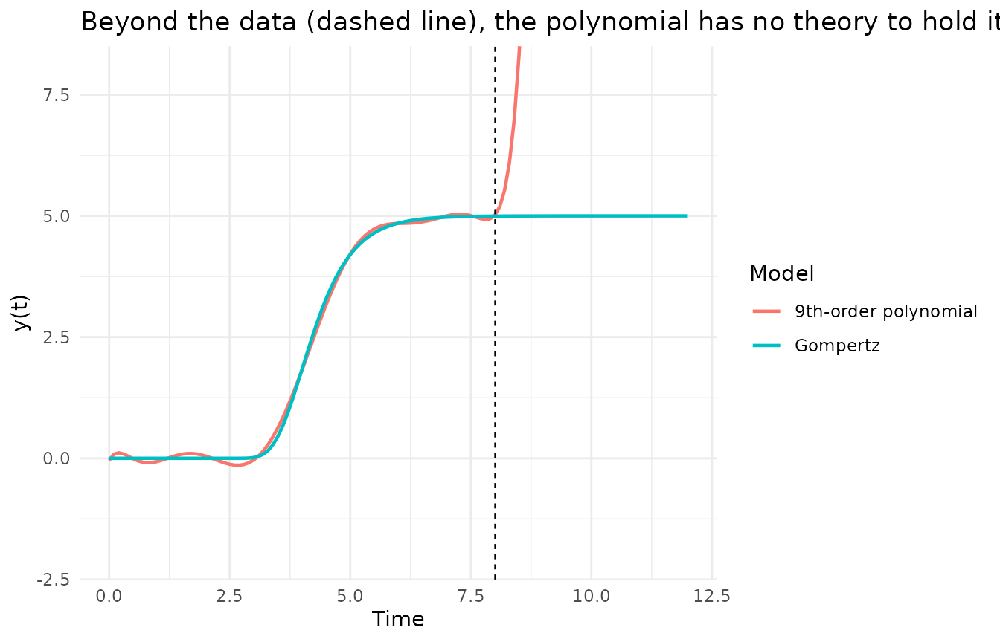

# Nonlinear Growth Curves and the Meaning of Their Parameters

When a researcher asks how something changes, the substantive questions
are rarely about coefficients. They are about landmarks: where does the
process start, where does it end, when is change fastest, and how
abruptly does the process turn from gaining to consolidating? Nonlinear
growth curves answer those questions directly, because each parameter
*is* one of those landmarks. This vignette walks through the four
nonlinear change models whose simulators DMAR provides, shows what each
parameter does, and closes with the comparison that motivates the whole
enterprise: what happens when S-shaped change is forced through
polynomial models instead (Kelley, 2005, 2008).

The four simulators share one interface. Each takes the population
parameters, the between-subject variances of those parameters (so that
individuals follow their own curves), a level-one error specification,
and a measurement schedule, and returns a long-format data frame that
[`plot_trajectories()`](https://yelleknek.github.io/DMAR/reference/plot_trajectories.md)
and nonlinear mixed-model fitters consume directly.

## The Negative Exponential: Change That Only Decelerates

The simplest nonlinear change model is the negative exponential, also
called asymptotic regression (Stevens, 1951):

y(t) = alpha + zeta \* exp(-gamma \* t).

Three parameters, three answers: `alpha` is where change ends (the
asymptote), `alpha + zeta` is where it starts (the intercept), and
`gamma` is how fast the remaining gap closes. Change is fastest at the
first moment and decelerates ever after; there is no inflection.

``` r

# The six deterministic curves of the illustration in Kelley (2005):
# three growth curves that differ only in curvature, and three decay
# curves that mirror them. Each curve is its own population of size one, so one
# simulator call draws the whole panel.
panel <- simulate_longitudinal_negative_exponential(
  n = 1, target_times = seq(0, 10, by = 0.1),
  fixed_parameters = list(
    c(alpha = 1, zeta = -1, gamma = 0.9),
    c(alpha = 1, zeta = -1, gamma = 0.4),
    c(alpha = 1, zeta = -1, gamma = 0.2),
    c(alpha = 0, zeta =  1, gamma = 1.2),
    c(alpha = 0, zeta =  1, gamma = 0.5),
    c(alpha = 0, zeta =  1, gamma = 0.3)),
  error_variance = 0
)
plot_trajectories(panel, id = "id", time = "time",
                  outcome = "true_score", group = "population")
```



The three rising curves share the same start (0) and end (1) and differ
only in `gamma`; the three falling curves mirror them. That is the point
of a curvature parameter: it moves *how fast* without touching *from
where* or *to where*.

A simulated sample makes the model concrete. Individuals get their own
asymptote, total change, and rate; measurements add error:

``` r

set.seed(113)
d_ne <- simulate_longitudinal_negative_exponential(
  n = 25, target_times = 0:8,
  fixed_parameters = c(alpha = 100, zeta = -80, gamma = 0.5),
  random_variances = c(alpha = 25, zeta = 16, gamma = 0.01),
  error_variance = 9
)
plot_trajectories(d_ne, id = "id", time = "time", outcome = "y")
```



## The Logistic: Symmetric S-Shaped Change

Processes with a floor and a ceiling need a second asymptote. The four
parameter logistic (Ratkowsky, 1983; Kelley, 2005) is

y(t) = alpha / (1 + exp(-gamma \* (t - beta))) + zeta.

The new landmark is `beta`, the point of inflection: the moment of
fastest change. For the logistic that moment always comes at exactly
half the total change, `alpha / 2 + zeta`; the climb away from the floor
mirrors the approach to the ceiling. The fourth parameter, `zeta`, is
the floor itself, freed from the fixed zero of the three parameter
logistic so the intercept is a modeled quantity.

``` r

tt <- seq(0, 12, by = 0.1)
curves <- do.call(rbind, lapply(c(0.5, 0.9, 2), function(g) {
  data.frame(t = tt, gamma = g,
             y = 80 / (1 + exp(-g * (tt - 6))) + 10)
}))
curves$gamma <- factor(curves$gamma)
ggplot2::ggplot(curves, ggplot2::aes(t, y, color = gamma)) +
  ggplot2::geom_line(linewidth = 0.8) +
  ggplot2::geom_hline(yintercept = c(10, 90), linetype = "dashed",
                      linewidth = 0.3) +
  ggplot2::geom_point(data = data.frame(t = 6, y = 50),
                      ggplot2::aes(t, y), inherit.aes = FALSE, size = 2) +
  ggplot2::labs(x = "Time", y = "y(t)",
                title = "Logistic change: floor 10, ceiling 90, inflection at t = 6",
                color = "gamma") +
  ggplot2::theme_minimal()
```



All three curves pass through the same inflection point (the dot at t =
6, y = 50): `gamma` concentrates the change around that moment without
moving it.

## The Gompertz: S-Shaped Change That Inflects Early

The Gompertz curve (Winsor, 1932) is also S-shaped, but it is not
symmetric:

y(t) = alpha \* exp(-exp(-gamma \* (t - beta))) + zeta.

Its inflection is pinned at `alpha / exp(1) + zeta`, about 36.8 percent
of the total change. Substantively that is a different theory of change:
rapid early gains, then a long consolidation. Learning curves often look
like this.

``` r

panel <- simulate_longitudinal_gompertz(
  n = 1, target_times = seq(0, 6, by = 0.05),
  fixed_parameters = list(
    c(alpha = 0.75, beta = 2, gamma =  1.75, zeta = 0.25),
    c(alpha = 0.75, beta = 2, gamma =  1.00, zeta = 0.25),
    c(alpha = 0.75, beta = 2, gamma =  0.45, zeta = 0.25),
    c(alpha = 0.75, beta = 3, gamma = -0.35, zeta = 0.25),
    c(alpha = 0.75, beta = 3, gamma = -0.60, zeta = 0.25),
    c(alpha = 0.75, beta = 3, gamma = -2.00, zeta = 0.25)),
  error_variance = 0
)
plot_trajectories(panel, id = "id", time = "time",
                  outcome = "true_score", group = "population")
```



This reproduces the illustration from Kelley (2005): the three rising
curves share the inflection time beta = 2, the three falling curves
share beta = 3, and because `alpha` and `zeta` are constant, every curve
crosses its inflection at the same height, 0.75 / exp(1) + 0.25, about
0.526.

## The Richards Family: The Inflection Becomes a Parameter

Choosing the logistic fixes the inflection at 50 percent of total
change; choosing the Gompertz fixes it at 36.8 percent. The Richards
curve (Richards, 1959) makes that fraction estimable:

y(t) = alpha / (1 + delta \* exp(-gamma \* (t - beta)))^(1/delta) +
zeta.

The shape parameter `delta` places the inflection ordinate at alpha \*
(1 + delta)^(-1/delta) + zeta. At delta = 1 the Richards curve *is* the
logistic; as delta approaches 0 it *is* the Gompertz; larger delta
pushes the inflection past halfway, a shape neither special case can
reach. The Richards family therefore subsumes the others, which is
exactly how Guo, Cheng, and Kelley (2016) used it to let network
structure move the inflection of self-replicating malware outbreaks.

``` r

tt <- seq(0, 12, by = 0.1)
rich <- function(delta) 80 / (1 + delta * exp(-0.9 * (tt - 6)))^(1 / delta) + 10
curves <- rbind(
  data.frame(t = tt, y = 80 * exp(-exp(-0.9 * (tt - 6))) + 10,
             shape = "delta -> 0 (Gompertz)"),
  data.frame(t = tt, y = rich(1), shape = "delta = 1 (logistic)"),
  data.frame(t = tt, y = rich(3), shape = "delta = 3 (late inflection)")
)
ggplot2::ggplot(curves, ggplot2::aes(t, y, color = shape)) +
  ggplot2::geom_line(linewidth = 0.8) +
  ggplot2::labs(x = "Time", y = "y(t)",
                title = "One Richards family, three shapes (same alpha, beta, gamma, zeta)",
                color = "Shape") +
  ggplot2::theme_minimal()
```



The simulator enforces delta \> 0 and, when `delta` is given a
between-subject variance, refuses draws that cross zero rather than
silently truncating them.

## Individual Differences, One Parameter at a Time

Populations do not follow one curve; individuals follow their own. The
simulators model that heterogeneity by drawing each subject’s parameter
vector from a multivariate normal centered at the fixed effects, with
variances (and, optionally, correlations) the researcher sets. A named
entry in `random_variances` varies a single parameter and leaves the
rest fixed, which turns each source of individual differences into its
own picture. Using the same logistic population as above (floor 10,
ceiling 90, inflection at week 6):

``` r

one_at_a_time <- function(which_var, label) {
  set.seed(113)
  d <- simulate_longitudinal_logistic(
    n = 20, target_times = seq(0, 12, by = 0.5),
    fixed_parameters = c(alpha = 80, beta = 6, gamma = 0.9, zeta = 10),
    random_variances = which_var, error_variance = 0
  )
  d$panel <- label
  d
}
d_all <- rbind(
  one_at_a_time(c(zeta = 25),    "Only the floor varies (zeta)"),
  one_at_a_time(c(alpha = 100),  "Only the total change varies (alpha)"),
  one_at_a_time(c(beta = 1.5),   "Only the timing varies (beta)"),
  one_at_a_time(c(gamma = 0.06), "Only the curvature varies (gamma)")
)
ggplot2::ggplot(d_all,
                ggplot2::aes(time, true_score, group = id)) +
  ggplot2::geom_line(alpha = 0.45, linewidth = 0.4) +
  ggplot2::facet_wrap(~ panel, ncol = 2) +
  ggplot2::labs(x = "Time", y = "True score",
                title = "Four sources of individual differences, isolated") +
  ggplot2::theme_minimal()
```



Each panel is a different substantive claim. Floors that vary mean
children start in different places; total change that varies means they
gain different amounts; timing that varies means the same growth happens
on different schedules; curvature that varies means some change abruptly
and others gradually. A real population mixes all four, which is one
line:

``` r

set.seed(113)
d_mix <- simulate_longitudinal_logistic(
  n = 30, target_times = 0:12,
  fixed_parameters = c(alpha = 80, beta = 6, gamma = 0.9, zeta = 10),
  random_variances = c(alpha = 36, beta = 1, gamma = 0.01, zeta = 9),
  error_variance = 16
)
plot_trajectories(d_mix, id = "id", time = "time", outcome = "y")
```



## Nonlinear Versus Polynomial: Why the Parameters Matter

Any smooth curve can be approximated by a polynomial of high enough
order, so why not stay with linear models? Two reasons, both visible in
one picture. Take the deterministic Gompertz curve used in Kelley
(2005), y(t) = 5 exp(-exp(7 - 1.75 t)), observe it on t = 0 to 8, and
fit polynomials of increasing order:

``` r

t_obs <- seq(0, 8, by = 0.25)
y_obs <- 5 * exp(-exp(7 - 1.75 * t_obs))
fits <- do.call(rbind, lapply(c(1, 3, 5, 9), function(p) {
  data.frame(t = t_obs, order = paste0("order ", p),
             y = fitted(lm(y_obs ~ poly(t_obs, p))))
}))
truth <- data.frame(t = t_obs, y = y_obs)
ggplot2::ggplot(fits, ggplot2::aes(t, y, color = order)) +
  ggplot2::geom_line(linewidth = 0.7) +
  ggplot2::geom_line(data = truth, ggplot2::aes(t, y),
                     inherit.aes = FALSE, linewidth = 1) +
  ggplot2::labs(x = "Time", y = "y(t)",
                title = "A Gompertz curve (solid) and its polynomial approximations",
                color = "Polynomial") +
  ggplot2::theme_minimal()
```



The ninth-order polynomial tracks the curve well. But it needed ten
parameters to do what the Gompertz does with four, and not one of the
ten answers a substantive question: no coefficient is the ceiling, none
is the moment of fastest growth. The Gompertz parameters are the theory;
the polynomial coefficients are bookkeeping.

The second reason appears the moment the model leaves the data. Refit
the best polynomial on the observed window, then extend the time axis:

``` r

fit9 <- lm(y_obs ~ poly(t_obs, 9, raw = TRUE))
t_new <- seq(0, 12, by = 0.1)
pred <- data.frame(
  t = t_new,
  polynomial = predict(fit9, newdata = data.frame(t_obs = t_new)),
  gompertz = 5 * exp(-exp(7 - 1.75 * t_new))
)
long <- rbind(
  data.frame(t = pred$t, y = pred$polynomial, model = "9th-order polynomial"),
  data.frame(t = pred$t, y = pred$gompertz,  model = "Gompertz")
)
ggplot2::ggplot(long, ggplot2::aes(t, y, color = model)) +
  ggplot2::geom_line(linewidth = 0.8) +
  ggplot2::geom_vline(xintercept = 8, linetype = "dashed",
                      linewidth = 0.3) +
  ggplot2::coord_cartesian(ylim = c(-2, 8)) +
  ggplot2::labs(x = "Time", y = "y(t)",
                title = "Beyond the data (dashed line), the polynomial has no theory to hold it",
                color = "Model") +
  ggplot2::theme_minimal()
```



Inside the observed window the two are indistinguishable; past it, the
polynomial rockets out the top of the figure while the Gompertz does
what growth to an asymptote must do. A nonlinear model extrapolates its
theory; a polynomial extrapolates its arithmetic.

## From Curves to Data and Back

The simulators exist so that designs, estimators, and analysis plans for
nonlinear change can be studied before data collection, and
[`analysis_of_change()`](https://yelleknek.github.io/DMAR/reference/analysis_of_change.md)
closes the loop: simulate a Gompertz sample with individual variation,
then recover both the population curve and the spread of its parameters,
one fitted curve per unit.

``` r

set.seed(113)
d <- simulate_longitudinal_gompertz(
  n = 60, target_times = 0:10,
  fixed_parameters = c(alpha = 75, beta = 3, gamma = 0.55, zeta = 10),
  random_variances = c(alpha = 25, beta = 0.4, gamma = 0.005, zeta = 4),
  error_variance = 9
)
analysis_of_change(d, id = "id", time = "time", outcome = "y",
                   model = "gompertz")
```

| term  | estimate | se     | sd_units | var_units |
|:------|:---------|:-------|:---------|:----------|
| alpha | 76.8     | 1.02   | 7.92     | 62.7      |
| beta  | 2.84     | 0.0939 | 0.727    | 0.529     |
| gamma | 0.55     | 0.016  | 0.124    | 0.0154    |
| zeta  | 9.29     | 0.735  | 5.7      | 32.4      |

The `estimate` column lands near the generating values (75, 3, 0.55,
10), and `sd_units` reports the individual differences in each landmark.
The two-stage spread carries each curve’s estimation noise on top of the
true heterogeneity; `method = "mixed"` fits the proper
random-coefficients model (through
[`nlme::nlme()`](https://rdrr.io/pkg/nlme/man/nlme.html) here, or
[`lme4::lmer()`](https://rdrr.io/pkg/lme4/man/lmer.html) for the
polynomial) and returns the variance components instead.

Every row reports a quantity a reader can care about: the total change,
the day change peaked, how concentrated the change was, and the floor it
started from. A fuller treatment of these models in heterogeneous
populations, where class membership itself may be unknown, is in Kelley
(2005, 2008).

## References

Guo, H., Cheng, H. K., & Kelley, K. (2016). Impact of network structure
on malware propagation: A growth curve perspective. *Journal of
Management Information Systems, 33*(1), 296–325.

Kelley, K. (2005). *Estimating nonlinear change models in heterogeneous
populations when class membership is unknown: Defining and developing
the latent classification differential change model* (Doctoral
dissertation). University of Notre Dame.

Kelley, K. (2008). Nonlinear change models in populations with
unobserved heterogeneity. *Methodology, 4*(3), 97–112.

Ratkowsky, D. A. (1983). *Nonlinear regression modeling: A unified
practical approach*. Marcel Dekker.

Richards, F. J. (1959). A flexible growth function for empirical use.
*Journal of Experimental Botany, 10*(2), 290–301.

Stevens, W. L. (1951). Asymptotic regression. *Biometrics, 7*(3),
247–267.

Winsor, C. P. (1932). The Gompertz curve as a growth curve. *Proceedings
of the National Academy of Sciences, 18*(1), 1–8.

``` r

sessionInfo()
#> R version 4.6.1 (2026-06-24)
#> Platform: x86_64-pc-linux-gnu
#> Running under: Ubuntu 24.04.4 LTS
#> 
#> Matrix products: default
#> BLAS:   /usr/lib/x86_64-linux-gnu/openblas-pthread/libblas.so.3 
#> LAPACK: /usr/lib/x86_64-linux-gnu/openblas-pthread/libopenblasp-r0.3.26.so;  LAPACK version 3.12.0
#> 
#> locale:
#>  [1] LC_CTYPE=C.UTF-8       LC_NUMERIC=C           LC_TIME=C.UTF-8       
#>  [4] LC_COLLATE=C.UTF-8     LC_MONETARY=C.UTF-8    LC_MESSAGES=C.UTF-8   
#>  [7] LC_PAPER=C.UTF-8       LC_NAME=C              LC_ADDRESS=C          
#> [10] LC_TELEPHONE=C         LC_MEASUREMENT=C.UTF-8 LC_IDENTIFICATION=C   
#> 
#> time zone: UTC
#> tzcode source: system (glibc)
#> 
#> attached base packages:
#> [1] stats     graphics  grDevices utils     datasets  methods   base     
#> 
#> other attached packages:
#> [1] DMAR_1.0.0
#> 
#> loaded via a namespace (and not attached):
#>  [1] gtable_0.3.6       jsonlite_2.0.0     dplyr_1.2.1        compiler_4.6.1    
#>  [5] tidyselect_1.2.1   jquerylib_0.1.4    systemfonts_1.3.2  scales_1.4.0      
#>  [9] textshaping_1.0.5  yaml_2.3.12        fastmap_1.2.0      ggplot2_4.0.3     
#> [13] R6_2.6.1           labeling_0.4.3     generics_0.1.4     knitr_1.51        
#> [17] MASS_7.3-65        tibble_3.3.1       desc_1.4.3         bslib_0.12.0      
#> [21] pillar_1.11.1      RColorBrewer_1.1-3 rlang_1.3.0        cachem_1.1.0      
#> [25] xfun_0.60          fs_2.1.0           sass_0.4.10        S7_0.2.2          
#> [29] otel_0.2.0         cli_3.6.6          pkgdown_2.2.1      withr_3.0.3       
#> [33] magrittr_2.0.5     digest_0.6.39      grid_4.6.1         lifecycle_1.0.5   
#> [37] vctrs_0.7.3        evaluate_1.0.5     glue_1.8.1         farver_2.1.2      
#> [41] ragg_1.5.2         rmarkdown_2.31     tools_4.6.1        pkgconfig_2.0.3   
#> [45] htmltools_0.5.9
```
