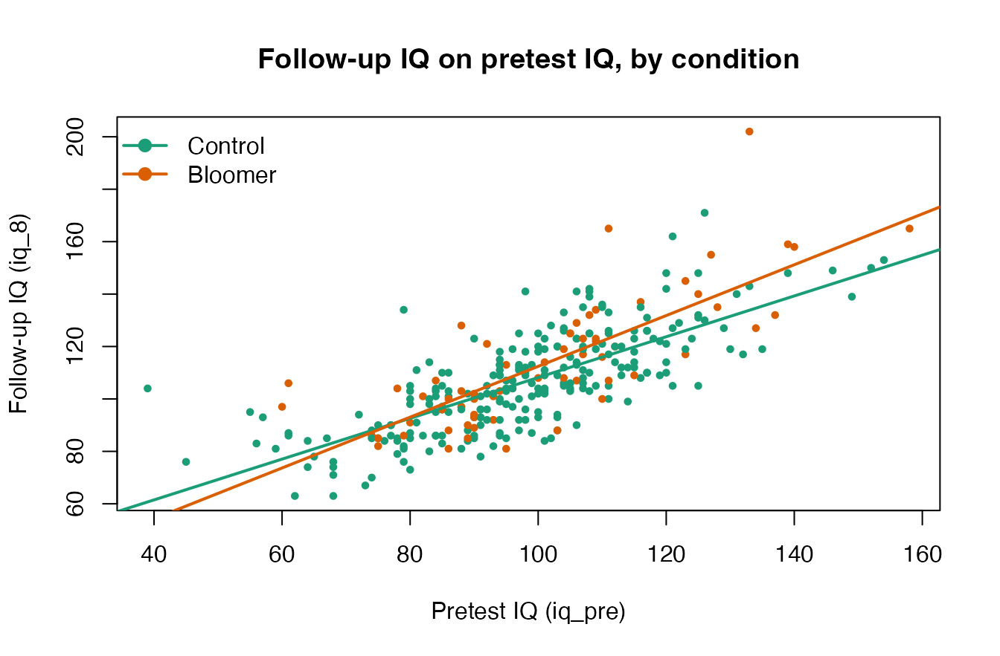

# Heterogeneity of Regression in the Pygmalion Data

The Pygmalion data are the running heterogeneity-of-regression example
in Maxwell, Delaney, and Kelley’s *Designing Experiments and Analyzing
Data: A Model Comparison Perspective*, where the analysis of covariance
treatment developed by Delaney shows what happens when the
covariate-outcome slope differs across treatment groups. This vignette
follows that treatment. The study itself is one famous experiment; the
*literature* it provoked, 18 replications synthesized by Raudenbush
(1984), ships separately as `teacher_expectancy` and is analyzed in
[`vignette("teacher_expectancy")`](https://yelleknek.github.io/DMAR/articles/teacher_expectancy.md).
The two are kept apart on purpose: a single study and the accumulated
evidence about its claim are importantly different things, and DMAR
treats them as such.

## The Data

`pygmalion` contains the teacher-expectancy data from Rosenthal and
Jacobson’s (1968) *Pygmalion in the Classroom*, the experiment that
introduced the **Pygmalion effect**: the idea that a teacher’s
expectations can become a self-fulfilling prophecy for a pupil’s
intellectual growth. At the start of the school year, a randomly chosen
~20% of the children in each classroom (here `treatment == "Bloomer"`,
*n* = 64) were described to their teachers as likely “intellectual
bloomers,” while the rest served as controls (*n* = 246). The only
manipulation was the expectation planted in the teachers. Intelligence
was measured before the manipulation (`iq_pre`) and again at follow-up
(`iq_8`).

``` r
data(pygmalion)

# A curated summary of the substantive IQ variables; the 'type' column
# reports each variable's class.
descriptives(pygmalion[, c("iq_pre", "iq_4", "iq_8", "iq_gain")])$descriptives
#>   variable    type   n n_missing prop_missing       mean median       sd min
#> 1   iq_pre integer 310         0            0  98.464516     98 18.67913  39
#> 2     iq_4 integer 310         0            0 101.677419    101 17.82327  58
#> 3     iq_8 integer 310         0            0 107.896774    105 20.44542  63
#> 4  iq_gain integer 310         0            0   9.432258      9 13.75680 -20
#>   max   q25 q75  skewness  kurtosis
#> 1 158 86.00 109 0.1259678 0.6021197
#> 2 157 89.25 112 0.3690189 0.4106643
#> 3 202 93.00 120 0.7312527 1.2090930
#> 4  69  1.00  17 0.7959656 1.7672510

# Pupils per condition within each grade.
table(pygmalion$treatment, pygmalion$grade)
#>          
#>            1  2  3  4  5  6
#>   Control 45 46 40 47 25 43
#>   Bloomer  7 12 13 12  9 11
```

The same numbers ship with the book’s data companion package (**AMCP**)
as `chapter_9_exercise_15`; here the experimental condition is a labeled
factor and the columns use DMAR’s descriptive names. The data set is the
running example for **analysis of covariance (ANCOVA) with heterogeneity
of regression** in Maxwell, Delaney, and Kelley, *Designing Experiments
and Analyzing Data: A Model Comparison Perspective* (Chapter 9).
Thorndike’s (1968) review questioned the reliability of the underlying
test (the Tests of General Ability, TOGA) at the extremes of the score
range for the youngest children, which is part of why these data reward
careful analysis.

## The Homogeneity-of-Regression Assumption

A standard ANCOVA uses the pretest (`iq_pre`) as a covariate and assumes
that the regression of the outcome on the covariate has the **same slope
in every group**. We can look at that assumption directly by fitting
separate slopes and overlaying them.

``` r
fit_het <- lm(iq_8 ~ iq_pre * treatment, data = pygmalion)
round(coef(fit_het), 5)
#>             (Intercept)                  iq_pre        treatmentBloomer 
#>                30.36587                 0.77799               -14.83283 
#> iq_pre:treatmentBloomer 
#>                 0.19096
```

The control slope is 0.778; adding the interaction gives a steeper
bloomer slope of 0.969.

``` r
cols <- c(Control = "#1b9e77", Bloomer = "#d95f02")
plot(pygmalion$iq_pre, pygmalion$iq_8,
     col = cols[pygmalion$treatment], pch = 19, cex = 0.6,
     xlab = "Pretest IQ (iq_pre)", ylab = "Follow-up IQ (iq_8)",
     main = "Follow-up IQ on pretest IQ, by condition")
for (g in levels(pygmalion$treatment)) {
  ab <- coef(lm(iq_8 ~ iq_pre, data = subset(pygmalion, treatment == g)))
  abline(ab, col = cols[g], lwd = 2)
}
legend("topleft", legend = names(cols), col = cols, pch = 19, lwd = 2, bty = "n")
```



The lines are not parallel: the relationship between pretest and
follow-up IQ is stronger for the bloomers. The formal test is the
treatment-by-covariate interaction, which is a **1-degree-of-freedom**
comparison of the additive (common-slope) model to the separate-slopes
model:

``` r
fit_add <- lm(iq_8 ~ iq_pre + treatment, data = pygmalion)
print_anova(anova(fit_add, fit_het))
#> Analysis of Variance Table
#> 
#> Model 1: iq_8 ~ iq_pre + treatment
#> Model 2: iq_8 ~ iq_pre * treatment
#> 
#>   Res.Df      RSS Df Sum of Sq        F Pr(>F)
#> 1    307 54329.63 NA        NA       NA   <NA>
#> 2    306 53649.49  1  680.1436 3.879327 0.0498
```

## A Tidy ANCOVA with `ancova()`

[`DMAR::ancova()`](https://yelleknek.github.io/DMAR/reference/ancova.md)
returns the adjusted (covariate-corrected) cell means, the omnibus *F*
for the treatment effect, partial `eta^2` and partial `omega^2` with
noncentral *F* confidence intervals, and the homogeneity-of-regression
test, all in one tidy data frame.

``` r
res <- ancova(pygmalion, outcome = "iq_8", treatment = "treatment",
              covariates = "iq_pre")
as_kable(res)
```

| term                         | value    |
|:-----------------------------|:---------|
| F_value                      | 5.38     |
| df_1                         | 1        |
| df_2                         | 307      |
| p_value                      | 0.0210   |
| sum_of_squares_type          | 3        |
| eta_squared_partial          | 0.0172   |
| eta_squared_partial_lower    | 0.000201 |
| eta_squared_partial_upper    | 0.056    |
| omega_squared_partial        | 0.0139   |
| omega_squared_partial_lower  | 0.000201 |
| omega_squared_partial_upper  | 0.056    |
| adjusted_mean\[Control\]     | 107      |
| adjusted_mean\[Bloomer\]     | 111      |
| se_adjusted_mean\[Control\]  | 0.849    |
| se_adjusted_mean\[Bloomer\]  | 1.67     |
| F_homogeneity_of_regression  | 3.88     |
| df_homogeneity_of_regression | 1        |
| p_homogeneity_of_regression  | 0.0498   |

Confidence level: 95%

Note that the `F_homogeneity_of_regression` row reproduces the 1-df
interaction test above, and that the adjusted means come from the
common-slope model. When the slopes genuinely differ, a single “adjusted
mean difference” is an incomplete summary, which is the point of the
next section.

Reported in a results-section sentence, the common-slope model shows a
treatment effect adjusting for pretest IQ, *F*(1, 307) = 5.38, *p* =
0.0210, with partial $`\eta^2`$ = 0.017, 95% CI \[0, 0.056\].

## The Treatment Effect Depends on the Covariate

Under heterogeneity of regression the estimated treatment effect is not
a single number: it is a function of the covariate value at which it is
evaluated,
``` math

\widehat{\Delta}(x) \;=\;
\bigl(\hat\alpha_{\text{Bloomer}} - \hat\alpha_{\text{Control}}\bigr)
\;+\;
\bigl(\hat\beta_{\text{Bloomer}} - \hat\beta_{\text{Control}}\bigr)\,x .
```
We can read it straight off the fitted separate-slopes model at any
pretest value. Below we evaluate it at the covariate grand mean and at
one standard deviation on either side.

``` r
x_bar <- mean(pygmalion$iq_pre)
x_sd  <- sd(pygmalion$iq_pre)
x_at  <- c(low = x_bar - x_sd, mean = x_bar, high = x_bar + x_sd)

effect_at <- function(x) {
  nd  <- data.frame(iq_pre = x)
  pB  <- predict(fit_het, transform(nd, treatment = factor("Bloomer", levels(pygmalion$treatment))))
  pC  <- predict(fit_het, transform(nd, treatment = factor("Control", levels(pygmalion$treatment))))
  pB - pC
}

data.frame(iq_pre = round(x_at, 2),
           estimated_effect = round(vapply(x_at, effect_at, numeric(1)), 3))
#>      iq_pre estimated_effect
#> low   79.79            0.403
#> mean  98.46            3.970
#> high 117.14            7.537
```

The estimated expectancy effect grows as pretest IQ increases, from
roughly 0.4 points at one SD below the mean to about 7.5 points at one
SD above it. Evaluating, testing, and *planning for* a treatment effect
at chosen covariate values, rather than only at the grand mean, is
exactly the problem treated by the variance of the estimated treatment
effect methodology of Li, McLouth, and Delaney (2020), implemented
natively as
[`var_ete()`](https://yelleknek.github.io/DMAR/reference/var_ete.md).

``` r
# Ingredients for that methodology (cf. var_ete()):
n_bloomer <- sum(pygmalion$treatment == "Bloomer")
n_control <- sum(pygmalion$treatment == "Control")
sigma2    <- sum(residuals(fit_het)^2) / fit_het$df.residual
sigmaz2   <- var(pygmalion$iq_pre)
slopes    <- c(
  Control = unname(coef(fit_het)["iq_pre"]),
  Bloomer = unname(coef(fit_het)["iq_pre"] + coef(fit_het)["iq_pre:treatmentBloomer"])
)
round(c(n_bloomer = n_bloomer, n_control = n_control,
        sigma2 = sigma2, sigmaz2 = sigmaz2, slopes), 5)
#> n_bloomer n_control    sigma2   sigmaz2   Control   Bloomer 
#>  64.00000 246.00000 175.32513 348.90974   0.77799   0.96894

# Variance of the estimated treatment effect at the covariate mean.
var_ete(sigma2 = sigma2, sigma2_Z = sigmaz2,
        n_1 = n_bloomer, n_2 = n_control,
        beta_1 = unname(slopes["Bloomer"]),
        beta_2 = unname(slopes["Control"]),
        type = "sample", covariate_value = "sample_mean")
```

| term    | value |
|:--------|:------|
| var_ete | 3.52  |

## One Study and Its Literature

The analysis above is everything a single experiment can tell you, and
the heterogeneity of regression is its most lasting statistical lesson.
What it cannot tell you is whether the expectancy effect replicates, for
whom, and under what conditions. Fourteen years of replications and
Raudenbush’s (1984) synthesis answered those questions: the effect
appears when teachers barely know their pupils at induction and
disappears once they do. See
[`vignette("teacher_expectancy")`](https://yelleknek.github.io/DMAR/articles/teacher_expectancy.md)
for that meta-analysis reproduced with
[`combine_p()`](https://yelleknek.github.io/DMAR/reference/combine_p.md),
[`meta_contrast()`](https://yelleknek.github.io/DMAR/reference/meta_contrast.md),
and
[`meta_smd()`](https://yelleknek.github.io/DMAR/reference/meta_smd.md).

## References

Kelley, K. (2007a). Confidence intervals for standardized effect sizes:
Theory, application, and implementation. *Journal of Statistical
Software, 20*(8), 1–24.

Kelley, K. (2007b). Methods for the behavioral, educational, and social
sciences: An R package. *Behavior Research Methods, 39*(4), 979–984.

Maxwell, S. E., Delaney, H. D., & Kelley, K. (2027). *Designing
experiments and analyzing data: A model comparison perspective* (4th
ed.). Routledge. (Heterogeneity-of-regression ANCOVA, Chapter 9.)

Raudenbush, S. W. (1984). Magnitude of teacher expectancy effects on
pupil IQ as a function of the credibility of expectancy induction: A
synthesis of findings from 18 experiments. *Journal of Educational
Psychology, 76*(1), 85–97.

Rosenthal, R., & Jacobson, L. (1968). *Pygmalion in the classroom:
Teacher expectation and pupils’ intellectual development.* Holt,
Rinehart and Winston.

Thorndike, R. L. (1968). Review of *Pygmalion in the Classroom.*
*American Educational Research Journal, 5*(4), 708–711.
