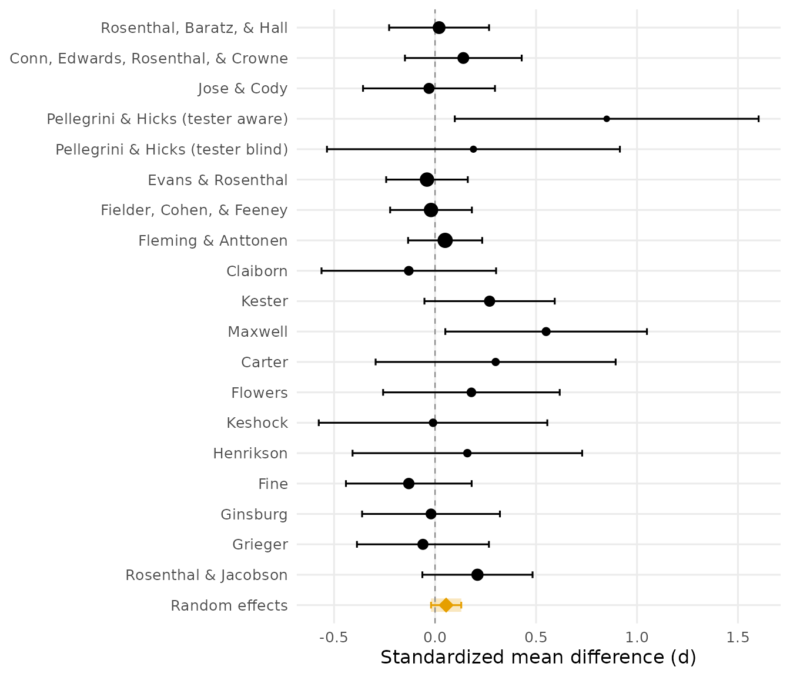

# The Teacher Expectancy Meta-Analysis: Reproducing Raudenbush (1984)

In 1968, *Pygmalion in the Classroom* (Rosenthal & Jacobson) reported
that telling teachers certain randomly chosen children were about to
bloom intellectually raised those children’s IQ. The single study
(shipped in DMAR as `pygmalion`, and the running analysis of covariance
example in Maxwell, Delaney, and Kelley’s *Designing Experiments and
Analyzing Data*) set off fourteen years of replications with wildly
varying results. Raudenbush (1984) synthesized 18 of those experiments
and asked the question that resolved the controversy: not *whether*
there is an expectancy effect, but *why the studies disagree*. His
answer: the longer teachers had known their pupils before the expectancy
induction, the smaller the effect. Credible deception is the Achilles’
heel of the design.

This vignette reproduces the paper’s analyses with DMAR’s synthesis
functions, then reanalyzes the data with modern random effects
machinery. The single Pygmalion study and this literature are
deliberately kept as separate data sets: one is a famous experiment, the
other is the evidence about the claim.

## The Data

The 1984 Table 1, at the condition level (Pellegrini & Hicks ran a
tester-aware and a tester-blind condition):

``` r

data(teacher_expectancy)
teacher_expectancy[, c("author", "weeks", "tester", "d", "p_one_tailed")]
#>                                author weeks tester     d p_one_tailed
#> 1           Rosenthal, Baratz, & Hall     2  aware  0.02        0.401
#> 2  Conn, Edwards, Rosenthal, & Crowne    21  aware  0.14        0.206
#> 3                         Jose & Cody    19  aware -0.03        0.791
#> 4   Pellegrini & Hicks (tester aware)     0  aware  0.85        0.003
#> 5   Pellegrini & Hicks (tester blind)     0  blind  0.19        0.242
#> 6                   Evans & Rosenthal     3  aware -0.04        0.709
#> 7            Fielder, Cohen, & Feeney    17  blind -0.02        0.595
#> 8                  Fleming & Anttonen     2  blind  0.05        0.224
#> 9                            Claiborn    24  aware -0.13        0.928
#> 10                             Kester     0  aware  0.27        0.050
#> 11                            Maxwell     1  blind  0.55        0.002
#> 12                             Carter     0  blind  0.30        0.043
#> 13                            Flowers     0  blind  0.18        0.210
#> 14                            Keshock     1  blind -0.01        0.528
#> 15                          Henrikson     2  blind  0.16        0.250
#> 16                               Fine    17  aware -0.13        0.877
#> 17                           Ginsburg     7  aware -0.02        0.519
#> 18                            Grieger     5  blind -0.06        0.637
#> 19               Rosenthal & Jacobson     1  aware  0.21        0.016
```

For the analyses with the 18 *studies* as units, Raudenbush merged the
two Pellegrini and Hicks conditions into their study-level values
(`d = 0.52`, one-tailed `p = .010`; see
[`?teacher_expectancy`](https://yelleknek.github.io/DMAR/reference/teacher_expectancy.md)):

``` r

s   <- teacher_expectancy[-c(4, 5), ]
d18 <- append(s$d,             0.52, after = 3)
p18 <- append(s$p_one_tailed,  .010, after = 3)
wk18 <- append(s$weeks,           0, after = 3)
ne18 <- append(s$n_experimental, 22, after = 3)
nc18 <- append(s$n_control,      22, after = 3)
round(c(mean = mean(d18), sd = sd(d18), max = max(d18), min = min(d18)), 2)
#>  mean    sd   max   min 
#>  0.11  0.20  0.55 -0.13
```

These match the paper’s summary exactly (*M* = 0.11, *SD* = 0.20, range
0.55 to -0.13).

## Are the Studies Significant in Combination? (Table 2)

Raudenbush opened with four classical combined significance tests, which
[`combine_p()`](https://yelleknek.github.io/DMAR/reference/combine_p.md)
provides in one call. The weights for the Mosteller-Bush weighted method
are the studies’ degrees of freedom:

``` r

df18 <- ne18 + nc18 - 2
combine_p(p18, weights = df18)
```

| term                | value  |
|:--------------------|:-------|
| fisher_chi_square   | 62.2   |
| fisher_df           | 36     |
| fisher_p            | 0.0043 |
| edgington_sum_p     | 7      |
| edgington_p         | 0.0509 |
| stouffer_z          | 2.2    |
| stouffer_p          | 0.0139 |
| stouffer_weighted_z | 0.87   |
| stouffer_weighted_p | 0.1922 |
| k                   | 18     |

Raudenbush’s Table 2 reports three of the four rejecting the null:
Fisher’s chi square(36) = 62.17, Edgington’s sum of 6.84 (*p* = .04),
and the adding-Zs test (his z = 2.12, *p* = .017), with only the
df-weighted variant not rejecting. Recomputed here from the tabled
one-tailed *p*-values, Fisher (chi square(36) = 62.17, *p* = .0043) and
adding-Zs (z = 2.20, *p* = .0139) reject as he found, but Edgington’s
sum comes to 6.996 rather than 6.84 and its *p*-value lands at .0509, a
hair past the line his rounding placed it inside. A method whose
decision flips with the third decimal of the inputs is telling you the
evidence is borderline, not settled; the two sturdy rejections and the
df-weighted non-rejection (z = 0.87, *p* = .19) carry the real message.
That disagreement is the first finding: the larger studies found smaller
effects, so something about the studies, not just sampling error, drives
the variation.

## Why Do the Studies Disagree? The Prior-Contact Contrast

The paper’s central hypothesis: the more weeks teachers had known their
pupils before the induction, the less credible the deception, the
smaller the effect.

``` r

plot(d18 ~ wk18,
     xlab = "Weeks of teacher-student contact before induction",
     ylab = "Effect size d", pch = 16)
```


The raw correlation and Raudenbush’s linearized (reciprocal-transformed)
version:

``` r

round(c(r = cor(d18, wk18),
        r_transformed = cor(-1 / (1 + d18), -1 / (2 + wk18))), 2)
#>             r r_transformed 
#>         -0.55         -0.76
```

(The paper reports -.55 and -.77.) The formal test is a Rosenthal-Rubin
contrast among the effect sizes, with weights inversely proportional to
weeks of prior contact and the standard large-sample variance for each
*d*:

``` r

v18 <- (ne18 + nc18) / (ne18 * nc18) + d18^2 / (2 * (ne18 + nc18))
meta_contrast(d18, v18, weights = 1 / (wk18 + 2))
#> Contrast weights mean-centered to sum to zero.
```

| term     | value  |
|:---------|:-------|
| estimate | 0.432  |
| se       | 0.156  |
| z        | 2.76   |
| p_value  | 0.0057 |
| k        | 18     |

The *z* of about 2.75 (one-tailed *p* = .003 in the paper) supports the
hypothesis. Raudenbush partitioned the total heterogeneity the way an
ANOVA partitions sums of squares: the fixed effect fit gives Cochran’s
Q,

``` r

fe <- meta_es(d18, v18, method = "fe")
fe[fe$term %in% c("Q", "Q_df", "Q_p"), ]
```

| term | value  |
|:-----|:-------|
| Q    | 14.9   |
| Q_df | 17     |
| Q_p  | 0.5997 |

Confidence level: 95%

and the squared contrast statistic over Q is the proportion of
heterogeneity the moderator explains (Raudenbush’s 52 percent; the
package returns 0.51 from these inputs):

``` r

z_contrast <- meta_contrast(d18, v18, weights = 1 / (wk18 + 2))$value[3]
#> Contrast weights mean-centered to sum to zero.
round(z_contrast^2 / fe$value[fe$term == "Q"], 2)
#> [1] 0.51
```

Note the instructive subtlety: the omnibus Q (14.9 on 17 df) would not
itself reject homogeneity. A diffuse test looked at the same data and
saw nothing; the focused contrast, specified in advance from a
substantive hypothesis, saw the structure. That lesson, prefer focused
model comparisons to omnibus tests, is the same one Maxwell, Delaney,
and Kelley (2027) teach for single studies.

## Low- Versus High-Contact Studies (Table 3)

Dichotomizing at two weeks of prior contact:

``` r

lo <- wk18 <= 2
round(c(mean_low = mean(d18[lo]), mean_high = mean(d18[!lo])), 2)
#>  mean_low mean_high 
#>      0.22     -0.04
combine_p(p18[lo],  weights = df18[lo])    # 10 low-contact studies
```

| term                | value     |
|:--------------------|:----------|
| fisher_chi_square   | 54.2      |
| fisher_df           | 20        |
| fisher_p            | \< 0.0001 |
| edgington_sum_p     | 1.73      |
| edgington_p         | 0.0002    |
| stouffer_z          | 4.15      |
| stouffer_p          | \< 0.0001 |
| stouffer_weighted_z | 2.52      |
| stouffer_weighted_p | 0.0059    |
| k                   | 10        |

``` r

combine_p(p18[!lo], weights = df18[!lo])   # 8 high-contact studies
```

| term                | value  |
|:--------------------|:-------|
| fisher_chi_square   | 7.98   |
| fisher_df           | 16     |
| fisher_p            | 0.9494 |
| edgington_sum_p     | 5.26   |
| edgington_p         | 0.9389 |
| stouffer_z          | -1.34  |
| stouffer_p          | 0.9104 |
| stouffer_weighted_z | -0.786 |
| stouffer_weighted_p | 0.7842 |
| k                   | 8      |

Every method finds the low-contact studies jointly significant (the
paper: adding-Zs z = 4.16, weighted 2.52); none finds anything in the
high-contact studies. Expectancy effects appear when, and only when, the
teachers barely knew the children.

## Tester Awareness (the Condition-Level Rows)

Could the effect be tester bias? Here the two Pellegrini and Hicks
conditions matter, so the analysis runs at the condition level with an
aware-versus-blind contrast:

``` r

d  <- teacher_expectancy$d
ne <- teacher_expectancy$n_experimental
nc <- teacher_expectancy$n_control
vi <- (ne + nc) / (ne * nc) + d^2 / (2 * (ne + nc))
aware <- teacher_expectancy$tester == "aware"
meta_contrast(d, vi, weights = ifelse(aware, 1 / sum(aware),
                                      -1 / sum(!aware)))
```

| term     | value   |
|:---------|:--------|
| estimate | -0.0349 |
| se       | 0.103   |
| z        | -0.338  |
| p_value  | 0.7351  |
| k        | 19      |

No main effect of tester awareness (the paper reports z = -0.36), and
the low-contact effect held in both the aware and blind subsets: the
prior-contact moderator is not an artifact of who administered the test.

## A Modern Reanalysis

Raudenbush worked with the tools of 1984. The same questions today get a
random effects model with REML, the Hartung-Knapp adjustment, a
Q-profile interval for the between-study variance, and a prediction
interval, all of which
[`meta_smd()`](https://yelleknek.github.io/DMAR/reference/meta_smd.md)
reports in one table (Hedges’ small-sample correction is on by default;
the historical analyses above pooled raw *d* values):

``` r

meta_smd(smd = teacher_expectancy$d,
         n_1 = teacher_expectancy$n_experimental,
         n_2 = teacher_expectancy$n_control)
```

| term             | value   |
|:-----------------|:--------|
| estimate         | 0.0544  |
| se               | 0.0352  |
| t                | 1.55    |
| p_value          | 0.1392  |
| lower_limit      | -0.0195 |
| upper_limit      | 0.128   |
| prediction_lower | -0.0198 |
| prediction_upper | 0.129   |
| tau2             | 0       |
| tau2_lower       | 0       |
| tau2_upper       | 0.048   |
| tau              | 0       |
| I2               | 0       |
| I2_lower         | 0       |
| I2_upper         | 64.6    |
| H2               | 1       |
| Q                | 16.7    |
| Q_df             | 18      |
| Q_p              | 0.5468  |
| k                | 19      |

Confidence level: 95%

And the picture (the forest plot pools the raw *d* values, so its
diamond sits fractionally left of the Hedges-corrected average in the
table above):

``` r

plot_forest(d, vi, labels = teacher_expectancy$author,
            xlab = "Standardized mean difference (d)")
```



The pooled average is small and its confidence interval narrow, but the
summary that respects the heterogeneity is conditional: pooling
everything answers a question (“what is the average effect across these
heterogeneous inductions?”) that the moderator analysis showed is the
wrong one. Where will the next study land? It depends almost entirely on
when the expectancy is induced.

## References

Raudenbush, S. W. (1984). Magnitude of teacher expectancy effects on
pupil IQ as a function of the credibility of expectancy induction: A
synthesis of findings from 18 experiments. *Journal of Educational
Psychology, 76*(1), 85–97.

Raudenbush, S. W., & Bryk, A. S. (1985). Empirical Bayes meta-analysis.
*Journal of Educational Statistics, 10*(2), 75–98.

Rosenthal, R., & Jacobson, L. (1968). *Pygmalion in the classroom*.
Holt, Rinehart & Winston.

Maxwell, S. E., Delaney, H. D., & Kelley, K. (2027). *Designing
experiments and analyzing data: A model comparison perspective* (4th
ed.). Routledge.
